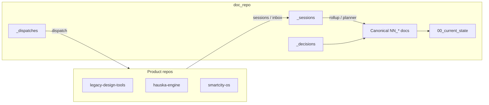

# doc_repo guide

Canonical company intelligence for the Empressa / Legacy Group ATX / Hauska portfolio. This repository lives at `P:\doc_repo`, sibling to product code repos (`legacy-design-tools`, `smartcity-os`, `hauska-engine`, and others). Product code ships elsewhere; strategy, architecture, sprint state, decisions, and agent coordination live here.

## What this repository is

A version-controlled knowledge base, not an application repo. It holds:

- Portfolio and product ground truth (what is live, what is broken, what is in flight)
- Architecture decision records (ADRs)
- Sprint plans, QA backlogs, roadmaps, and commercial docs
- Agent operating rules and runbooks
- Session history and decision records with audit trail
- Dispatches (paste-ready prompts for engineering agents on other repos)

The operating thesis: agents and humans have no durable memory across sessions except what is written here. [`00_current_state.md`](00_current_state.md) is the daily entry point; everything else is linked from there or from numeric-band docs.

**New machine (laptop):** before a long QA or E2E block, run [`90_runbooks/laptop_workspace_sync.md`](90_runbooks/laptop_workspace_sync.md) so clones, `.env.local`, Cursor MCP, and Grok settings match the desktop.

### Entities tracked (do not conflate)

| Layer | Entity | Examples in docs |
|-------|--------|------------------|
| Operating company | Legacy Group ATX LLC | Internal ops |
| Commercial substrate | Hauska Inc. | Engine, SDK, MCP server, atom contract, catalog, payments |
| Product brand | Empressa | SmartCity OS, Cortex (design accelerator), Codex, Revit Connector |

Brand and entity placement per [`80_adrs/adr_008_engine_factor_out.md`](80_adrs/adr_008_engine_factor_out.md). Full planner constitution: [`CLAUDE.md`](CLAUDE.md).

## How we use it

### Who writes what

| Actor | Typical role | Writes to |
|-------|--------------|-----------|
| **planner** (Grok-capable Cursor in `doc_repo`) | Strategy, atom catalog synthesis, reconciliation, session close, canonical doc updates, dispatches. Atom-first per [`01a_atom_conventions.md`](01a_atom_conventions.md) and HR-12 in [`20_agent_operating_rules.md`](20_agent_operating_rules.md). | Canonical docs, `_sessions/`, `_decisions/`, `_dispatches/`, `00_current_state.md` |
| **cc-agent-*** (Cursor Grok on product repos) | Code, PRs, verification. Default models: Grok Build 0.1 (agentic) / grok-code-fast-1 (speed) per HR-12. | Product repos; findings route to `_inbox/` or `_sessions/` |
| **Nick** | Merge, deploy, binary decisions | Reviews commits; does not maintain docs day-to-day |

Two patterns coexist:

1. **Courier pattern** ([`00_README.md`](00_README.md), [`20_agent_operating_rules.md`](20_agent_operating_rules.md) HR-11): engineering agents do not edit canonical docs. They drop findings in `_inbox/` or write `_sessions/` summaries; the planner rolls up into canonical docs.

2. **Planner-in-repo pattern** ([`CLAUDE.md`](CLAUDE.md)): the doc_repo planner writes and commits canonical docs directly after Nick reviews a plan. Session close still produces `_sessions/` summaries and regenerates `00_current_state.md`.

### Session rhythm

**Session start**

1. Read [`00_current_state.md`](00_current_state.md)
2. Resolve listed atoms from [`01a_atom_conventions.md`](01a_atom_conventions.md) when dispatch or task names them
3. Read [`01_doc_conventions.md`](01_doc_conventions.md) if editing docs
4. Read product or sprint docs for today's topic (for example [`43_cortex_qa_backlog.md`](43_cortex_qa_backlog.md), [`51_substrate_v1_sprint.md`](51_substrate_v1_sprint.md))
5. Sweep `_inbox/` if you own it (planner)

**During work**

- Stay at planning altitude unless greenlit to execute (write files, commit)
- Cross-reference by doc slot; do not restate long canonical content in chat
- Use skills in `.claude/skills/` for decisions (`decision-log`), commitments (`premortem-check`), facts (`source-required`)

**Session close** (on "wrap up", high context use, or a material doc batch)

1. Write `_sessions/<YYYY-MM-DD>_<topic>_claude_code.md` per [`01_doc_conventions.md`](01_doc_conventions.md)
2. Patch canonical docs that changed (`last_updated` bump)
3. Add `_decisions/<date>_<slug>.md` for load-bearing calls
4. Regenerate [`00_current_state.md`](00_current_state.md) per [`90_runbooks/current_state_protocol.md`](90_runbooks/current_state_protocol.md)
5. Present commit plan; commit when Nick approves (push only when asked)

## Repository structure

### Numeric bands (root-level canonical docs)

Most docs sit at repo root as `<NN>_<snake_case_title>.md` with YAML frontmatter. Band table:

```
00-09  Meta — README, conventions, current state, this guide
10-19  Ground truth, thesis, roadmap, commercialization
20-29  Agent rules, AI-first dev flow, MCP/tier model
30-39  SmartCity OS
40-49  Cortex / Design Accelerator, Codex, Revit, product sprints (40a, 40d, 40e…)
50-59  Hauska substrate / SDK / substrate v1 sprint
60-69  ECI atomization
70-79  Bizops — pipeline, Hauska ops, partnerships, agreements
80-89  ADRs (files also live under 80_adrs/)
90-99  Runbooks, postmortems
```

Sub-letters (`30a_`, `42a_`, `00b_`) group tightly coupled docs next to a parent. Subdirectories own a band; files inside do not need numeric prefixes.

### Special directories

| Path | Purpose |
|------|---------|
| [`00_current_state.md`](00_current_state.md) | Read first — active fires, in-flight tracks, agent fleet, recent sessions, watch list |
| [`CLAUDE.md`](CLAUDE.md) | Planner agent constitution (entities, commitments, settled vs open) |
| `_sessions/` | Append-only session summaries; archive to `_sessions/archived/<YYYY-MM>/` after ~30 days |
| `_decisions/` | Single-decision records with reversal criteria |
| `_dispatches/` | Paste-ready engineering prompts (repo, branch, acceptance criteria) |
| `_inbox/` | Courier drop from cc-agents; planner sweeps into sessions, decisions, or research |
| `_research/` | Deeper recon notes not yet canonical |
| `_prospects/` | Counterparty and prospect material |
| `80_adrs/` | One ADR per file (`adr_NNN_<slug>.md`) |
| `90_runbooks/` | Operational procedures (deploy, session close, current state protocol) |
| `91_postmortems/` | Incident records |
| `.claude/skills/` | Agent skills (premortem, decision-log, source-required, and others) |

### Frontmatter (every canonical doc)

Required: `id`, `title`, `status` (`active` | `draft` | `superseded` | `historical`), `last_updated`, `applies_to`.

Optional: `supersedes`, `related`, `owner`.

Default change model: edit in place, bump `last_updated`. Create a new doc only for new scope, ADRs, or meaningful restructures (old doc becomes `superseded`). Full rules: [`01_doc_conventions.md`](01_doc_conventions.md).

## Relationship to code repos

```
P:\
├── doc_repo\              ← this repo (strategy + memory)
├── legacy-design-tools\   ← Cortex / Design Tools (cc-agent-C, C2, R)
├── smartcity-os\          ← SmartCity OS (cc-agent-M)
├── hauska-engine\         ← ingest, atoms (cc-agent-E)
├── hauska-mcp-server\     ← MCP tools (cc-agent-M)
└── …
```

Agents read `..\doc_repo` from product clones. Contradiction rule: if code or production disagrees with a canonical doc, flag it in a session summary; verify before patching canonical truth.

## Key entry points

| If you need… | Start here |
|--------------|------------|
| What's happening right now | [`00_current_state.md`](00_current_state.md) |
| Naming, sessions, rollup | [`01_doc_conventions.md`](01_doc_conventions.md) |
| Band map and repo list | [`00_README.md`](00_README.md) |
| Agent hard rules (HR-1–HR-12) | [`20_agent_operating_rules.md`](20_agent_operating_rules.md) |
| Portfolio atom catalog | [`01a_atom_conventions.md`](01a_atom_conventions.md) |
| Hauska / catalog thesis | [`09_post_saas_substrate_thesis.md`](09_post_saas_substrate_thesis.md) |
| Planner behavior | [`CLAUDE.md`](CLAUDE.md) |
| Regenerate snapshot | [`90_runbooks/current_state_protocol.md`](90_runbooks/current_state_protocol.md) |

## What is not here

Per [`00_README.md`](00_README.md): brand assets, sales and marketing collateral, customer deliverables, legal and corporate execution (routed to Nick), and day-to-day product implementation (lives in product repos).

## Mental model



**One line:** `doc_repo` is the portfolio's externalized memory: structured docs, decisions, and session trail so every agent session starts from verified state instead of chat history.
