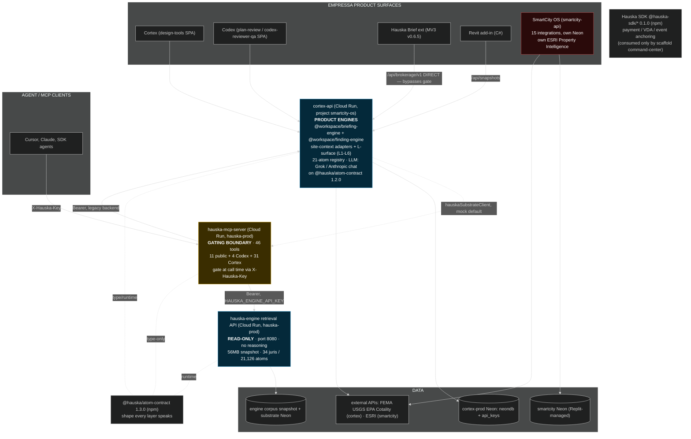
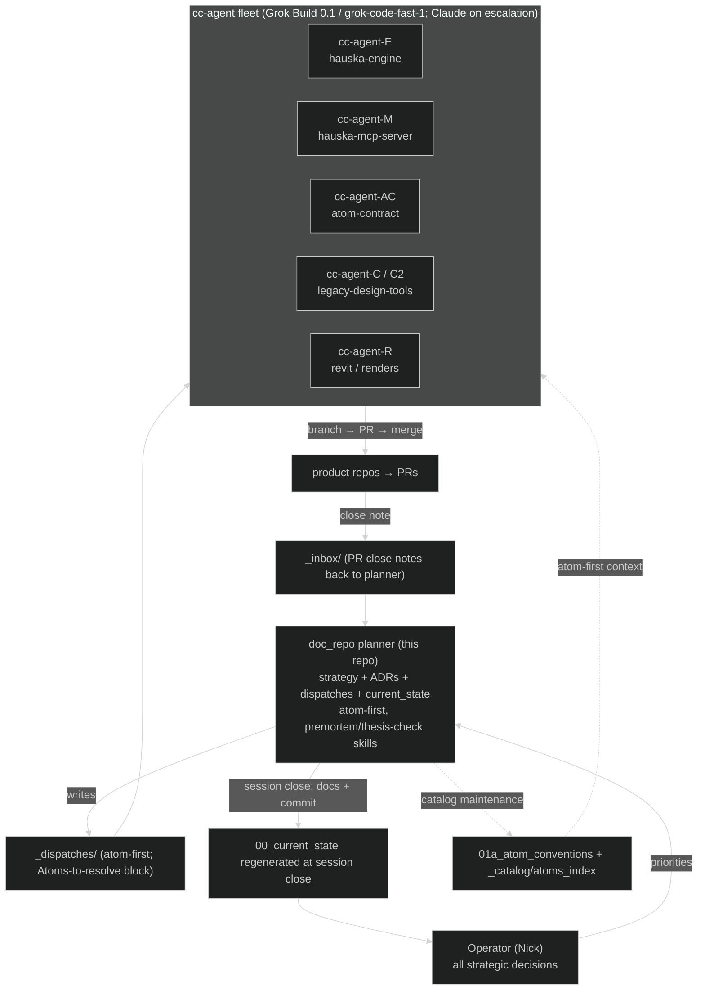
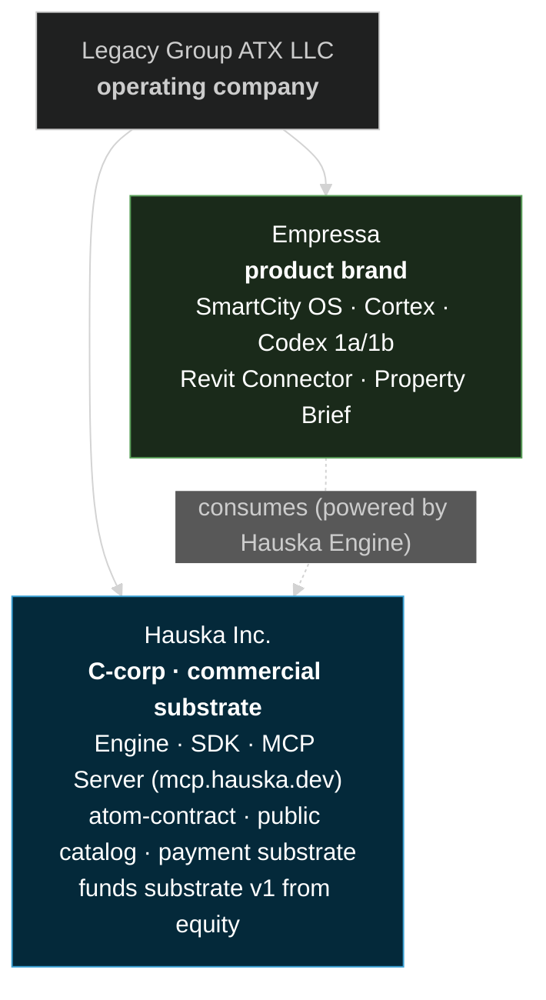
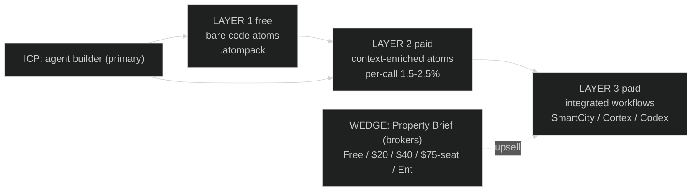
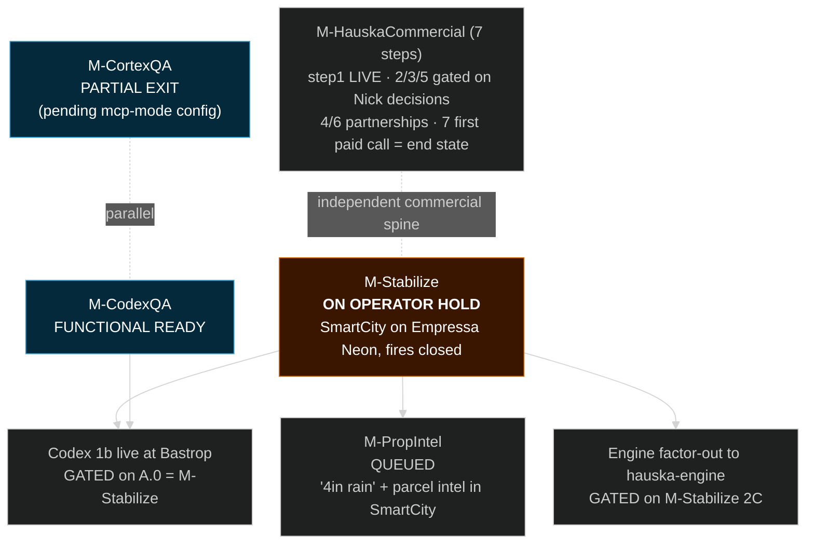

# Portfolio master map

> **Purpose.** One place to see the whole portfolio in focus: every repo and what it actually is today, how the spine fits together, the dev process that produces it, the GTM engine, and the autonomous maintenance engine. Built from a live cross-repo recon on 2026-06-01 (not from the doc set, which had drifted — see [Doc-drift corrections](#doc-drift-corrections)). This is the orientation map (verified topology); [`00d_portfolio_roadmap_reference.md`](00d_portfolio_roadmap_reference.md) is the honed planned-work roadmap, [`00_current_state.md`](00_current_state.md) remains the rolling fires-and-sprints snapshot, and [`07_product_line_summary.md`](07_product_line_summary.md) remains the product value-prop summary.
>
> **Recon basis.** Five read-only repo passes on 2026-06-01 against `hauska-engine`, `legacy-design-tools` (cortex-api), `hauska-mcp-server`, `hauska-atom-contract`, `empressaio_tech_smartcity_os`, `hauska-brief-extension`, `Hauska SDK`, `legacy-revit-sensor`. Branch/commit per repo in the ground-truth table.

## 1. What runs where (verified ground truth)

| Repo (local) | Layer | What it IS today | Deploy state | Atom contract |
|---|---|---|---|---|
| `hauska-engine` | Hauska spine | Code ingest + atomization + eval + **read-only retrieval API** (port 8080). No product reasoning, no LLM. 56MB snapshot, 34 jurisdictions / 21,126 atoms (2 public-free, 32 platform-internal). New `packages/workspace/` for brokerage property-workspace atoms. | **LIVE** Cloud Run `hauska-retrieval-api`, `hauska-prod`, us-central1 | `@hauska/atom-contract@1.3.0` (runtime) |
| `hauska-mcp-server` | Hauska spine | The gating boundary. **46 MCP tools** (11 public + 4 Codex + 31 Cortex), product gate at call time via `X-Hauska-Key` (malformed/unknown keys 401; only the no-header anonymous path is public). Calls hauska-engine retrieval API and cortex-api legacy backend. | **LIVE** Cloud Run `hauska-prod` (since 2026-05-21); `mcp.hauska.dev` mapping pending | `@hauska/atom-contract@^1.1.0` (type-only) |
| `hauska-atom-contract` | Hauska spine | The atom shape every layer speaks. Framework primitives + `./testing` + `./encumbrances` (ADR-020/021) + `./workspace` (brokerage). | **PUBLISHED** npm `@hauska/atom-contract@1.3.0` (manual publish) | is the contract |
| `legacy-design-tools` (cortex-api) | Empressa product engine | The product reasoning monorepo. `@workspace/briefing-engine` + `@workspace/finding-engine` + site-context adapters + L-surface (L1-L6) + 21-atom registry. LLM: Grok primary, Anthropic for chat. | **LIVE** Cloud Run `cortex-api`, project `smartcity-os`, us-central1 | `@hauska/atom-contract@1.2.0` (migration DONE) |
| `empressaio_tech_smartcity_os` | Empressa product | City platform. 15 integrations (MyGov, Samsara, FirstDue, OpenGov, PowerBI, ESRI, Verkada, Calendar, Compass, Property Intelligence, etc.). Self-contained. | **LIVE** Cloud Run `smartcity-api` (+ staging), us-central1, Neon (Replit-managed) | **none** (not integrated; Codex 1b is the trigger) |
| `hauska-brief-extension` | Empressa product | Chrome MV3 extension (v0.6.5), property briefs on MLS/Zillow/Redfin. Calls cortex-api `/api/brokerage/v1` **directly, bypassing the MCP gate**. | Sideload only (not on Web Store) | renders atoms from API payload |
| `Hauska SDK` | Hauska spine (commerce) | CNS Protocol SDK: payment, VDA, event anchoring, IPFS retrieval. 12 packages, v0.1.0. Crypto USDC rail is real (on-chain Transfer-event verification, Base/ETH/Polygon); fiat is a **Circle stub** (placeholder URL + TODO, zero Stripe code); revenue routing/splitting not built (single facilitator wallet). Dormant since 2026-04-05. | **PUBLISHED** npm `@hauska-sdk/*@0.1.0` (publish unverified). Consumed only by a scaffolded `command-center` app. | peer to the contract |
| `legacy-revit-sensor` | Empressa product (bridge) | C# Revit 2026/2024 add-in. Pushes model snapshot + sheet PNGs to cortex-api `/api/snapshots` (`x-snapshot-secret`). IFC export working (v0.2). | Compiled add-in; clean | consumer of `detail-callout-spec` |

The one-line takeaway: the **Hauska spine is real and deployed** (contract published, engine and MCP on Cloud Run), the **product reasoning lives in cortex-api** (not in hauska-engine), and **SmartCity OS is still an island** that touches none of it yet.

**Deploy-state update (2026-06-09 recon, [`_research/2026-06-09_cross_repo_recon.md`](_research/2026-06-09_cross_repo_recon.md)).** Three deltas to this table since the 06-01 pass. (1) The gate now registers and serves **57 tools** (main `src/tools.ts`; the 46 figure above is the 06-01 count), deployed rev `hauska-mcp-server-00007-njc`, `/health` ok with all four deps wired. (2) A **second prod service `api-server`** (`api-server-00003-wix`, legacy-design-tools-prod, `/api/healthz` ok) now serves alongside cortex-api; it is not yet characterized (brokerage/brief + snapshot backend vs thin BFF) and the master diagram in §2 predates it. (3) The retrieval API serves the corpus live (21,126 atoms) but its **substrate Neon observability DB is unwired** (`/healthz/` reports `not_configured`); PR #68 wires it. cortex-api is at `00140-dax` serving real anthropic findings (the full build-out + Miami arc #141-156 merged and deployed).

**Scoped-tenant pattern (2026-06-07).** SmartCity OS, the Mox engagement ([`_prospects/mox/2026-06-07_mox_engagement_plan.md`](_prospects/mox/2026-06-07_mox_engagement_plan.md)), and the brokerage extension are three instances of one shape: a scoped tenant with custom surfaces on the shared, gated spine, same theology (calibration + sovereignty, the deposit loop, the gate). Custom surfaces (a city dashboard, Mox ops-finance apps) are tenant-specific, not forks. Bringing SmartCity onto the spine (it is an island today) is the same work as onboarding Mox. Both force the same dependency chain, which this elevates from roadmap to load-bearing: **ADR-005 multitenancy** (per-tenant private store + tenant `accessPolicy` at the gate; the gate gates by product today, not tenant), **ADR-008 engine extraction** (gate-front the property/parcel + plan-review engines so a tenant consumes through the gate, not by reaching cortex-api directly), and **arrow two** ([`04a`](04a_arrow_two_calibration_capture.md); the deposit loop is the calibration mechanism, and the tenant-partitioned evidence ledger is the sovereignty guardrail). Planned and scaffolded 2026-06-07: the sequenced plan is [`54_tenant_leg_sprint.md`](54_tenant_leg_sprint.md); ADR-005 is scaffolded as the portfolio multitenancy ADR [`80_adrs/adr_005_multitenancy.md`](80_adrs/adr_005_multitenancy.md) (Layer A gate + Layer B storage); the ADR-008 tenant-leg slice is the gate-front seam, distinct from the repo factor-out ([`_decisions/2026-06-07_adr008_gate_front_seam_scoping.md`](_decisions/2026-06-07_adr008_gate_front_seam_scoping.md)). Verified against live source: the gate has no tenant field, `accessPolicy` is declared-but-unenforced, the arrow-2 Phase 1 ledger already partitions on `jurisdictionTenant`.

## 2. Master system diagram (verified topology)

Three things this asserts. The brokerage extension and SmartCity OS both sit outside the gate (extension calls cortex-api directly; SmartCity touches nothing Hauska). The MCP-to-cortex edge is now bidirectional in principle (cortex's outbound client exists but defaults to mock). And the engine is live, so the catalog surface is no longer dark.

For the destination architecture (two shared engines, everything through the gate, per-tier context gating) and the today-vs-vision delta, see [`_research/2026-06-01_shared_engines_vision_and_current_state.md`](_research/2026-06-01_shared_engines_vision_and_current_state.md). Note that doc inherits the pre-recon "engine dark / cortex on empressa-atom" framing and needs a correction pass.

## 3. The two logical engines

One product-engine codebase (cortex-api), two logical capabilities. Per ADR-008 the destination is the `hauska-engine` repo, but today the reasoning is in cortex-api as workspace packages.

| Engine | Where today | Primary jobs | Key outputs | Consumers |
|---|---|---|---|---|
| **Property / parcel** | `@workspace/briefing-engine` + `brokerageSiteContext` + `siteTopographyIngest` in cortex-api | geocode, site-context adapters (FEMA/USGS/EPA/Cotality), briefing composition, topography (DEM/contours, 2D.1 built) | `parcel-briefing`, `briefing-source`, `site-topography`, `brief-run` atoms | Cortex, Brief extension, future SmartCity Parcel Intel |
| **Plan review** | `@workspace/finding-engine` in cortex-api | code retrieval, full-pass findings, adjudication (accept/edit/reject), comment letters | `finding`, `submission`, `decision-event`, deliverable-letter atoms | Codex reviewer-qa, future SmartCity Plan Review |

Plan review **consumes** property/parcel context; the two should compose, not duplicate. The "4 inches of rain" capability (hydrology/rainfall reasoning) is the property engine's missing piece: topography ingest (2D.1) is built, drainage + rainfall simulation (2D.2/2D.3) are not.

## 4. Dev process (the fleet loop)

Settled standard per HR-12: default models Grok Build 0.1 (agentic) and grok-code-fast-1 (speed), Claude on escalation; every dispatch carries an "Atoms to resolve" block; the planner owns the atom catalog. Per-repo single-agent ownership across the three spine repos (AC/E/M).

## 5. GTM engine and autonomous maintenance engine

Both already exist as canonical diagrams; reused here rather than duplicated.

**GTM engine.** Sensor surface (extension installs, card shares, comms, conversions, support, content, deal flow) → telemetry with consent flags → triage → worker pool (outbound, persona, onboarding, pricing, support, content, deal-flow) → policy tier gate (Tier 0 auto through Tier 3 design-call) → action + verify → steward agent as the single human interface, escalating to human specialists. Source: [`90_runbooks/diagrams/gtm_loop.mermaid`](90_runbooks/diagrams/gtm_loop.mermaid). Plan context: [`76_empressa_wedge_90d_operating_plan.md`](76_empressa_wedge_90d_operating_plan.md), [`76a_operator_autonomous_loops.md`](76a_operator_autonomous_loops.md).

**Autonomous maintenance engine (self-healing loop).** App surface → telemetry → durable observation log → triage (bug / degradation / friction / opportunity / noise) → worker pool → policy tier gate (Tier 0 safe auto-fix, Tier 1 auto-merge if green, Tier 2/3 to steward) → action (PR/config/hotpatch) → verify (canary, re-measure) → rollback on regression. Steward agent is the single human interface; drift watcher monitors agent behavior. Source: [`90_runbooks/diagrams/self_healing_loop.mermaid`](90_runbooks/diagrams/self_healing_loop.mermaid).

Status note: both loops are designed (90d operating plan) but not yet built as running systems. The GTM telemetry plane and the maintenance observation log are roadmap, not deployed. cortex-api has an in-flight GTM observation layer (uncommitted on a feature branch as of recon).

## 6. Entity and brand structure

Rule that governs every placement decision: substrate (catalog, engine, MCP, contract, reasoning, payment) is Hauska; product surfaces are Empressa; products are branded forward, the engine is acknowledged as "Powered by Hauska Engine" (ADR-008). The buyer of the Hauska layer is the **agent operator**; ECI (Empressa Company Intelligence) is the internal dogfood instance on the same contract.

## 7. Commercial and GTM structure

**Tier model** (per [`08_tiered_access_model.md`](08_tiered_access_model.md)). Layer 1 free: bare code-reference atoms, `.atompack` export, maximum distribution. Layer 2 paid: context-enriched atoms (adjudication-record, per-reviewer-pattern, comparable-project-precedent, lineage). Layer 3 paid: integrated workflows (SmartCity OS, Cortex, Codex 1a/1b, Revit Connector). The "sell reasoning, not data" rule applies across all tiers — every output carries reasoning chain, citation, confidence, timestamp.

**Revenue model** (per [`14_pricing_framework.md`](14_pricing_framework.md)). Layer 2 is per-call by default with optional stream subscription; take rate settled at a 1.5 to 2.5 percent range (exact number sets at first paid call). Rails: crypto USDC on Base/ETH/Polygon is **built and tested** (`@hauska-sdk/payment` v0.1.0); fiat rail is **Circle** (selected 2026-05-21, near-greenfield build, only a placeholder checkout function exists). Revenue routing (source-actor split) is designed but not enforced; revenue share is contractually promised, not yet substrate-settled.

**ICP** (ratified 2026-05-21): primary buyer is the agent builder on the Anthropic SDK building permit/zoning/diligence workflows; secondary is the Cursor/coding-agent user; enterprise reseller deferred.

**The commercial wedge** is Property Brief to brokers ([`76_empressa_wedge_90d_operating_plan.md`](76_empressa_wedge_90d_operating_plan.md)). Tier ladder: Free (5/mo), Home $20/mo, Pro $40/mo, Team $75/seat/mo, Enterprise custom. 90-day gates: day 14 ten internal briefs, day 45 Valerie five live listings, day 75 first paid pilot + E&O bound, day 90 $80K+ ARR run-rate or $150K pipeline. Five-year base ladders to ~$500M ARR (wedge + vertical + data + transaction). Upsell doors from a brief: high complexity to Cortex, code language to Codex, municipal badge to SmartCity OS, API volume to Hauska MCP.

**Pipeline and partnerships** (per [`71_pipeline.md`](71_pipeline.md), [`73_partnerships.md`](73_partnerships.md)). Bastrop is the anchor customer and the partnership template (Sylvia; pioneering-first-city narrative). Mox Living is the live prospect (Miguel Arce; lead with accounting close, not parcel intel). Valerie Thompson (eXp Austin) is the Property Brief design partner. Publisher partnerships: General Code / eCode360 (outreach scheduled 2026-05-30; largest access-blocked bucket); ICC and NFPA are prospective standards-body licensors (one ICC deal clears the Layer 1 model-code base for the whole catalog).

## 8. Roadmap milestone ladder

**Active sprints as of 2026-06-01.** Property Brief data wave (blocked on PR #134 merge). Cortex QA backlog burndown (cc-agent-C, final WS-G phase). Substrate v1 / Hauska commercialization (Step 1 live, Wave 2 gated on Nick decisions B pricing and C GTM channels). Bastrop 31a maintenance (Phase 0-2 parallel-safe, YELLOW). M-Stabilize on operator DB hold.

**The three critical paths.** Codex 1b live at Bastrop and M-PropIntel both gate on M-Stabilize releasing the operator DB hold, then engine-quality eval cycles (not implementation hours). The "4 inches of rain" capability had its Cortex 40d phases 2D.2 (drainage) and 2D.3 (rainfall sim) land in PR #142 (2026-06-06, running on the native D8 fallback; pysheds sidecar bake is a fast-follow); what remains is the port to SmartCity. First revenue gates on Nick's pricing (Decision B) and GTM-channel (Decision C) calls plus the Circle fiat-rail build.

**Substrate v1 status.** Phase 0 decisions all closed. MCP server and retrieval API live on Cloud Run. Corpus (committed snapshot 2026-05-26, per [`_research/2026-06-06_cross_repo_recon.md`](_research/2026-06-06_cross_repo_recon.md)): 34 jurisdictions / 21,126 atoms, all passing — supersedes the earlier 2702/5 figure. Two jurisdictions are public-free (Bastrop 193, Grand County/Moab 285; ~478 atoms); the other 32 are platform-internal. State external figures with that split, never a bare headline. Hard-kill cost checkpoint CLEAR. Cotality 8-adapter data-layer pack merged (PR #141, 2026-06-06); Cotality is the sole parcel/property spine (Regrid purged 2026-06-17). Sync 5 (remaining TX cities) deferred to demand-pull.

**Parked, with reason:** ECI atomization (internal, behind commercial spine), intent atoms ADR-016 (v2 candidacy), firm tenancy ADR-009 / Codex 1a (post-Bastrop-live), Hauska SDK external motion (post-commercial decision), Starlink/IoT (warm only), Jarrell/M9 (P3), 3D site assembly (2D-first).

## 9. Holistic housekeeping list

Loose ends found in recon, grouped by where they live. Product-repo items route to Nick or a cc-agent (planner does not execute in product repos). Doc-repo items the planner can clean directly at session close.

### Doc-drift corrections (highest priority for a clean start)

1. [`44_mcp_cortex_architecture_map.md`](44_mcp_cortex_architecture_map.md) — stale on three facts: cortex-api atom-contract migration is DONE (not a can-kick), the MCP-to-cortex edge is no longer one-directional, hauska-engine is deployed (not dark). Needs a refresh pass.
2. [`00_current_state.md`](00_current_state.md) — engine/MCP deploy state and the 40-vs-46 tool count should be reconciled.
3. [`_research/2026-06-01_shared_engines_vision_and_current_state.md`](_research/2026-06-01_shared_engines_vision_and_current_state.md) — current-state diagram inherits the pre-recon framing; correct the "engine dark / empressa-atom" notes.
4. Tool count drift: server registers 46. **Recategorized 2026-06-06** to the recon's split (11 public + 4 Codex + 31 Cortex); the earlier 5+6+18+17 grouping was wrong. Atom-contract published is 1.3.0; corrected in `CLAUDE.md` and this map 2026-06-06.
5. **Fiat-rail drift — APPLIED 2026-06-06 in `CLAUDE.md` (now Circle, per `_decisions/2026-05-21_fiat_rail_circle.md`).** [`14_pricing_framework.md`](14_pricing_framework.md) was already Circle. **Still pending:** [`74_commercial_agreements.md`](74_commercial_agreements.md) and the [`44_mcp_cortex_architecture_map.md`](44_mcp_cortex_architecture_map.md) refresh (item 1).
6. **Corpus count — RECONCILED 2026-06-06.** Both 2414 and 2702 are dead; ground truth is 34 jurisdictions / 21,126 atoms (committed snapshot), stated with the public-free (2 juris, ~478) vs platform-internal (32 juris) split. Corrected in `CLAUDE.md` and this map; still to propagate to external-facing docs before any share.

### Product-repo loose ends (route to Nick / cc-agents)

7. `hauska-engine` — WIP uncommitted on `feat/neon-warmup-pilot-load`; `.tmp-recon/` exploration cruft (May probes, old tarball, sample PDFs); stale worktrees in `P:\tmp` (mission, saginaw, schertz). Regional clones (e-central/-houston/-north/-west) are legitimate Sync 5 ingest worktrees.
8. `legacy-design-tools` — 6 uncommitted GTM-observation files on `cortex/extension-public-client-key`; orphaned worktrees (`.claude/worktrees/recon-add-jurisdiction`, `track-b-ifc-ingest`); 4 orphaned sibling clones with upstream gone (`ldt-V1-1`, `-V1-2`, `-V1-3-rebase`, `-V1-1-fixup`) plus `-c2` and `-r` feature clones.
9. `hauska-mcp-server` — 3 untracked files; `mcp.hauska.dev` custom-domain mapping pending; `LEGACY_BACKEND_API_KEY` rotation owed (flagged exposed in cutover).
10. `hauska-atom-contract` — untracked `_sessions/`, `docs/`, `publish-approve-1.3.0.ps1`; npm publish is manual (no CI publish action).
11. `empressaio_tech_smartcity_os` — on `recon/bastrop-platform-health-check`, 1 ahead of main, 7 untracked recon markdowns to commit or drop; stale `archive/*` and `backup/*` branches; retired Replit config still present; 2 Verkada writes flagged guard-or-remove; `wo-manager-sync` Scheduler job failing (Chromium lock, pinned).
12. `hauska-brief-extension` — 15 uncommitted files on `extension/zero-config-consumer-v065`; manifest version (0.6.5) ahead of package.json (0.5.0).
13. `Hauska SDK` — submodule drift in `archive/demos/pinata-demo`; stale `RECON_2026-05-18.md`.

### doc_repo residual (planner can clean at session close)

14. Large uncommitted/untracked set at session start (many `M` and `??` files from prior sessions in the 75-series, 76-series, 77/78/79 strategy docs, 80_meetings/, several new runbooks). Needs a commit-batch sweep so tomorrow starts clean.

## 10. Adjustments to consider (for the realignment session)

The architecture is closer to the substrate vision than the docs imply. The spine is deployed and the contract migration is done. The real gaps to decide on:

The property/plan-review engines are factored as workspace packages inside cortex-api but not extracted to the `hauska-engine` repo per ADR-008. Resolved for the tenant leg (2026-06-07, [`_decisions/2026-06-07_adr008_gate_front_seam_scoping.md`](_decisions/2026-06-07_adr008_gate_front_seam_scoping.md)): the tenant leg needs only the gate-front seam (generalize the brief service-seam so tenants consume the engines through the gate; logical decoupling, engines stay workspace packages), not the physical repo factor-out. The repo move stays on its M-Stabilize Phase 2C gate per the 2026-06-06 unfrozen decision.

SmartCity OS is the biggest island. It has its own ESRI-based Property Intelligence that overlaps the property engine, and no atom-contract integration. Decide whether the "4 inches of rain" capability gets built once in the shared property engine and ported, or continues to diverge in SmartCity's own stack.

The verified contents of the analysis engines (site-context, hydrology, plan-review, code corpus, subsurface) and the spine robustness roadmap now live in [`55_spine_data_intelligence_stack.md`](55_spine_data_intelligence_stack.md), with the all-inclusive spine COGS. Key gaps flagged there: the plan-set decomposition + per-discipline agent conductor is not built; accessibility standards (A117.1/ADA/FHA) and subsurface soils/geology are absent; finding confidence is uncalibrated. Four spine dispatches are teed for deployment.

**Full engine extraction committed (2026-06-07).** Resolved: the engines are extracted out of cortex-api into the spine. Target topology - `hauska-engine` gains a new `engine-api` reasoning service (sibling to the read-only `retrieval-api`) plus `packages/engine-core` and `packages/adapters`; cortex-api thins to a product BFF (UI/session/auth/ingest, no engines); every app (Cortex, Codex, Brief extension, SmartCity) consumes the spine through the one MCP gate, no ungated path. Decision: [`_decisions/2026-06-07_full_engine_extraction_and_data_packages.md`](_decisions/2026-06-07_full_engine_extraction_and_data_packages.md); sprint: [`56_engine_extraction_sprint.md`](56_engine_extraction_sprint.md). Scaffold the engine home now (parallel-safe); the physical lift is gated behind M-Stabilize Phase 2C (verified NOT started). The in-flight cortex-api builds (subsurface adapters merged PR #145; plan-set decomposition pending rebase) are interim migration cargo. The §3/§10 "engines live in cortex-api" lines describe the current state; the target is the spine.

The brokerage extension bypasses the gate. Decide whether per-tier gating needs to route through the MCP server for the brokerage surface, or whether direct cortex-api access is acceptable for v0.

The GTM and maintenance engines are designed but not built. Decide whether either gets a build sprint in the next leg or stays roadmap.

Hauska SDK is published and real but consumed by nothing in production. Decide whether it stays parked until paid-tier surfaces need it, or gets a first integration.

## Revision history

- **2026-06-01 (origin):** Built from live cross-repo recon. Captures verified topology, dev-process loop, the two logical engines, and the holistic housekeeping list. Supersedes scattered architecture facts in the 44 map (which needs its own correction pass).
- **2026-06-01 (commercial + roadmap pass):** Added entity/brand structure (§6), commercial and GTM structure (§7), and the roadmap milestone ladder (§8) from a doc-set synthesis, so the master map covers GTM and sequencing alongside the technical topology. Renumbered housekeeping (§9) and adjustments (§10).
