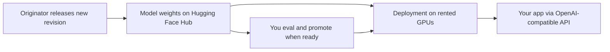

# Open-weight LLM inference on rented GPU

Internal research guide. Read this when the requirement is **full control over model weights**, **ability to take updates from the model originator**, and **inference on someone else's hardware** (no owned datacenter). Complements the on-prem tier menu in [`hardware_reference_architecture.md`](hardware_reference_architecture.md) and the client-facing cloud/local framing in [`client_brief_local_and_cloud.md`](client_brief_local_and_cloud.md).

Captured 2026-08-02 from operator research session. Pricing and provider SKUs move fast; re-verify dollar figures before committing.

---

## The target pattern

Three separable layers:

You control **which model, which version, fine-tunes, and where it runs**. A GPU host runs the silicon. If a vendor gets expensive or unreliable, redeploy the same weights elsewhere. That is the opposite of a closed API (GPT-4, Claude, Gemini API) where you never hold checkpoints and cannot follow upstream releases on your own schedule.

This doc is the **cloud open-weights path**. The desk-side and on-prem path stays in the hardware reference architecture. Both can coexist in a portfolio deployment (local executor + cloud frontier, per the org-chart framing in the client brief).

---

## What "full control" means

| Level | What you get |
|-------|--------------|
| **Open weights** | Download checkpoints (`.safetensors`, GGUF), run locally or on rented GPU, fine-tune |
| **Open weights + permissive license** | Above, plus commercial use with minimal restrictions (Apache 2.0, MIT) |
| **Fully open research** | Weights + training code + (sometimes) training data (OLMo, Apertus, Pythia) |

Closed API models do **not** satisfy weight control regardless of how "open" the vendor's tooling claims to be.

### What you get on the cloud open-weights path

- Choose model and version; pin revisions deliberately
- Move to another GPU host without retraining your application
- Fine-tune and own resulting adapters or weights (license permitting)
- Upgrade on your schedule when the originator releases new checkpoints
- No dependency on OpenAI/Anthropic closed APIs for the served model

### What you do not get (without more ops or a different architecture)

- Physical ownership of GPUs
- Zero trust in the inference host (the provider sees prompts at inference time unless you add rare E2E patterns)
- Guaranteed stable pricing or SKU lifetime from a managed API (mitigation: open weights + portable deploy)

---

## Model families with a good "stay current" story

Prioritize models that (a) publish on [Hugging Face Hub](https://huggingface.co/models), (b) use permissive licenses, and (c) maintain an active release train.

### Permissive licenses (Apache 2.0 / MIT)

Best default when the goal is commercial freedom and portability.

| Family | License | Update pattern | Notes |
|--------|---------|----------------|-------|
| **Qwen 3** | Apache 2.0 | Frequent Hub releases | Strong coding and multilingual; safe production default |
| **Gemma 4** | Apache 2.0 | Google pushes revisions to Hub | Multimodal options |
| **gpt-oss** (20B / 120B MoE) | Apache 2.0 | OpenAI open-weight line | Strong reasoning; 20B fits ~16GB quantized, 120B needs ~80GB |
| **DeepSeek V3 / V4** | MIT (recent releases) | Major version bumps on Hub | Frontier coding and reasoning |
| **Mistral Small 3.x** (24B) | Apache 2.0 | Steady smaller-model updates | Good cost/latency |
| **Microsoft Phi-4** (14B) | MIT | Compact release train | Edge and small-GPU friendly |
| **Apertus 1.5** (8B / 70B) | Apache 2.0 | Weights + data + training code | ETH/EPFL fully open stack |

**Llama 4** (Scout, Maverick): custom Llama license, very permissive for most commercial use but not OSI-open. Broad tooling support; Meta release train.

**Kimi K3** (2.8T MoE): weights on Hub under modified MIT; check license for your use case. Frontier multimodal; heavy GPU requirements.

### Specialized open-weight families

| Category | Examples |
|----------|----------|
| Code | Qwen2.5-Coder, Qwen3-Coder, DeepSeek-Coder, Codestral (Apache 2.0) |
| Vision / multimodal | LLaVA, Qwen-VL, Gemma 4 vision, Kimi K3 |
| Speech | Whisper (MIT), XTTS-v2 |
| Image / video | Stable Diffusion 3, FLUX (check license tier), CogVideoX, Wan |

### Fully open research (maximum transparency)

Weaker on frontier benchmarks but you control checkpoints, training code, and sometimes data.

- **OLMo 2** (Allen AI)
- **Pythia** (EleutherAI)
- **BLOOM** (BigScience)
- **Apertus**

Use when auditability and reproducibility matter more than raw capability.

### Models to avoid for this use case

Anything that exists **only** behind a vendor API with no public weights. You cannot take originator updates you never receive.

---

## Hardware sizing (rented GPU, not owned)

| Rented GPU / RAM | Good starting points |
|------------------|----------------------|
| **8–16 GB** | Phi-4 14B (quantized), Gemma 4 2B/4B, Qwen3 4B/8B, gpt-oss-20b (quantized) |
| **24–48 GB** | Qwen3 32B, Mistral Small 24B, Llama 4 Scout |
| **80 GB+** | gpt-oss-120b, DeepSeek-V3/V4 (MoE), Llama 4 Maverick, Kimi K3 |

MoE models (Mixtral, DeepSeek, gpt-oss, Kimi K3) activate a subset of parameters per token, so frontier quality does not require loading the full parameter count into VRAM at once.

---

## Three deployment patterns

Ranked by control versus operational burden.

### 1. Dedicated endpoint from Hugging Face Hub (recommended default)

**How it works:** Select a model on Hugging Face (e.g. `Qwen/Qwen3-32B-Instruct`). Provision a **Dedicated Inference Endpoint** on Hugging Face, RunPod, Baseten, or Together. Point at a repo + revision tag.

**Why it fits the three requirements:**

- Weights stay tied to the originator's Hub repo
- New originator releases appear as new tags; you promote after eval
- No datacenter; pause/stop billing when idle (HF Endpoints, GPU pods)

**Tradeoff:** Hourly dedicated GPU cost, or per-token on serverless tiers.

### 2. Managed open-model API (least ops, least weight custody)

**Providers:** Together AI, Fireworks AI, Groq (for supported models)

**How it works:** OpenAI-compatible API. Provider hosts Llama, Qwen, DeepSeek, gpt-oss, etc.

| Pros | Cons |
|------|------|
| Zero infra; fast start; originator models often day-one | Usually do not hold the checkpoint on your account |
| Per-token billing for bursty workloads | Fine-tune portability varies by provider |

**Use when:** Speed matters now and you accept "portable because open weights exist elsewhere, even if we don't store files today."

Together Dedicated Model Inference (2026): supports multiple deployments behind one endpoint, canary/blue-green/rolling updates, bring-your-own weights or adapters from Hugging Face, S3, or local upload.

### 3. BYO weights on GPU cloud (maximum control, most ops)

**Providers:** RunPod, Lambda Labs, Modal, Vast.ai, Spheron

**How it works:** Rent H100/L40S, deploy vLLM or llama.cpp, set `MODEL_NAME=org/model` from Hugging Face. You own restarts, scaling, monitoring, and security patches.

**Pros:** Full stack control, custom Docker, merge fine-tunes, exact quantizations  
**Cons:** You operate the serving layer

**Use when:** Custom merges, private fine-tunes, or strict data residency on a specific machine type.

### Provider comparison (2026 snapshot)

| Provider | Billing | Best for |
|----------|---------|----------|
| Hugging Face Inference Endpoints | Hourly while running; pause to stop | Direct Hub-to-managed deploy |
| RunPod (Serverless / Pods) | Per-second serverless; hourly pods | GPU flexibility, vLLM templates |
| Together AI | Per-token serverless; hourly dedicated | Broad catalog, LoRA fine-tuning, rolling deploys |
| Fireworks AI | Per-token | Fast open-model inference |
| Baseten | Custom / per-second | Custom and fine-tuned production |
| Modal | Per-second | Python-native serverless containers |
| Lambda Labs | Hourly | Straightforward dedicated GPU rental |

Hugging Face **Inference Providers** (2025+) routes many serverless calls to third-party backends (Fireworks, Together, Groq, etc.) rather than HF-hosted infrastructure alone. Strong for discovery and prototyping; verify production reliability on your chosen backend.

---

## Upgrade workflow (do not get left behind)

Operational discipline most teams skip:

1. **Pin a revision.** Do not float on `main`. Example: `Qwen/Qwen3-32B-Instruct` at tag `v1.0` or a commit hash.
2. **Watch the Hub repo.** Hugging Face notifications or RSS for new tags.
3. **Stage the new weights** on a second endpoint (blue/green). Platforms like Together support canary and rolling deploys behind one stable URL.
4. **Run your eval suite** on staging: regression prompts, latency, cost per task.
5. **Swap production** when staging passes. Keep the old revision for one week for rollback.

You stay on originator improvements without forced day-one upgrades (new releases sometimes regress on domain-specific tasks).

### Fine-tune and merge tooling (you own the artifacts)

| Tool | Role |
|------|------|
| **Unsloth** | Fast LoRA/QLoRA/full fine-tune |
| **LLaMA-Factory** | GUI + CLI for many architectures |
| **Axolotl**, **TRL** | Standard training loops |
| **MergeKit** | Merge fine-tunes into one checkpoint |

LoRA/QLoRA produces a small adapter you control. Full fine-tune rewrites all weights and needs more VRAM and data.

### Local inference engines (same weights, different host)

- **llama.cpp** / **Ollama**: CPU + GPU, GGUF quantizations
- **vLLM** / **SGLang**: production GPU serving
- **Transformers** (Hugging Face): direct Python inference

---

## Recommended starter stack

For **control + originator updates + no datacenter + minimal ops**:

| Layer | Choice |
|-------|--------|
| **Model** | **Qwen3-32B-Instruct** or **gpt-oss-20b** (Apache/MIT, Hub-native, widely hosted) |
| **Hosting** | **Hugging Face Dedicated Endpoints** or **RunPod serverless** with vLLM template pointed at that Hub repo |
| **App integration** | OpenAI-compatible client (swap base URL + API key; application code unchanged) |
| **Fine-tune (optional)** | LoRA on Together or Unsloth on a RunPod pod; store adapters in private HF repo or S3; load at serve time |
| **Upgrade policy** | Quarterly Hub tag check; stage, eval, promote |

### Cost ballpark (order of magnitude, 2026)

- Dedicated H100: roughly **$3–8/hr** depending on provider (24/7 adds up fast)
- Serverless / per-token: roughly **$0.03–$0.50 per 1M tokens** depending on model size
- Intermittent workloads: serverless or pausable endpoints beat always-on dedicated

Re-verify before budgeting; Community Cloud tiers (RunPod, Vast) trade cost for reliability variance.

---

## Decision matrix

| If you want… | Start here |
|--------------|------------|
| API + easy upgrades, minimal infra | HF Dedicated Endpoints or Together dedicated + Hub-pinned models |
| Own serving config and fine-tunes | RunPod or Lambda + vLLM + Hub pulls |
| Cheapest experiments | Together or Fireworks serverless; migrate to dedicated when traffic stabilizes |
| Maximum auditability over capability | OLMo 2 or Apertus on rented GPU |
| Desk-side sovereignty (no cloud inference) | See [`hardware_reference_architecture.md`](hardware_reference_architecture.md) |

---

## License gotchas

Not all "open weight" is equally free:

| License type | Examples | Watch for |
|--------------|----------|-----------|
| Apache 2.0 / MIT | Qwen, gpt-oss, Mistral, Phi, DeepSeek (recent), Apertus | Straightforward commercial use |
| Custom (usually fine) | Llama, Gemma, Kimi K3 | Attribution, user-count, redistribution clauses |
| Tiered / NC variants | Some Stable Diffusion, FLUX tiers | Non-commercial restrictions on some weights |

For **zero vendor dependency + commercial freedom**, prioritize Apache 2.0 / MIT families first.

---

## Relationship to portfolio posture

- **Tenant data sovereignty** (ADR-005 / ADR-017): rented GPU inference still sends prompts to the host unless architected otherwise. On-prem or private dedicated tenancy may be required for some enterprise tenants; see the hardware sovereignty overview guardrails.
- **Agent fleet model** ([`21_ai_first_dev_flow.md`](../21_ai_first_dev_flow.md)): this guide covers **where inference runs**, not which agent roles use which model. The org-chart split (cheap local executor vs cloud frontier planner) applies unchanged.
- **LLM cost economics** ([`25a_atom_principle_llm_economics.md`](../25a_atom_principle_llm_economics.md)): atom-structured context reduces tokens per answer regardless of hosting choice; open weights on rented GPU address **vendor lock-in and upgrade path**, not token compression.

---

## Sources and confidence

Captured 2026-08-02. Provider pricing and model availability change frequently; treat costs as snapshots.

| Source | Topic |
|--------|-------|
| [openai/gpt-oss](https://github.com/openai/gpt-oss) | gpt-oss weights, Apache 2.0, Hugging Face download |
| [OpenAI gpt-oss announcement](https://openai.com/index/introducing-gpt-oss/) | Model sizing and licensing |
| [MoonshotAI/Kimi-K3](https://github.com/MoonshotAI/Kimi-K3) | Kimi K3 open weights, license |
| [Together AI inference platform update](https://www.together.ai/blog/the-production-platform-for-open-weight-ai-inference) | Dedicated endpoints, BYO weights, rolling deploys |
| [Fireworks AI provider comparison](https://fireworks.ai/blog/best-llm-api-providers) | Managed inference landscape |
| [Hugging Face Hub](https://huggingface.co/models) | Primary weight distribution |
| [12britz/awesome-free-models](https://github.com/12britz/awesome-free-models) | Curated open-weight catalog (community-maintained; verify before cite) |

Confidence: **architecture and licensing patterns** are high confidence. **Specific dollar rates and provider feature matrices** are medium confidence; re-verify at procurement time.

---

## Open items

- [ ] Operator choice: default model family for portfolio inference (Qwen3 vs gpt-oss vs Llama 4) pending workload profile (coding vs general vs multimodal)
- [ ] Operator choice: preferred hosting tier (HF Dedicated vs Together dedicated vs RunPod BYO) pending expected QPS and budget ceiling
- [ ] If this becomes a customer-facing sovereignty tier, spin a brief from [`client_brief_local_and_cloud.md`](client_brief_local_and_cloud.md) pattern (cloud open-weights as third path between pure SaaS API and desk-side box)
