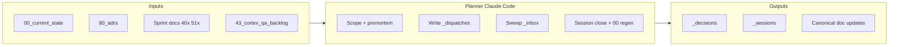
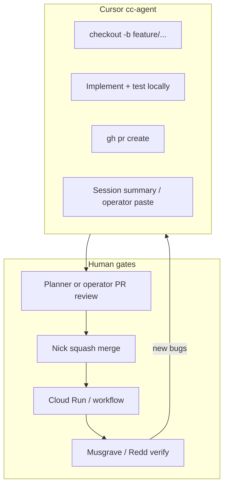

# Cursor usage and development workflow observatory

> **What this is.** A evidence-based snapshot of how Cursor is used across the portfolio, synthesized from local artifacts on the Cente workstation (`C:\Users\cente\.cursor\projects\`) and the canonical `doc_repo` fleet log. It complements [`21_ai_first_dev_flow.md`](21_ai_first_dev_flow.md) (the intended process) with observed behavior (what actually happened in May 2026).
>
> **What this is not.** Cursor account analytics (model mix, token spend, Tab vs Agent hours). Those live in the [Cursor usage dashboard](https://cursor.com/dashboard/usage) and are not readable from the IDE or this repo.

## Methodology and limitations

### Data sources used

| Source | Location | What it captures |
|--------|----------|------------------|
| Agent transcripts | `C:\Users\cente\.cursor\projects\<workspace>\agent-transcripts\**\*.jsonl` | Cursor Agent chat turns (user prompts, tool calls, assistant replies) |
| Session summaries | `doc_repo/_sessions/*.md` | Formal close-outs: outcomes, PRs, operator handoffs (137 non-archived files in window) |
| Dispatches | `doc_repo/_dispatches/*.md` | Scoped work orders pasted into Cursor agents (48 files) |
| Current state | `00_current_state.md` | Rolling fleet status, active sprints, watch list |
| Git log | `doc_repo` commits since 2026-04-01 | Planner commit cadence and topics |

### Hard limitations

1. **Incomplete chat history.** Only conversations persisted as `.jsonl` under `.cursor/projects` are visible. Deleted chats, other machines, and Claude.ai browser planner sessions are mostly absent from transcripts (planner work appears as `_sessions` files instead).
2. **Session files over-count activity.** Many `_sessions` entries are agent reports filed by the planner after paste-back, not separate Cursor windows.
3. **No model telemetry.** Cannot infer Auto vs Opus vs Composer usage from local files.
4. **Observation window.** Primary density is **2026-05-18 through 2026-05-23** (substrate close, Cloud Run cutover QA, rendering sprint, TX ingest). Earlier May activity is sparser in transcripts but present in `_sessions`.

### Confidence

| Claim type | Confidence |
|------------|------------|
| Fleet roles, clone paths, dispatch pattern | High (canonical docs + repeated session evidence) |
| Workstream time allocation | Medium-high (`_sessions` tagging; theme grep) |
| Transcript volume by repo | High (file counts) |
| "How Nick prompts agents" | Medium (sampled transcripts; representative patterns) |

---

## Executive summary

Cursor is used as **mission control for a multi-repo agent fleet**, not as a single-developer autocomplete environment. The operating pattern:

1. **Planner** (Claude Code in `doc_repo`, sometimes Claude.ai browser) owns strategy, dispatches, `_inbox` sweeps, and `00_current_state.md`.
2. **cc-agent-\*** Cursor sessions execute scoped builds in **dedicated clones** (`P:\legacy-design-tools`, `P:\legacy-design-tools-r`, `P:\legacy-design-tools-c2`, `hauska-engine`, etc.).
3. **Nick (operator)** owns merge, Cloud Run deploy, secret rotation, traffic shift, and **live QA** on real engagements (Musgrave, Redd).
4. Work products flow back: **PR → merge → deploy → verify → session summary → planner rollup**.

The last ten days are dominated by **Cortex post-cutover QA** (adapter failures, BIM/IFC, audience gates), **rendering parity sprint (40e)**, **site-context / Regrid / EPA**, and **Sync 5 Texas jurisdiction ingest**. Intensity peaked on **2026-05-19** (27 session files) and stayed high through **2026-05-23**.

A deliberate **mode shift on 2026-05-23** moved build heavy-lifting to Cursor agents while the doc_repo planner stays in planning/filing/dispatch design (noted in `00_current_state.md`).

---

## Evolution vs `21_ai_first_dev_flow.md`

[`21_ai_first_dev_flow.md`](21_ai_first_dev_flow.md) (last updated 2026-05-11) describes the intended fleet. Observed May 2026 deltas:

| Topic | Doc (May 11) | Observed (May 23) |
|-------|----------------|-------------------|
| Agent IDs | `cc-agent-1` … `cc-agent-4` | Named agents: **C, C2, E, R, M, AC** (+ retired **D**) |
| Planner | Claude.ai browser, non-executing | **Claude Code in doc_repo** executes commits; second planner for rendering sprint |
| Replit | Still a deploy path for legacy-design-tools | **Cutover complete**; cortex-api on Cloud Run + cortex-prod Neon |
| Parallelism | 4 agents per workspace | **Multiple clones per repo** (C vs C2 vs R on legacy-design-tools) per [`agent_workspace_hygiene`](90_runbooks/agent_workspace_hygiene.md) |
| QA | Implied in work cycle | Formal **QA-NN backlog** ([`43_cortex_qa_backlog.md`](43_cortex_qa_backlog.md)), customer-zero loop |
| Deploy | Nick via Cloud Shell | **Agent-runnable** `cloud-run-deploy.yml` jobs (PR #81): `run-migrations`, `deploy-canary`, `shift-traffic` |

This observatory should be read as an addendum, not a replacement for `21` or [`20_agent_operating_rules.md`](20_agent_operating_rules.md).

---

## Cursor workspace inventory (local transcripts)

Counts from `C:\Users\cente\.cursor\projects\` on 2026-05-23:

| Cursor project folder | Transcript files | JSONL lines (approx) | User turns (approx) | Primary activity |
|----------------------|------------------|----------------------|---------------------|------------------|
| `p-Empressa-Trading` | 23 | 1,486 | 245 | Separate product (not Hauska fleet) |
| `p-legacy-design-tools` | 17 | 1,227 | 98 | Cortex/Codex: QA, rendering, deploy, PR hygiene |
| `p-empressaio-tech-smartcity-os` | 10 | 331 | 38 | SmartCity OS stabilization |
| `p-Hauska-SDK` | 6 | 43 | 11 | SDK / payment substrate |
| `p-doc-repo` | 5 | 79 | 11 | Planner/strategy in-repo (includes this analysis thread) |
| `p-hauska-MCP-server` | 3 | 107 | 14 | MCP server tools and deploy |
| `p-hauska-engine` | 2 | 40 | 7 | Jurisdiction ingest (underrepresented vs `_sessions`) |
| Other (single-digit) | 7 | — | — | Revit sensor, drafts, experiments |

**Total:** ~78 transcript files across all projects.

**Interpretation:** Engineering Cursor time concentrates on **`legacy-design-tools`** (Cortex). `doc_repo` Cursor use is lighter in transcripts because much planner output is committed directly in Claude Code sessions without a separate long transcript trail. **`hauska-engine`** ingest volume shows up more in `_sessions` (27 cc-agent-E files) than in local transcript count (2), suggesting ingest work may run on another window/machine or longer sessions not all persisted here.

---

## Session log analysis (`_sessions/`)

### Volume by date (non-archived)

| Date | Session files |
|------|---------------|
| 2026-05-05 – 05-10 | 14 |
| 2026-05-11 | 8 |
| 2026-05-15 – 05-16 | 11 |
| 2026-05-18 | 14 |
| 2026-05-19 | **27** |
| 2026-05-20 | 6 |
| 2026-05-21 | 22 |
| 2026-05-22 | 19 |
| 2026-05-23 | 19 |

### Volume by agent tag (filename heuristic)

| Agent / role | Session files |
|--------------|---------------|
| cc-agent-E | 27 |
| planner (`claude_code`) | 26 |
| cc-agent-C | 24 |
| planner (`claude_ai`) | 17 |
| cc-agent-M | 13 |
| cc-agent-R | 6 |
| cc-agent-AC | 5 |
| cc-agent-C2 | 4 |
| cc-agent-UI | 2 |
| Other / untagged | 11 |

### Workstream themes (keyword classification, approximate)

| Theme | ~Files | Representative work |
|-------|--------|---------------------|
| Cortex / QA / site context / rendering | 29 | QA-22 adapters, BIM/IFC, 40e rendering, Regrid, CalEPA |
| Sync 5 / ingest | 19 | TX cities, Municode, ICC prebuild, Grand County |
| Substrate v1 / atom contract | 8 | Phase 0, dispatch reallocation, npm publish |
| Codex reviewer | 8 | CDX-3/4/5/9, reviewer surfaces |
| SmartCity / M-Stabilize | 5 | Deploy recovery, hold |
| MCP / commercialization | 3 | Stream 2C/2D, launch prep |
| ECI | 2 | Registry naming, sprint kickoff |

---

## Dispatch inventory (`_dispatches/`)

48 dispatch artifacts; concentration by target agent:

| Agent | Dispatches |
|-------|------------|
| cc-agent-C | 16 |
| cc-agent-E | 8 |
| cc-agent-AC | 6 |
| cc-agent-M | 6 |
| cc-agent-R | 2 |
| cc-agent-C2 | 2 |
| Legacy numbered (1–4), EVAL, UI, D | 8 |

Dispatches are **paste-ready contracts**: read-first doc list, scope boundaries, acceptance criteria, branch naming, workspace ownership clause, and reporting format back to `_inbox/` or planner.

---

## Current fleet model (as of 2026-05-23)

From [`00_current_state.md`](00_current_state.md) §4:

| Agent | Repo / clone | Role |
|-------|----------------|------|
| **planner** (doc_repo Claude Code) | `P:\doc_repo` | Portfolio planning, `_inbox` sweep, `00`, dispatches, decision records |
| **rendering planner** (second doc_repo session) | `P:\doc_repo` | Rendering sprint docs (40e); does not sweep `_inbox` or edit `00` |
| **cc-agent-C** | `P:\legacy-design-tools` | Cortex QA build, adapters, Codex Phase 2 surfaces |
| **cc-agent-C2** | `P:\legacy-design-tools-c2` | Site context 2D: USGS DEM, Regrid, topography worker |
| **cc-agent-R** | `P:\legacy-design-tools-r` | Rendering parity sprint (40e): mnml power tools, inline dashboard |
| **cc-agent-E** | `hauska-engine` clone | Sync 5 Texas ingest, ICC prebuild |
| **cc-agent-M** | `smartcity-os` | M-Stabilize (**on hold** 2026-05-21) |
| **cc-agent-AC** | (dormant) | Atom contract migration complete |
| **Nick** | — | Merge, deploy, secrets, live QA, binary decisions |
| **Replit Agent** | (scoped, not fleet) | UI overhaul under discussion 2026-05-23 |

**Retired:** `cc-agent-D` (invented name, retired 2026-05-22).

**~7 working seats** including Nick (per CLAUDE.md stakeholders section).

---

## Comprehensive development workflow

### 1. Strategic layer (doc_repo)



**Planner responsibilities observed in May 2026:**

- Regenerate [`00_current_state.md`](00_current_state.md) at session close ([`current_state_protocol`](90_runbooks/current_state_protocol.md)).
- Write or update sprint docs (e.g. [`40e_cortex_rendering_parity_sprint.md`](40e_cortex_rendering_parity_sprint.md), [`40d_cortex_site_context_sprint.md`](40d_cortex_site_context_sprint.md)).
- File [`_decisions/`](_decisions/) with reversal criteria when operator commits direction.
- Run **premortem-check** on load-bearing moves (partnership-first scoping, rendering sprint scope).
- **Two-planner split (2026-05-22):** QA planner owns `_inbox` + `00`; rendering planner owns 40e docs only.

**Commit pattern (doc_repo):** Dense `docs:` commits on 2026-05-22–23, often inbox sweeps consolidating multiple agent reports into `00` and watch list.

### 2. Dispatch layer (operator → Cursor agent)

Typical dispatch structure (from `_dispatches/` and agent session reports):

1. **Read first** — canonical docs, prior session, relevant ADR.
2. **Workspace ownership** — one clone; refuse alien HEAD/uncommitted state ([`agent_workspace_hygiene`](90_runbooks/agent_workspace_hygiene.md)).
3. **Scope** — files allowed / forbidden; branch prefix (`cortex/`, `2d/`, `render/`, `stream-1d/`).
4. **Acceptance** — tests, PR shape, max N files, held for operator merge.
5. **Reporting** — session summary path, `_inbox` drop, blockers verbatim.

**Operator activation:** Paste dispatch into a **fresh or continued** Cursor Agent chat pinned to the correct clone. Common operator phrases in transcripts: *"execute this for me"*, *"keep cranking through everything autonomously"*, *"commit and push then move into A.5"*.

### 3. Execution layer (cc-agent in product repos)



**Engineering norms** (from [`20_agent_operating_rules.md`](20_agent_operating_rules.md)):

| Rule | Operational meaning |
|------|---------------------|
| HR-1 | GitHub web UI tiebreaker on branch state disputes |
| HR-2 | Push to origin required; Replit checkpoints do not count |
| HR-3 | Deploy ≠ live; curl probe or live UI verify before "done" |
| HR-4 | Drizzle TS schema is source of truth |
| HR-8 | Verbatim `git` / `gh` / log output in reports |

**Typical cc-agent outputs:**

- Feature PRs with unit/integration tests (`pnpm --filter ... test`).
- Diagnostic PRs (logging, throw-path capture) held for merge before next debug pass.
- Runbook-driven infra (`cloud-run-deploy.yml` workflow actions).

### 4. Merge and deploy layer (operator)

**legacy-design-tools / cortex-api** (post–2026-05-20 cutover):

| Step | Mechanism |
|------|-----------|
| Merge | Nick, GitHub squash merge |
| Build image | `cloud-run-deploy.yml` on push to `main` or manual workflow |
| Migrate DB | `run-migrations` workflow (after PR #81) or Cloud Shell `psql` for idempotent SQL |
| Deploy | `deploy-canary` or `gcloud run deploy` + **`update-traffic --to-latest`** |
| Secrets | `gcloud secrets` + `--update-secrets` on service (mount ≠ traffic shift) |

Canonical references:

- [`90_runbooks/legacy_design_tools_replit_to_cloud_run_cutover.md`](90_runbooks/legacy_design_tools_replit_to_cloud_run_cutover.md)
- [`90_runbooks/cloud_run_canary_deploy.md`](90_runbooks/cloud_run_canary_deploy.md)

**Known deploy gotchas** (documented in sessions):

- `--update-secrets` does not shift traffic to new revision.
- `REGRID_API_KEY` must be mounted on Cloud Run service env, not only created in Secret Manager.
- Production DB drift caused IFC 500 until migration `0015` applied (schema behind code).

### 5. QA layer (operator-led, agent-supported)

**Customer-zero engagements:** Musgrave_Residence_B, Redd (and variants). Operator exercises full UI loop; files QA-NN items in [`43_cortex_qa_backlog.md`](43_cortex_qa_backlog.md).

**QA cycle observed May 22–23:**

1. Deploy revision → operator browser test.
2. New failure → planner triages → dispatch cc-agent-C or C2.
3. Agent ships fix PR → operator merge + redeploy.
4. Repeat until structural closure (e.g. QA-32 BIM loop closed 2026-05-23).

**Representative QA threads:**

| ID | Arc |
|----|-----|
| QA-30/31 | Audience gate 403 on renders + BIM GET |
| QA-32 | IFC ingest `materialized_at` / briefing coupling |
| QA-33/35 | Viewer CSS + ingest supersession |
| QA-22 | Federal/county adapters (EPA, FCC, Grand County → Regrid, CalEPA) |
| Rendering | 40e inline dashboard vs modal (operator screenshot feedback) |

### 6. Closure layer (documentation)

| Artifact | When |
|----------|------|
| `_sessions/YYYY-MM-DD_<topic>_<agent>.md` | Agent or planner session close |
| `_decisions/YYYY-MM-DD_<slug>.md` | Binary commitment with reversal criteria |
| `00_current_state.md` | Planner regen at portfolio session close |
| Canonical doc `last_updated` | When state in that doc changed |

Courier pattern ([`session_close_template`](90_runbooks/session_close_template.md)) still applies when browser planner hands off to doc_repo Cursor for commits.

---

## Interaction patterns (from transcripts)

### Pattern A — Dispatch execution

Long initial user message = full dispatch or handoff prompt. Agent reads docs, implements across many files, runs tests, opens PR. Operator intermittently: *merge*, *resume*, *push*.

**Example (cc-agent-R / 40e):** Handoff after PR #105–#108 → autonomous A.2–C workstreams → PR #109 bulk merge → PR #110 CI triage → operator feedback on white screen and inline dashboard UX.

### Pattern B — Operator runbook execution

Step-by-step `gh` / `gcloud` / `psql` commands pasted from planner. Agent runs commands, reports verbatim output. Used for: auth refresh (`gh auth refresh -s workflow`), canary deploy, secret mount fixes.

### Pattern C — Recon then decision

Agent investigates only (vendor eval, EPA retirement, FCC WAF). No PR or PR marked recon-only. Planner or operator files `_decisions/`. Follow-on dispatch for implementation.

**Examples:** Regrid vs ATTOM (C + C2), EPA Path 1a → CalEPA mirror opt-in.

### Pattern D — Debug with screenshots

Operator attaches browser screenshots. Agent correlates with code paths (EngagementDetail tests, SiteContextTab, BimModelViewport). Common in rendering and QA-33.

### Pattern E — Git/CI hygiene

Conflict resolution, flaky test fix, PR body heredoc fixes, branch recovery after workspace incident (2026-05-22 cc-agent-R HEAD on wrong branch).

---

## Active workstreams (snapshot 2026-05-23)

### Cortex / Design Tools QA (cc-agent-C, C2)

- **Phase 1–2 merged** (geocode, overlays, deploy workflow, migrations runner).
- **Site context:** Regrid SCOPE B (PR #104), FCC dropped (PR #102), CalEPA EPA mirror (branch ready, PR pending), DEM worker (PR #107, migration 0016 collision with cc-agent-R).
- **Backlog:** [`43_cortex_qa_backlog.md`](43_cortex_qa_backlog.md); Phase 3 features gated on canary verification.

### Cortex rendering (cc-agent-R)

- **40e ~90% code-complete:** PR #109 merged; PR #110 open (CI test updates for inline kickoff panel).
- **Prod dark** until `RENDERS_PROD_ENABLED` + `MNML_RENDER_MODE=live` flipped together.

### Sync 5 Texas ingest (cc-agent-E)

- Continuous statewide ingest; Tier 1–2 + metro batch PRs #38–#47.
- Blocked cities → General Code partnership track ([`73_partnerships.md`](73_partnerships.md)).

### Codex (cc-agent-C, historical)

- CDX-3/4/5/9 merged; reviewer QA in Design Tools Findings tab per relocation decision.

### Substrate / Hauska (cc-agent-E, AC; dormant AC)

- `@hauska/atom-contract` on npm; engine ingest operational; ECI atomization queued.

---

## Workstation and clone map (Cente box)

Observed paths (verify on machine before relying):

| Path | Purpose |
|------|---------|
| `P:\doc_repo` | Canonical docs, planner |
| `P:\legacy-design-tools` | cc-agent-C primary |
| `P:\legacy-design-tools-r` | cc-agent-R rendering |
| `P:\legacy-design-tools-c2` | cc-agent-C2 site context |
| `P:\hauska-mcp-server` | Local MCP (when running) |
| `C:\Users\cente\.cursor\projects\` | Per-workspace agent transcripts |

[`22_workstation_inventory.md`](22_workstation_inventory.md) lists Nick box paths; Cente box layout partially TBD in that doc. This observatory confirms **Cente** as an active Cursor host for the fleet.

**MCP in Cursor:** `hauska-cortex` and `hauska-codex` servers configured (per IDE MCP list); used for smoke and tool-driven QA, not the Design Tools web app's runtime path.

---

## Friction and incident patterns (recurring)

| Pattern | Impact | Mitigation (documented) |
|---------|--------|-------------------------|
| Shared working tree between agents | Lost commits, wrong HEAD | [`agent_workspace_hygiene`](90_runbooks/agent_workspace_hygiene.md) |
| Prod DB schema behind code | 500s after deploy | `run-migrations` workflow + manual psql apply |
| Traffic not on latest revision | "Deployed" but old behavior | `update-traffic --to-latest --clear-tags` |
| Secret created but not mounted | Adapter "not configured" | `--update-secrets` on Cloud Run service |
| Migration number collision | Two PRs both `0016_*.sql` | Operator renumber + fixture sync (active 2026-05-23) |
| Network-layer adapter failures | QA-22 red pills | Throw-path diagnostics; Regrid baseline; FCC drop; CalEPA for EPA |
| Planner vs agent doc concurrent edit | Merge conflicts on `00` | Two-planner territory split |

---

## Recommendations

### For operator

1. **Export Cursor usage dashboard** monthly (models, cost) if you want model-mix analysis; local files cannot provide it.
2. **Keep clone discipline** when spinning Replit Agent or new UI agent; assign branch prefix and path allowlist up front.
3. **Resolve migration 0016 collision** before merging PR #107 (cc-agent-C2) per `00` watch list.
4. **Open CalEPA PR** (`cortex/qa22-epa-dig`) when ready for merge + redeploy + Redd retest.

### For planner

1. **Refresh [`21_ai_first_dev_flow.md`](21_ai_first_dev_flow.md)** fleet table to named agents and dual-planner model (this observatory can seed that edit in a future session).
2. **Refresh [`22_workstation_inventory.md`](22_workstation_inventory.md)** Cente paths (`legacy-design-tools-r`, `-c2`, transcript root).
3. Re-run this observatory quarterly or after major workflow change (e.g. Cloud Agents, SDK automation).

### For cc-agent dispatches

Continue including: workspace ownership, branch prefix, held-for-operator-merge, verbatim verification, and explicit "do not edit `00`" when not the QA planner.

---

## Appendix A — Key canonical references

| Doc | Use |
|-----|-----|
| [`21_ai_first_dev_flow.md`](21_ai_first_dev_flow.md) | Intended fleet and work cycle |
| [`20_agent_operating_rules.md`](20_agent_operating_rules.md) | Hard rules HR-1–HR-8, SR/PC |
| [`90_runbooks/agent_workspace_hygiene.md`](90_runbooks/agent_workspace_hygiene.md) | One clone per agent |
| [`43_cortex_qa_backlog.md`](43_cortex_qa_backlog.md) | QA item register |
| [`00_current_state.md`](00_current_state.md) | Live fleet and fires |
| [`CLAUDE.md`](CLAUDE.md) | Planner operating instructions |

## Appendix B — How to regenerate this report

```powershell
# Transcript counts per project
Get-ChildItem "$env:USERPROFILE\.cursor\projects" -Directory | ForEach-Object {
  $n = (Get-ChildItem $_.FullName -Recurse -Filter "*.jsonl" -EA SilentlyContinue).Count
  if ($n -gt 0) { [PSCustomObject]@{ Project = $_.Name; Transcripts = $n } }
} | Sort-Object Transcripts -Descending

# Session files by agent (doc_repo)
Get-ChildItem "P:\doc_repo\_sessions" -Filter "*.md" -Recurse |
  Where-Object { $_.DirectoryName -notmatch 'archived' } |
  ForEach-Object { $_.Name }
```

Pair with `git log --since=...` on `doc_repo` and product repos for commit velocity.

---

## Model layer (2026-05-23)

**Fleet policy (not product runtime).** As of 2026-05-23 the portfolio committed to Grok-first cc-agents and atom-first context retrieval per HR-12 ([`20_agent_operating_rules.md`](20_agent_operating_rules.md)), decision [`_decisions/2026-05-23_grok_atom_fleet_migration.md`](_decisions/2026-05-23_grok_atom_fleet_migration.md), and reconciliation plan [`21c_grok_atom_migration_plan.md`](21c_grok_atom_migration_plan.md).

| Layer | Default | Escalation |
|---|---|---|
| cc-agent dispatch execution | Grok Build 0.1 | grok-4.3 / grok-4.20-reasoning, then Claude |
| Focused code / tests | grok-code-fast-1 | Grok Build 0.1 |
| doc_repo planner | Grok Build 0.1 | Claude on failure |
| Cortex api-server (product) | Anthropic Sonnet | Unchanged — see [`_research/2026-05-23_cortex_ai_model_inventory.md`](_research/2026-05-23_cortex_ai_model_inventory.md) |

**Telemetry gap.** Local agent transcripts still do not expose model mix. HR-12 is policy until the operator exports the [Cursor usage dashboard](https://cursor.com/dashboard/usage) monthly. [`21_ai_first_dev_flow.md`](21_ai_first_dev_flow.md) is the canonical fleet + model doc post-Phase 2.

**Atom-first dispatch.** New dispatches lead with `Atoms to resolve:` per [`01a_atom_conventions.md`](01a_atom_conventions.md) and [`_dispatches/_template.md`](_dispatches/_template.md). Historical dispatches (48 files through 2026-05-23) retain legacy "read verbatim" language; do not bulk-rewrite.

---

## Revision history

- **2026-05-23:** Model layer section added (Grok transition, HR-12, telemetry gap).
- **2026-05-23:** Initial observatory authored from Cente workstation local transcripts, 137 `_sessions` files (May 5–23), 48 `_dispatches`, and `00_current_state` as of same date. Requested by operator after Cursor models summary and usage breakdown discussion.
