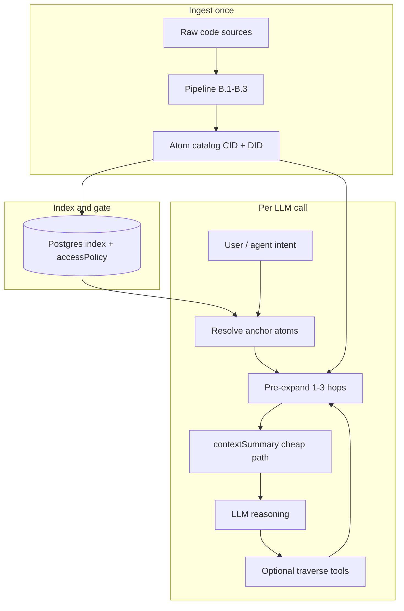

# Atom principle — what it is, how it works, and how it lowers LLM cost

> **Purpose.** Standalone explainer for the atom architecture principle and its LLM cost economics. The full contract spec lives in [`25_atom_architecture_reference.md`](25_atom_architecture_reference.md); the architectural decision record is [`80_adrs/adr_001_atom_architecture.md`](80_adrs/adr_001_atom_architecture.md).

---

## 1. What the atom principle is

The atom principle is the portfolio's foundational data-model bet: **every addressable entity carries its own intelligence**, and applications are surfaces the entity passes through, not owners of meaning.

That idea comes from the **living lineage** observation in Section 1 of the architecture reference: real-world things (parcels, permits, code sections, findings) have histories that predate and should outlast any software that touches them. Traditional apps store snapshots in product-specific tables; strip the app and you get inert rows. Atoms invert that. The entity carries identity, a machine-readable self-description, compositional links to other entities, and an append-only history.

**The atom** is the smallest addressable unit in that model. It is defined by `@hauska/atom-contract` (Hauska commercial substrate, peer to the Hauska SDK per [ADR-018](80_adrs/adr_018_atom_contract_substrate_layer.md)) and bundles four mandatory layers:

| Layer | What it is |
|---|---|
| **Identity** | `entityType`, stable `entityId`, content-addressed `cid`, and (for data-level atoms) `vdaRef` |
| **Context interface** | `contextSummary(scope)` returning prose, typed fields, key metrics, related atoms, provenance |
| **Composition** | Declared slots for owned children and peer references (parcel, findings, code cross-refs, etc.) |
| **History** | Semantic entity memory plus cryptographic event chain (data-level atoms) |

Two categories share the same shape:

- **Data-level atoms** (permit, parcel, `code-section`, finding): real-world referents, VDA-backed, anchored history.
- **App-level atoms** (engagement, briefing, sprint board): workflow containers, same AI read path, lighter write guarantees.

The strategic commitments that follow from this are in ADR-001 and the thesis docs:

1. **Sell reasoning, not data** (Commitment 1): outputs carry reasoning chain, source citation, confidence, timestamp.
2. **AI uniformity**: the LLM never reads raw DB internals; it reads `contextSummary`.
3. **AI as gateway**: users speak in natural language; the system resolves intent to atoms.
4. **One graph, many windows**: SmartCity OS, Cortex, Codex, MCP all consume the same contract.

At portfolio scale as of 2026-05-23, the substrate is live: thousands of `code-section` and related catalog atoms across central Texas (Sync 5 ingest), a production retrieval API, and a deployed Hauska MCP Server wired to that catalog.

---

## 2. How it works (end to end)

### 2.1 Registration and compile-time enforcement

Every atom type registers once via `AtomRegistration<TType>`. TypeScript enforces the contract at build time: missing `contextSummary`, missing render modes, unregistered composition targets, or `piiFields` without scope filtering all fail compilation. This is not convention; it is structural.

Each atom implements **five rendering modes** (`inline`, `compact`, `card`, `expanded`, `focus`). Windows pick modes; atoms do not know which UI they are in.

### 2.2 The context interface (the AI read API)

When any consumer (Compass, Codex finding engine, Cortex briefing, MCP agent) needs to reason about an entity, it calls `contextSummary(scope)` and gets:

```ts
{
  prose: string,              // 1-3 sentence summary
  typed: { entityType, entityId, status, ... },
  keyMetrics: Record<string, unknown>,  // pre-computed fields the model would otherwise ask for
  relatedAtoms: AtomRef[],
  historyProvenance: "native" | "backfill",
  scopeFiltered?: boolean
}
```

Scope awareness is internal to the atom. The same person atom returns different prose for inspector vs citizen vs public scope.

**Cheap path vs expensive path** (Section 4 of [`25_atom_architecture_reference.md`](25_atom_architecture_reference.md)):

- **Cheap**: typed fields from materialized views, prose from templates. Synchronous on every query; target sub-100ms.
- **Expensive**: model-generated narrative from large history. Cached with short TTL; regenerated on new events.

Rule of thumb: if `contextSummary` takes longer than 100ms, it should be cached.

### 2.3 Ingestion: raw code to queryable atoms

The Code Ingestion Pipeline ([`49_code_ingestion_pipeline.md`](49_code_ingestion_pipeline.md)) turns jurisdiction sources into atoms:

```
Raw sources (Municode, eCode360, PDF)
  → B.1 adapters
  → B.2 structural extraction (sections, definitions, cross-refs)
  → B.3 atomization (code-section, code-definition, code-amendment, ...)
  → B.4 retrieval index + eval harness
  → IPFS bodies + Postgres index
```

Per [ADR-019](80_adrs/adr_019_layered_code_substrate.md), codes are **layered**, not monolithic:

- **Layer 1**: model-code base (ICC/NEC), ingested once, referenced by many jurisdictions.
- **Layer 2**: jurisdiction amendment overlay.
- **Layer 3**: local UDC/zoning/subdivision code.

A `jurisdiction-corpus` atom points at shared Layer 1 plus local Layer 2/3. That is the structural answer to scaling onboarding cost, and it also shapes what gets retrieved per query.

### 2.4 Retrieval: graph traversal, not blob search

[ADR-010](80_adrs/adr_010_atom_graph_traversal.md) settles retrieval:

- Atom bodies are **content-addressed** (CID/IPFS).
- Postgres is the **index and access-control gate** (what exists, who can see it, what links where).
- Retrieval is **hybrid**:
  - **Pre-expansion**: engine finds anchor atom(s), walks 1-3 hops, fetches neighborhood, injects into the LLM context.
  - **Tool-call traversal**: LLM invokes `get_atom`, `traverse`, `find_precedent` only when pre-expansion is insufficient.

Cross-references become typed graph edges (`code-cross-reference` → `code-section`), not text fragments. That is how "what does § 5.04(b) actually require?" resolves to specific atoms instead of similarity over whole code PDFs.

The eval harness gates quality before a jurisdiction ships: curated reviewer-realistic queries, **top-3 retrieval**, section-number lookup, cross-ref resolution. Current bar in doc: ~90% top-3, 100% section-number, 95% cross-ref.

### 2.5 Consumption surfaces

| Surface | Role |
|---|---|
| **Retrieval API** (`hauska-engine`) | HTTP query layer MCP and products call |
| **Hauska MCP Server** | Public Layer 1 tools for agent clients (Cursor, Claude Desktop, etc.) |
| **Product engines** (Codex, Cortex, SmartCity) | Layer 2+ reasoning over retrieved atoms |
| **`.atom` / `.atompack` export** ([ADR-012](80_adrs/adr_012_atom_export_format.md)) | Offline/portable distribution with `llm-context.md` bootstrap |

MCP is Layer 1 only by design ([`50_hauska_mcp_server.md`](50_hauska_mcp_server.md)): adjudication records, reviewer patterns, and comparable-project precedent stay in paid product surfaces.

### 2.6 Context assembly migration (the before/after)

SmartCity Compass illustrates the shift ([`26_atom_upgrade_guide.md`](26_atom_upgrade_guide.md) Section 3):

- **V3 (legacy)**: `buildLegacyContext()` reads ~15 data sources and **bulk-injects** everything into the prompt.
- **V4 (atom-backed)**: `buildCuratedContext()` resolves relevant atoms first, then calls `contextSummary()` on each.

Empressa Demo already runs the V4 path in production. SmartCity M3 is the same migration on customer traffic.

---

## 3. How the atom principle lowers LLM cost

"LLM cost" here means inference spend: input tokens, output tokens, and round-trips. The atom model attacks that on several independent axes.

### 3.1 Retrieve small, not dump large

**Without atoms:** a jurisdiction query tends toward "put the code corpus (or big chunks) in context and hope the model finds the right section." That scales linearly with corpus size and blows context windows.

**With atoms:** ingestion produces section-grain `code-section` atoms with section numbers and cross-ref links. The retrieval index returns **top-k** (eval target: top-3 contains the known answer). The LLM sees a few relevant atoms, not thousands of sections.

At ~8,000 central-TX code atoms and growing, the difference between "3 atoms" and "whole UDC in prompt" is orders of magnitude in input tokens per call.

### 3.2 Pre-computed summaries instead of re-deriving context every call

`contextSummary` is designed so the **common path is cheap**:

- Template prose + materialized typed fields + **keyMetrics** pre-populated (days in review, parcel ref, inspector, setback fields, etc.).

That means the model does not need extra turns to ask "who is the inspector?" or "what parcel?" and you do not need a second LLM pass to summarize raw records into prose before the main reasoning pass.

Expensive narrative generation is explicitly **cached**, not run on every request.

### 3.3 Curated context vs bulk prompt injection

The V3 → V4 migration is a direct LLM cost story:

| V3 | V4 |
|---|---|
| ~15 data sources injected every message | Only atoms resolved as relevant to intent |
| Model does relevance search in-context | Engine does relevance search pre-prompt |
| Large, noisy prompt | Smaller, structured prompt |

Tradeoff documented honestly: V4 can do more DB work per atom (10 atoms ≈ 10 summary calls), but each summary is bounded and cacheable, whereas V3 pays a large fixed token tax on every message regardless of query.

### 3.4 Hybrid retrieval bounds context expansion

ADR-010's pre-expansion + tool-call split is a **token budget strategy**:

- Default: 1-3 hop neighborhood only (predictable context size, predictable latency).
- Unusual queries: LLM pays for extra traversal via tools only when needed.

You avoid both extremes: never stuffing the whole graph, never forcing the model to hallucinate links it cannot see.

### 3.5 Structured graph reduces wrong-answer retries

Eval harness metrics (`retrieval-top3`, section-number lookup, cross-ref resolution) exist because **bad retrieval is wasted LLM spend**: the model reasons confidently over wrong sections, users retry, findings get regenerated.

Typed cross-references and section-number indexing make first-pass retrieval accurate. That is a quality gate that doubles as a cost gate. The eval rubric tracks `cost-per-finding-run` and `cost-per-jurisdiction`.

### 3.6 "Sell reasoning, not data" keeps payloads thin

Commitment 1 is commercial and architectural. Commercially, Layer 1 bare code is free; Layer 2 adjudication context is paid ([`08_tiered_access_model.md`](08_tiered_access_model.md)).

Architecturally, the LLM-facing payload is a **reasoning product**:

- Cited atom DID/CID + source document
- Confidence and timestamp
- Interpretation chain

Not verbatim dumps of operational databases or full permit histories on every call. Products charge for the enriched atoms; the prompt carries what is needed to reason, not everything the platform knows.

### 3.7 MCP tools return scoped atom envelopes, not documents

Agent clients call Hauska MCP tools (`search_atoms`, jurisdiction search, etc.) that hit the retrieval API. Each response is atom-shaped with provenance, not a PDF or HTML page.

That matches the post-SaaS thesis ([`09_post_saas_substrate_thesis.md`](09_post_saas_substrate_thesis.md)): agents self-integrate via MCP; they do not need UI-sized payloads to get jurisdictional grounding.

### 3.8 Layered substrate amortizes both compute and retrieval scope

ADR-019's three-layer code model lowers **onboarding compute** (ingest base once, cheap per-city overlay ingest). It also lowers **retrieval scope** for many queries: a city-specific question often resolves to a local amendment atom plus a reference to shared base structure, not a full re-ingest of IBC/IRC for every jurisdiction.

### 3.9 Portable exports reduce repeated bootstrap cost

`.atompack` files with `llm-context.md` (ADR-012) let BYO-LLM users load jurisdictional grounding once per session instead of re-fetching or re-prompting from scratch. The tier model's conversion trigger for Cortex paid tier is explicitly "when prompting volume exceeds comfortable `.atompack` paste per session" ([`08_tiered_access_model.md`](08_tiered_access_model.md)).

---

## 4. Mental model



---

## 5. What it does not claim

Worth separating so expectations stay honest:

- **Atoms do not eliminate LLM cost.** High-value reasoning (Codex findings, Cortex briefings, plan review) still runs live models. Production uses Anthropic for findings/briefings when env modes are `live`.
- **Per-atom DB work can exceed single bulk fetch** if resolution is sloppy or caching is missing. The architecture assumes caching and batched queries.
- **Ingest/onboarding cost** (under $200 compute per jurisdiction) is a separate commitment from **inference cost**. Layered substrate helps both, but they are not the same budget line.
- **Render credits** (mnml.ai, Cortex rendering) are product COGS, not atom-catalog economics.

---

## 6. Bottom line

The atom principle is: **entities are first-class, portable, graph-linked objects with a mandatory AI read API (`contextSummary`), not rows owned by an app.**

It lowers LLM cost by making inference **selective, structured, and cacheable** instead of **bulk, repetitive, and rediscovered every call**:

1. Section-grain retrieval (top-k) replaces corpus-in-prompt.
2. Pre-computed summaries and key metrics replace multi-turn fact gathering.
3. Curated atom context replaces ~15-source prompt injection.
4. Bounded graph pre-expansion plus on-demand tools replaces uncontrolled context growth.
5. Quality-gated retrieval reduces expensive wrong-answer retries.
6. Layered code substrate and tier separation keep each call's payload aligned to what the query actually needs.

---

## References

- [`25_atom_architecture_reference.md`](25_atom_architecture_reference.md) — full contract spec
- [`80_adrs/adr_001_atom_architecture.md`](80_adrs/adr_001_atom_architecture.md) — architectural decision
- [`80_adrs/adr_010_atom_graph_traversal.md`](80_adrs/adr_010_atom_graph_traversal.md) — retrieval pattern
- [`49_code_ingestion_pipeline.md`](49_code_ingestion_pipeline.md) — pipeline stages B.1–B.6
- [`26_atom_upgrade_guide.md`](26_atom_upgrade_guide.md) — V3 → V4 context migration
- [`01a_atom_conventions.md`](01a_atom_conventions.md) — doc_repo portfolio atom catalog (Phase 1 manual)
- [`08_tiered_access_model.md`](08_tiered_access_model.md) — Layer 1 free / Layer 2 paid

## Revision history

- **2026-05-23 (origin):** Drafted from planner session report at operator request. Companion to `25_atom_architecture_reference.md`.
