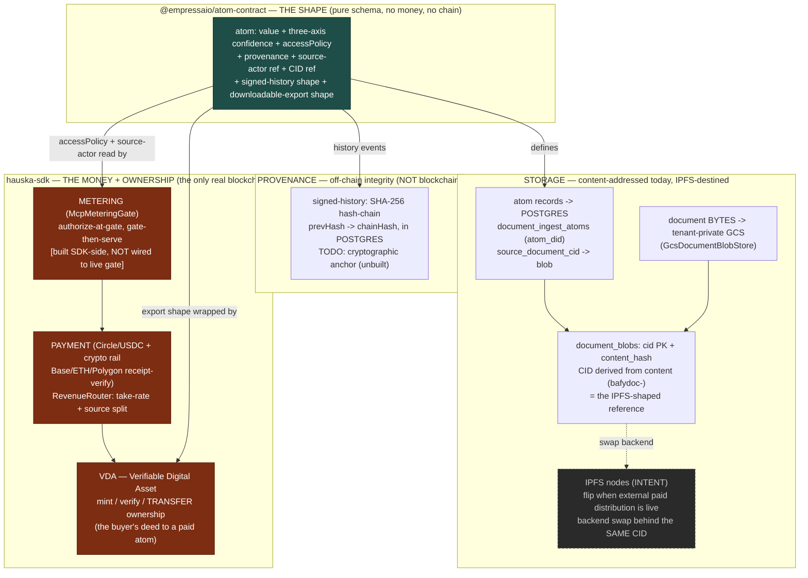
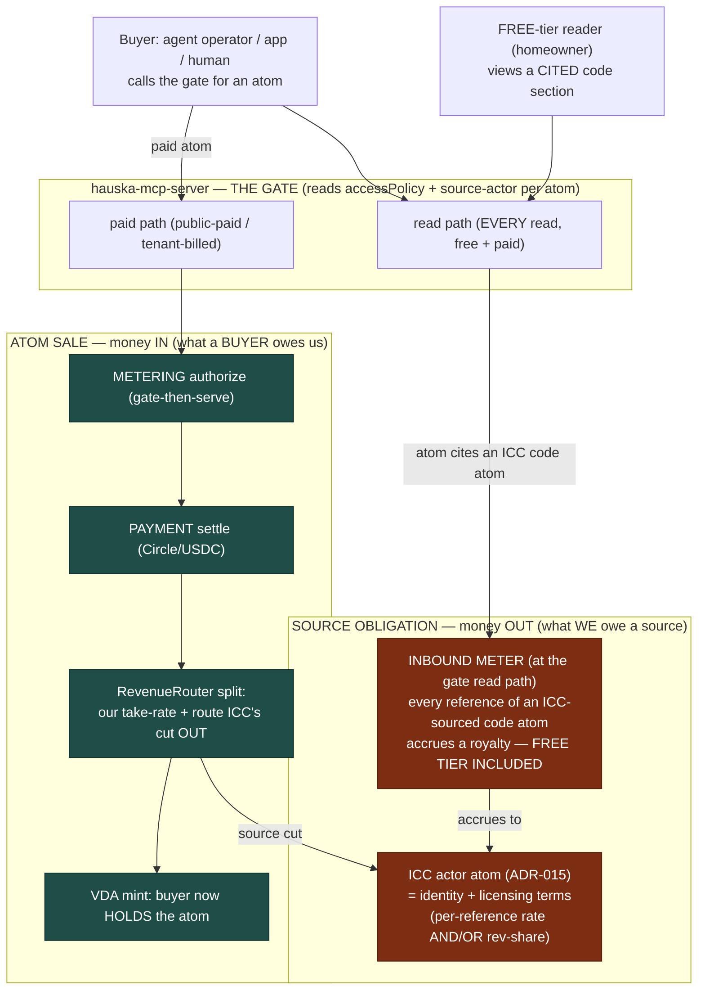

# Monetization, provenance, and storage stack

AUTHORITATIVE (2026-07-23). This is the canonical picture of how an atom is shaped, stored, proven, entitled, and paid for — and, crucially, how money flows BOTH ways: inbound (a buyer pays us for reasoning) and outbound (we owe a data source, e.g. ICC, a royalty for every reference). It supersedes any older diagram or prose sketch of this part of the stack. State claims here were verified against live source 2026-07-23 (an eight-agent code-review fan); where a piece is designed-but-not-yet-wired, it is marked INTENT, not asserted as live.

## The four layers, kept distinct (the thing everyone conflates)

The system is easy to blur because "atom-contract" and "VDA" both sound like they are "about the atom." They are different layers doing different jobs. Hold them apart:

1. CONTRACT (`@empressaio/atom-contract`) = the SHAPE. A published schema: what an atom is (value, provenance, three-axis confidence, accessPolicy, source-actor + licensing metadata, the CID reference, the signed-history shape, the downloadable-export shape). Pure definition. Holds no money, wraps nothing, settles nothing. The grammar of an atom.
2. PAYMENT (`@hauska-sdk/payment`) = the SETTLEMENT. Moves the money and splits it: Circle/USDC fiat rail, the crypto rail (USDC on Base/ETH/Polygon with on-chain receipt verification), and RevenueRouter (take-rate split + route a cut to the source-actor). Verified live and real.
3. VDA (`@hauska-sdk/vda`) = the ENTITLEMENT. Verifiable Digital Asset: mints the buyer's ownership of a paid atom, verifies ownership on later reads, transfers ownership actor-to-actor. The deed, not the thing.
4. METERING (`@hauska-sdk/metering`, `McpMeteringGate`) = the GATE HOOK. Authorizes a paid read at call time (gate-then-serve), decrements bundles, triggers overage checkout. Built on the SDK side; NOT wired into the live gate today (see the honest-state note).

One line each: contract = shape, payment = settle, VDA = entitle, metering = gate.

## Provenance vs blockchain — where each actually lives (a common misconception)

Provenance is NOT on-chain today, and by design it stays off the money chain:

- The contract's signed-history layer is a deterministic SHA-256 hash-chain (prevHash -> chainHash), stored in POSTGRES. Tamper-evident, cheap, high-volume. Source carries a TODO to replace the deterministic chainHash with a cryptographic anchor — so "signed" is aspirational; today it is a hash-chain, not a signature, and not anchored to a blockchain.
- The ONLY real blockchain in the system is in payment + VDA: USDC settlement (Base/ETH/Polygon) and VDA minting/transfer. On-chain because MONEY and OWNERSHIP need it; provenance does not.

The clean line: provenance = content-integrity (hashes in Postgres); blockchain = money + ownership (payment / VDA). The eventual cryptographic anchor for provenance is the bridge between them, and it is unbuilt.

## Storage — content-addressed today, IPFS-destined (verified live)

A hybrid, and it is NOT IPFS yet, but it is shaped for IPFS so the switch is a backend swap behind an unchanged reference:

- ATOM RECORDS live in Postgres (`document_ingest_atoms`, keyed by `atom_did`; migration 004 in hauska-engine). (Richer code-corpus atoms are still snapshot-backed, not durably in Postgres yet — the StoragePort gap the property program's Phase 1 closes.)
- SUPPORTING DOCUMENT BYTES (the PDF, the data table) live in a tenant-private GCS bucket (`GcsDocumentBlobStore`, env `DOC_INGEST_BLOB_BUCKET`).
- THE LINK IS ALREADY CID-SHAPED: `document_blobs` has a `cid` primary key + `content_hash` unique index; the CID (`bafydoc-` prefix) is derived from the content hash, dedup-on-CID. The atom row carries `source_document_cid` back to the blob. So the CID indirection the contract references is REAL and LIVE — the backend behind the CID is just GCS, not IPFS.
- Swapping GCS -> IPFS is a backend swap behind an unchanged CID contract. The SDK already ships IPFS/Pinata + cluster adapters (`@hauska-sdk/retrieval`) not yet wired to the engine blob path.

WHEN TO SWITCH TO IPFS (the trigger, not a date): flip when the first real EXTERNAL PAID-ATOM DISTRIBUTION goes live — the first moment "the buyer holds the asset, not us" stops being a slogan and becomes a requirement (an atom that only resolves through our GCS bucket is one we can revoke; IPFS makes it durable independent of us). Same trigger convinces an adversarial third party (a city official disputing "that's not the document submitted" is answered by a public CID they verify themselves — the same milestone as the provenance cryptographic anchor). Until then GCS-behind-a-CID is strictly better (no IPFS ops burden, no payoff yet). The one discipline to keep NOW: always reference the CID, never the GCS URL directly — that is what keeps the switch cheap.

## The document + atom move together — by reference, and every actor handoff is recorded

- The atom carries `source_document_cid`; because the CID is content-derived, the atom is permanently bound to the exact bytes it was extracted from. They do not move as one file — they move as atom + a content-addressed pointer, which is stronger: the atom is portable and small, the heavy PDF is fetched (and access-gated) only when needed. Anyone holding the atom can re-hash the document to confirm it is unchanged.
- Actor-to-actor handoff (contractor -> architect -> city official) is recorded as EXECUTION atoms (ADR-013, with the purpose field for intent) naming the actor (ADR-015 actor atoms) and the action, with the entitlement transfer carried by VDA ownership-transfer, and the whole sequence made tamper-evident by the signed-history chain. Because atoms default tenant-private and cannot self-escalate (ADR-017), a handoff is fundamentally an ACCESS-POLICY TRANSITION — the next actor gains visibility by policy change, not by copying data around. INTENT/UNVERIFIED: that the plan-review flow emits an actor/execution atom on each step today was not verified; the architecture is defined, the live wiring in plan-review is not confirmed.

## TWO money meters — inbound (we owe a source) and outbound (a buyer owes us)

This is the piece an atom-sale-only view misses, and it is where the ICC obligation lives. Selling an atom is money IN; referencing a licensed source (ICC I-Codes, a General Code partner, TxGIO, Cotality) is money OUT — owed on every reference REGARDLESS of whether we sold anything. A homeowner on the FREE tier who views a cited code section triggers an ICC royalty and zero sale. So a single "meter only when an atom sells through VDA" leaves every free-tier and internal reference as an UNMETERED SOURCE LIABILITY — a licensing-compliance gap, the dangerous kind.

The fix is one identity + two meters, driven by metadata ON THE ATOM:

- SOURCE-ACTOR IDENTITY: each licensed source is an actor atom (ADR-015). ICC's actor atom is referenced by every ICC-derived code atom as its source, and carries the licensing terms (per-reference rate, rev-share %, or both). This is what RevenueRouter's `SourceActorReference` is meant to point at — and it is the placeholder-not-yet-landed the property program flags.
- INBOUND METER (what we owe the source): every REFERENCE/READ of a source-attributed atom — free tier included — accrues an obligation to that source-actor. Runs at the GATE's read path (so it fires on the free path too), NOT in the VDA/payment sale path.
- OUTBOUND ROUTING (what we owe the source out of a sale): when an atom IS sold, RevenueRouter splits the proceeds and routes the source's cut. Runs in the payment/VDA sale path.

ICC touches BOTH: a per-reference royalty (inbound, fires on every cite) AND a revenue share when a paid report includes their content (outbound, fires on sale). Different sources pay differently, which is exactly why the terms live on the atom/source-actor, not hardcoded in the payment path. Same four-layer separation as a customer sale, pointed outbound at a supplier: actor atom = identity, licensing metadata on the atoms = terms, source-obligation meter at the gate = accrual, the SDK = payout.

## TIER 1 — the money + provenance + storage stack

## TIER 2 — the two money flows (inbound sale + outbound source obligation), ICC as the worked example

Reading Tier 2: ICC gets paid on BOTH arrows. The left arrow (inbound meter) fires on EVERY reference including the free-tier homeowner — that is the obligation an atom-sale-only meter misses. The right arrow (RevenueRouter source split) fires only when a paid report actually sells ICC-cited content. One identity (the ICC actor atom), two accrual paths, one payout rail (the SDK).

## Honest current state (do not overclaim in a demo)

- LIVE + VERIFIED: the contract shape; CID-addressed storage (Postgres atoms + GCS blobs behind a content-derived CID); the SHA-256 provenance hash-chain; the SDK's payment (real Circle + real crypto receipt-verify), metering, and VDA modules exist and are real.
- BUILT SDK-SIDE, NOT WIRED TO THE GATE: the metering hook. Today the live gate meters paid reads through STRIPE, not the SDK — the SDK money boundary (ADR-018) is currently violated in live code. Restoring it is named work (swap the gate's read-attribution hook to McpMeteringGate + retire the Stripe path). See [[2026-07-23_MASTER_WDLL_property_reasoning_substrate]] I-F.
- NOT YET LANDED (the ICC gap): source-actor + licensing metadata on atoms, and the INBOUND per-reference meter. Until these land, ICC references at volume are unmetered liability. This is now a named plan item with ICC as the test account.
- INTENT: IPFS storage; the provenance cryptographic anchor; the plan-review actor/execution-atom handoff wiring.

The demo story this diagram tells (and it is the valuable one): a document enters tenant-private, atomizes with a content-addressed provenance chain, every actor interaction is recorded and tamper-evident, and every reference to a licensed source is metered and paid — so a source like ICC is paid correctly whether their content is viewed free or sold in a paid report. That is IP protection made operational: not "trust us," but a provable, metered, entitled substrate.
