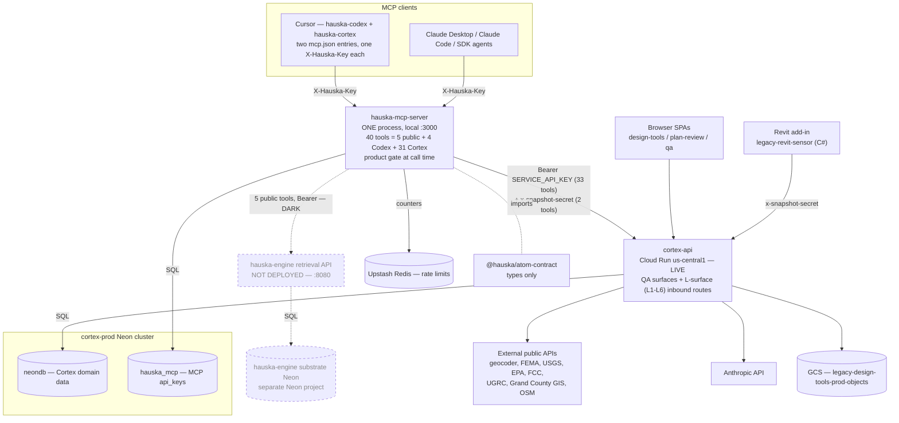

# MCP and Cortex architecture map

> Delivers QA-05 (WS-D) of the [Cortex QA backlog](43_cortex_qa_backlog.md): one map of which MCP servers run what, how they relate to the databases, and how they consume the atom contract and the Hauska SDK. Synthesized from two code-verified recon passes on 2026-05-20: cc-agent-M against `hauska-mcp-server` (`_research/2026-05-20_mcp_architecture_map.md`, HEAD `3f45655`) and cc-agent-C against `legacy-design-tools` (`_research/2026-05-20_cortex_qa_wsa_data_source_audit.md`, on main post PR #55). Those two repo-local drafts hold the exhaustive file-and-line detail; this doc is the unified picture.

> **Update 2026-05-22.** Facts 5 and 6 are partly superseded. `00_current_state.md` records the hauska-mcp-server deployed to hauska-prod and the hauska-engine retrieval API live, since this map was written on 2026-05-20. QA-17 (PR #64, merged 2026-05-21) added one Code-Library-to-MCP outbound path on cortex-api (`hauskaSubstrateClient.ts`, mock-mode default), a documented exception to the one-directional-edge claim in fact 3. The customer-zero loop breakage tracked in `43_cortex_qa_backlog.md` WS-G is not MCP-related; the Design Tools app surfaces remain self-contained. A full refresh of this map against the post-deploy topology is owed.

## The picture in six facts

1. **One MCP server process, two client entries.** `hauska-codex` and `hauska-cortex` in the operator's Cursor config are two `mcp.json` entries pointed at the same single process on `http://localhost:3000/mcp`. They differ only by the `X-Hauska-Key` value. There is no separate Codex server and no separate Cortex server.

2. **Forty tools, one registration, gated at call time.** The MCP server registers all 40 tools on every request, so `tools/list` returns 40 to every caller. The "31 Cortex plus 4 Codex" in `00_current_state.md` is the count each product key can successfully call; the product gate fires at call time, not list time. Full split: 5 public catalog, 4 Codex, 31 Cortex.

3. **The MCP-to-Cortex link is one-directional.** `hauska-mcp-server` calls into `cortex-api` on the L-surface routes (L1-L6) over an `Authorization: Bearer SERVICE_API_KEY` token. `cortex-api` makes no outbound call to the MCP server or the hauska-engine retrieval API. Cortex is a data provider to the MCP layer, not a consumer of the Hauska catalog.

4. **Two databases on one Neon cluster, plus a separate substrate Neon.** The cortex-prod Neon cluster holds `neondb` (Cortex domain data, written by cortex-api) and `hauska_mcp` (the MCP server's `api_keys` table). They share a Postgres server and nothing else. The Hauska substrate corpus lives in a separate Neon project behind the hauska-engine retrieval API.

5. **Half the catalog surface is dark.** The hauska-engine retrieval API is not deployed (`HAUSKA_BACKEND_URL` still `localhost:8080`). The MCP server's 5 public catalog tools cannot return data today. cortex-api is live on Cloud Run; the MCP server runs only on the operator's workstation.

6. **The Hauska SDK is consumed nowhere in this topology.** The MCP server imports `@hauska/atom-contract` type-only (for the `AccessPolicy` type) and pulls in no `@hauska-sdk/*` package. cortex-api has not yet migrated to the atom contract (still on `@workspace/empressa-atom`; that migration is a tracked can-kick). Per ADR-018 the SDK is only for paid-tier VDA wrapping and revenue routing, neither of which is built. For QA-05's "how do they consume the Hauska SDK" question, the verified answer is: they do not.

## Unified diagram

Solid edges are live paths. Dotted edges are wired but dark because the far end is not deployed. There is no arrow back from `cortex-api` to the MCP server: the coupling runs one way.

## Components

### MCP clients

The MCP server is reached by MCP-protocol clients over `POST :3000/mcp` with an optional `X-Hauska-Key` header. The operator's Cursor config holds two entries, `hauska-codex` and `hauska-cortex`, identical except for the key value. Claude Desktop, Claude Code, the MCP Inspector, and SDK agents are equivalent clients. A missing or misnamed key silently degrades the caller to the public tier: the connection looks healthy and every gated tool returns a rejection envelope. This is the `X-Hauska-Key` wrong-header gotcha recorded in the cutover runbook Stage 9.

### hauska-mcp-server

One Node process, Express, port 3000, three route groups: `/health` (no auth), `/mcp` (the MCP Streamable HTTP transport), `/admin/keys` (admin-key gated). The transport is stateless, so a fresh server instance and all 40 tool registrations are built per request. Tools split 5 public catalog (ungated), 4 Codex (`requireProduct(codex)`), 31 Cortex (`requireProduct(cortex)`). The gate reads the caller's product, bound from the matched `api_keys` row, and refuses mismatches at call time with an error envelope rather than a protocol error. The server owns exactly one datastore, the `api_keys` table, and one cache, Upstash Redis rate-limit counters. It holds no domain data.

### cortex-api

The Cortex backend, formerly the Replit `prompt-agent-accelerator` app, now on Cloud Run (`us-central1`, `legacy-design-tools-prod` project) reading the cortex-prod Neon cluster (`us-east-1`). It serves the three browser SPAs (design-tools, plan-review, qa), the four QA surfaces (Code Library, site-context, in-app chat, Revit/IFC ingest), and the L-surface routes. The four QA surfaces are self-contained: each touches only cortex-prod Neon, a fixed set of external public APIs, the Anthropic API, and GCS object storage. cortex-api has no MCP client and no hauska-engine consumer.

### The L-surface (inbound from MCP)

cortex-api exposes L1-L6 routes (response-tasks, sheet content-extraction, deliverable-letters, detail-callout-specs, product-spec-references, letter-renders) guarded by `requireServiceToken` / `requireServiceTokenOrSession`. The MCP server calls these with an `Authorization: Bearer` token whose value must equal cortex-api's `SERVICE_API_KEY`. The dual-path guard also lets the browser SPAs reach the same routes via session. This is the only MCP-to-Cortex coupling, and it runs one way: MCP into Cortex.

### Databases

The cortex-prod Neon cluster hosts two logical databases. `neondb` carries the Cortex domain data (engagements, snapshots, sheets, `code_atoms`, `briefing_sources`, `bim_models`, the L-surface atoms) and is written only by cortex-api. `hauska_mcp` carries the MCP server's `api_keys` table. They share a Postgres server and nothing else. The Hauska substrate corpus, including the Elgin and Bastrop County jurisdiction atoms, lives in a separate Neon project behind the hauska-engine retrieval API.

### hauska-engine retrieval API

Not deployed. `HAUSKA_BACKEND_URL` still points at `localhost:8080` with nothing listening. The MCP server's 5 public catalog tools (`search_atoms`, `get_atom`, `query_jurisdiction`, `search_permit_atoms`, `list_jurisdictions`) call it and return an unreachable-backend error today. Deploying it is tracked under the commercialization roadmap Streams 2C/2D.

### Atom contract and Hauska SDK

The MCP server imports `@hauska/atom-contract` type-only, for the `AccessPolicy` union, and pulls in no `@hauska-sdk/*` package. cortex-api has not migrated to the atom contract; it still uses `@workspace/empressa-atom`, and that migration is a tracked can-kick. The Hauska SDK is consumed by nothing in this topology, consistent with ADR-018, which scopes the SDK to paid-tier surfaces needing VDA wrapping or revenue routing.

## What this means for the Cortex QA backlog

The four Cortex surfaces audited in WSA.1 touch neither the MCP server nor the Hauska substrate. The Code Library reads cortex-prod-local `code_atoms`; the in-app chat calls the Anthropic API directly with no tool use. Consequences for the backlog:

QA-13 (Code Library missing Elgin) is not a cutover-tail bug. The Code Library has never been connected to the Hauska substrate. Connecting it is the Cortex MCP retrofit, a roadmap item per [`28_mcp_first_product_design.md`](28_mcp_first_product_design.md).

QA-07 and the WS-C work-stream (in-app agent platform awareness and write-back) are the same retrofit. WS-C is net-new wiring onto the MCP tool surface, not a repair of something broken.

The asymmetric MCP-to-Cortex edge means that today Cortex feeds the MCP layer through the L-surface but does not read from it. Any design where Code Library or the in-app agent reads the Hauska catalog is net-new.

## Correction tracked against existing docs

[`50_hauska_mcp_server.md`](50_hauska_mcp_server.md) is stale on the tool surface. It uses a slash namespace (`codex/finding_generation`) and counts "14 new tools." The shipped surface is 40 flat-underscore-named tools (`codex_finding_generation`), 35 product-gated plus 5 public. A corrective edit to doc 50 is tracked as a WS-D close-out follow-up.

## Cross-references

- [`43_cortex_qa_backlog.md`](43_cortex_qa_backlog.md) — the QA backlog; QA-05 is this doc's origin.
- [`50_hauska_mcp_server.md`](50_hauska_mcp_server.md) — the MCP server canonical doc (stale on the tool surface, see above).
- [`28_mcp_first_product_design.md`](28_mcp_first_product_design.md) — the MCP-first / retrofit principle that QA-07 and QA-13 route to.
- [`80_adrs/adr_018_atom_contract_substrate_layer.md`](80_adrs/adr_018_atom_contract_substrate_layer.md) — atom contract versus SDK consumption rule.
- [`90_runbooks/legacy_design_tools_replit_to_cloud_run_cutover.md`](90_runbooks/legacy_design_tools_replit_to_cloud_run_cutover.md) — Stage 9 cutover state.
- `hauska-mcp-server/_research/2026-05-20_mcp_architecture_map.md` and `legacy-design-tools/_research/2026-05-20_cortex_qa_wsa_data_source_audit.md` — the two code-verified recon drafts behind this synthesis.
