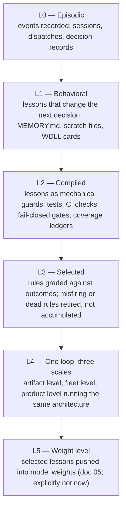

# Recursive improvement loop

This folder is the canonical home of the portfolio's recursive improvement program: one repeatable model for making any artifact (a product spine, an app, the agent fleet itself) improve through its own use, with the improvement compounding instead of evaporating.

The origin frame is the "universal code" pattern the operator captured 2026-08-02 (consciousness as substrate, four laws, everything is compute). This folder deliberately strips the cosmology and keeps the operational machinery, because the machinery is testable and the cosmology is not. What survives the strip is four mechanisms that any self-improving system runs, and the observation that this portfolio independently converged on the same architecture at the product layer before ever naming it: commitment #2 (confidence is earned, not asserted) with the adjudication-to-atom evidence ledger is exactly this loop applied to the atom catalog. This folder generalizes that loop so it can be instantiated on purpose rather than rediscovered by accident.

## The four mechanisms, stated operationally

**Efficiency (intelligence per unit of energy).** A lesson that must be re-read and re-reasoned every session costs tokens and attention forever. A lesson compiled into a gate costs nothing and protects everyone. The target gradient for every piece of durable knowledge is marginal cost trending toward zero. This is the same gradient as commitment #3 (cost per jurisdiction onboarded), applied to our own knowledge instead of the product's.

**Compression.** Raw experience compresses upward through named rungs: raw event, then recorded lesson, then durable rule, then mechanical guard (a test, a CI check, a fail-closed gate). Each rung costs less to consume than the one below it and is harder to silently violate. The fleet already runs the lower rungs (scratch files, MEMORY.md, promoted lessons); the program's work is making the top rung the default destination, per the M0 rule that the strongest promotion is a mechanical guard, not prose.

**Coherence.** A lesson only counts if it reaches every seat that can repeat the mistake. Today lessons concentrate at the planner seat and travel by hand-pasted dispatch blocks. Coherence work is making the carrier structural: dispatch templates that pull standing decisions automatically, shared packages that embed guards, the parity ledger that carries spine-model concepts across verticals.

**Selection.** Rules and memories must live or die by ground truth, not accumulate. A loop with capture and compression but no selection is the scan-fix drift shape this portfolio has already been burned by. Selection pressure is important enough to carry its own doc: [`02_selection_pressure.md`](02_selection_pressure.md).

## The maturity ladder

Honest current position: the portfolio is solidly L1, and its strongest L2 footings live in the property spine (the owner-match integrity gate, the R0 geometry tests, functional health probes born from the /search outage); the fleet's own top rung is thinner, with most lessons stopping at prose. L3 is the missing rung everywhere: nothing today measures whether a promoted rule fired, helped, or misfired, and nothing retires rules except manual reversal. L4 is the design claim this folder makes explicit. L5 is an option kept open, not a commitment.

## Scope and honesty notes

Recursion here is artifact level, not model level. The improving thing is the rulebook, the gates, and the calibration ledgers, not the weights of the models reading them. That is not a lesser form; it is the same move the genome makes, accumulating compressed selected instructions rather than rewriting chemistry. The weight-level extension exists as a researched option in [`05_weight_level_recursion.md`](05_weight_level_recursion.md) and is gated hard.

Every claim in this folder about what currently exists traces to a named practice, incident, or doc. Where an instantiation names a gap, the gap is the backlog, recorded in [`04_instantiations.md`](04_instantiations.md).

## Folder index

| Doc | What it is |
|---|---|
| [`00_recursive_loop_overview.md`](00_recursive_loop_overview.md) | This doc. The frame, the four mechanisms, the ladder. |
| [`01_loop_template.md`](01_loop_template.md) | The repeatable instantiation worksheet. Fill it to put the loop on any artifact. |
| [`02_selection_pressure.md`](02_selection_pressure.md) | Ground-truth taxonomy, design rules, portfolio exemplars and anti-patterns. |
| [`03_world_models.md`](03_world_models.md) | What a world model is, and which of ours are world models. |
| [`04_instantiations.md`](04_instantiations.md) | The template applied: property spine, trading, agent fleet, smartcity. Doubles as the program backlog. |
| [`05_weight_level_recursion.md`](05_weight_level_recursion.md) | The open-weight path as the L5 option, with its preconditions. |

## What this folder builds on (does not duplicate)

The loop was not invented here and these docs do not restate their sources. [`90_runbooks/fleet_memory_practice.md`](../90_runbooks/fleet_memory_practice.md) owns the fleet's capture and promotion mechanics (M0). [`90_runbooks/wdll_practice.md`](../90_runbooks/wdll_practice.md) owns drift-visible done-lines, itself adopted from empressa-trading, which is standing proof the loop transfers across artifacts. [`04a_arrow_two_calibration_capture.md`](../04a_arrow_two_calibration_capture.md) owns product-layer calibration. [`62_proof_of_record_spec.md`](../62_proof_of_record_spec.md) and [`63_empressa_certification_program.md`](../63_empressa_certification_program.md) are this folder's band neighbors because all three are about earned truth. This folder adds the connective architecture: the shared vocabulary, the template, and the selection discipline that makes the pieces one program.
