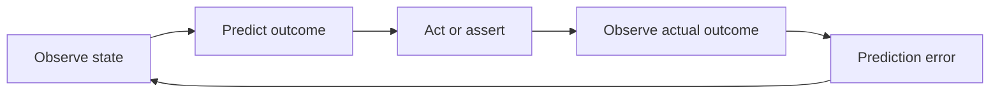

# World models

## What a world model is

A world model is an internal model of an environment's state and dynamics that supports prediction and counterfactuals. It answers two questions a plain record store cannot: "what happens next" and "what would happen if." The distinction is not what data the system holds but what the system can do with it: a database of parcels is a record; a model that predicts what can legally be built on a parcel, and how that changes if the road is reclassified, is a world model.

The canonical loop a world model enables:

Prediction error is the native selection pressure of a world model. This is why the world-model concept belongs in this folder: the recursive loop needs predictions to grade, and an artifact that only stores facts can be audited (is the record correct) but never calibrated (is the model's judgment improving). Calibration, which is commitment #2's whole content, presupposes a world model somewhere in the artifact.

For context on the term as used in the AI field: large language models are next-token predictors over text, which gives them a broad but implicit and unreliable model of the world. Systems built for control and embodiment (DeepMind's Dreamer line, LeCun's JEPA program, generative environment models like Genie, and driving stacks like Tesla's) learn explicit predictive models of environment dynamics, because acting in an environment punishes bad prediction immediately. The industry consensus the operator's source material gestures at is real: LLMs alone are not sufficient for grounded action; predictive models of specific domains are where the leverage is. That maps cleanly onto this portfolio, which is in the business of building exactly such a domain model for the physical-jurisdictional world.

## Which of our artifacts are world models

**The property spine's world model is the warm digital twin.** The road-node engine and warm digital twin spec ([`27c`](../27c_road_node_engine_and_warm_digital_twin_spec.md)) is precisely the move from record store to world model: roads as first-class nodes, parcels with lot-line geometry, setbacks indexed by road class and edge role, buildable envelopes derived from the whole. The buildable envelope is the clearest example in the portfolio of a predictive claim: it asserts what a jurisdiction will permit on a parcel. That assertion is gradeable by tier 1 ground truth (the permit outcome) and tier 2 (the adopted code), which is what makes the property spine calibratable rather than merely auditable. The depth engine program is, in this folder's vocabulary, the build-out of the world model's dynamics layer.

**The trading app's world model is its market state and risk model.** Every position is a prediction; every Greek is a dynamics claim; P&L is the environment grading the model daily. empressa-trading independently rebuilt the atom and calibration architecture in Python, which is unsurprising in this frame: any serious trading system is forced into the world-model-plus-selection shape because the market supplies relentless tier 1 pressure whether you design for it or not.

**The atom catalog is the world model's substrate, not the model.** Atoms are compressed, cited state. The reasoning layer that composes atoms into a judgment (an envelope, a finding, a brief claim with confidence) is where prediction lives. This distinction matters for the loop: selection pressure attaches to the judgments, and flows back through lineage to the atoms that fed them, which is exactly the arrow-two deposit-to-atom lineage build.

**The agent fleet's world model is thin, and that is a finding.** The fleet holds state about the portfolio (docs, memory, ground-truth entries with timestamps) but its predictive layer is mostly implicit in the planner. Where the fleet HAS made predictions explicit, drift became visible: a WDLL Start card is a prediction of the end state, graded at close; dispatch acceptance items are predictions verified by adversarial review. The instantiation doc treats "make fleet predictions explicit and gradeable" as a live gap.

## Rule of thumb for instantiations

When filling the template's world-model field, ask: what does this artifact assert about the future or the counterfactual, and what event would prove that assertion wrong? If nothing could prove it wrong, the artifact has no world model yet, and the loop can only run in audit mode (tier 2/3 checks on records) until one exists. That is a legitimate dormant state, but name it honestly.
