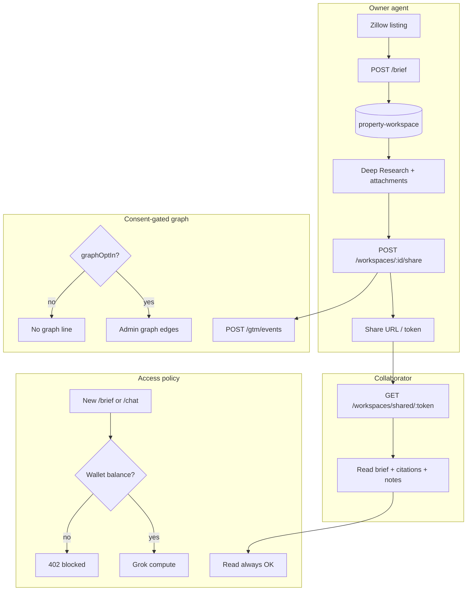

# Hauska Property Brief — complete handoff

> **Audience:** Replit Agent (or any UI prototyping agent) exploring layout, interaction, collaboration flows, and visual variations.
>
> **Do not rebuild the backend.** The product engine lives on `cortex-api` (`legacy-design-tools`, PR #132, migration `0029`). Your job is UI/UX exploration against existing API contracts.
>
> **Reference screenshot:** Deep Research page as shipped in extension v0.5.x (302 Pack Horse Dr, Bastrop, TX example).

---

## 1. What this product is

**Hauska Property Brief** is decision-support for Texas real estate agents and buyers. Given a property address, it answers questions about:

- **Municipal code** (ADUs, setbacks, short-term rental rules, pools, additions) when the city is in the Hauska code corpus
- **Site context** (FEMA flood zones, parcel/zoning from Regrid, federal environmental layers)
- **Plain-language synthesis** with source citations, confidence score, and timestamp

It is **not legal advice**. Every output carries a disclaimer and tells users to verify with city staff and licensed professionals.

**One-liner:** Carfax-style property intelligence for land use and local rules, embedded where agents already work (Zillow/Redfin listing pages via Chrome extension, with a full-screen research chat for follow-up questions).

**Buyer:** Texas residential/commercial broker (pilot: eXp / Unlock MLS corridor). **Engine:** Hauska municipal code catalog + Cortex site-context adapters + Grok summarization on the server.

---

## 2. Product surfaces (two UI modes)

| Surface | Where | Purpose |
|---------|-------|---------|
| **Listing panel** | Injected on Zillow/Redfin/Matrix listing pages (Chrome extension Shadow DOM) | One-click "Run brief" → traffic-light verdict cards (Yes/Maybe/No/Unknown) |
| **Deep Research** | Full tab: `research/research.html` in extension (matches reference screenshot) | Conversational follow-up, property history, multi-property nav |

There is also a **toolbar popup** and **side panel** (`panel/panel.html`) that mirror verdict cards. For Replit variations, **Deep Research is the primary canvas** — it has the richest layout (property list + chat + starter chips).

**Code home:** `P:\hauska-brief-extension` (Chrome MV3 extension, not in doc_repo).

**Backend:** `POST /api/brokerage/v1/*` on prod `cortex-api` (Cloud Run). Extension is a thin client; no LLM keys in the browser.

---

## 3. Deep Research UI anatomy (reference screenshot)

The screenshot shows the **consumer-mode Deep Research page** after a brief has been run.

### 3.1 Global header

| Element | Example | Source |
|---------|---------|--------|
| Brand | `hauska property brief` (lowercase, blue dot icon) | Static CSS |
| Property address | `302 Pack Horse Dr, Bastrop, TX 78602` | `POST /brief` → `property.address` |
| Subtitle metadata | `Bastrop Texas · in_corpus · AI research on · <workspace-id>` | `jurisdiction`, `corpusStatus`, `atoms.workspaceDid` or run ID |

**Corpus status values:** `in_corpus` (code retrieval works), `partial`, `no_match`, `unknown`. UI must not imply code coverage when status is not `in_corpus`. Honesty list: [`75b_brief_coverage_v0.md`](75b_brief_coverage_v0.md).

### 3.2 Left column — Properties nav

| Element | Behavior |
|---------|----------|
| Section title | `PROPERTIES` (small caps) |
| Property cards | One card per recent workspace from `GET /api/brokerage/v1/workspaces/recent` |
| Active state | Blue border + light blue background on selected property |
| `View listing` link | Opens original Zillow/Redfin URL stored on workspace |

**Design intent (wave 7):** Property list **replaces** a permanent citations sidebar. Citations appear inline in chat, not as a fixed right rail.

### 3.3 Main column — Chat workspace

#### Starter chips ("Start with a question")

Six pill buttons shown before or above the conversation:

1. `Can I add an ADU here?`
2. `Will this property flood?`
3. `What schools are nearby?`
4. `Could this work as a short-term rental?`
5. `What are setback rules for an addition?`
6. `Biggest red flags for this lot?`

**Behavior:** Click prefills the input, sends to chat API with `starterPromptId` + `personaBucket`. IDs align with server `propertyBriefStarters.ts`. Schools starter uses a **static honest template** (municipal code does not include school assignments) — do not hallucinate campus names.

#### Initial assistant message (property brief seed)

On load, the page renders a structured summary from the brief run:

- **Accessory dwelling units** — verdict + one-line explanation
- **Flood risk** — verdict + zone info when FEMA layer present
- **Major restrictions** — verdict or "not enough data"
- **Local rules coverage** — whether city code is in corpus

This comes from `laySummary.verdicts[]` and/or `reasoningSummary` on the brief response, not from a separate chat turn.

#### Conversation thread

| Role | Visual |
|------|--------|
| User | Right-aligned bubble, label "You" |
| Assistant | Left-aligned, Hauska "H" avatar, structured paragraphs |

**Footer on every assistant message:**

```text
Property intel from Hauska municipal code catalog. Not legal advice. Verify with city staff...
(Hauska AI · confidence 50%)
```

- `confidence` from `POST /research/chat` response (0–1, shown as percent)
- When confidence is low or reply is generic, show collapsed **"View sources from this brief"** accordion + **"Upload CC&Rs or HOA docs"** CTA (stub until encumbrance upload lands)

#### Inline atom chips (wave 7c)

When API returns `atoms.inlineRefs[]`, render tappable chips inside assistant bubbles:

```json
{
  "did": "did:hauska:code-section:<atomId>",
  "entityType": "code-section",
  "entityId": "<atomId>",
  "label": "ADU requirements",
  "mode": "inline"
}
```

Tap expands snippet **inside the chat thread** (not a side panel). Also parses `{{atom:type:id:label}}` markup in `messageHtml`.

#### Input bar

| Element | Behavior |
|---------|----------|
| Placeholder | `Ask about this property...` |
| Submit | Blue **Ask** button |
| Enter key | Sends message |

Messages go to `POST /api/brokerage/v1/research/chat` with `runId` from the brief, `message`, and `history[]`.

---

## 4. Listing panel UI (secondary surface)

Injected floating panel on listing sites:

| State | UI |
|-------|-----|
| Collapsed | Pill/tab under toolbar: "property intel" |
| Expanded | Fixed-radius card (18px, no morph animation) with verdict traffic lights |
| Actions | **Run brief**, **Deep research** (opens full tab), **See sources** (toggles pro citation block) |

**Verdict cards** (`laySummary.verdicts[]`):

| Verdict | Color semantics |
|---------|-----------------|
| Yes | Green |
| Maybe | Amber |
| No | Red |
| Unknown | Gray |

Categories typically include ADU, flood, STR, setbacks, red flags. Flood verdict uses FEMA layer when present.

---

## 5. What the tool does (data flow)

```text
User on Zillow listing
  → Extension extracts address from DOM
  → POST /api/brokerage/v1/brief { address, source, page_url }
       → Server geocodes address
       → Resolves jurisdiction_key (e.g. bastrop_tx)
       → Fetches Regrid parcel + FEMA flood (cached in place_layer_snapshots)
       → Runs 5 fixed code queries via retrieveAtomsForQuestion
       → Grok synthesizes reasoningSummary + laySummary verdicts
       → Persists brokerage_brief_runs + property-workspace atom projection
  → Panel shows verdict cards
  → User opens Deep Research
       → GET /workspaces/recent populates left nav
       → Seed message from brief
       → User asks follow-up
       → POST /research/chat { runId, message, history }
            → Server retrieves more code atoms for question
            → Grok answers with atom-only citations
       → UI renders reply + inline chips + confidence footer
```

**Five fixed code queries** (brief generation): ADU, pool, STR, major addition, setbacks. Research chat retrieves dynamically per user message.

**What it does NOT do (v1):**

- School district assignment lookup (honest gap message only)
- CMA / MLS comps
- Legal advice or guaranteed disclosure language
- Full title / encumbrance analysis (upload path queued as PB-301)
- Paywall UI (deferred; wallet metering exists server-side)

---

## 6. Collaboration, sharing, and workspace persistence

Property Brief is built around a **property workspace**: one durable folder per listing (address, source listing URL, brief runs, chat history, attachments, and access control). Collaboration means multiple people can view or build on the same evidence package without re-running research. Sharing is how the owner invites a collaborator to read that full package via a link.

**Backend status:** Shipped in legacy-design-tools PR #132 (`1109f02`, migration `0029`). Extension wires recent list, reopen, and copy share link in v0.5.0+. Atom emission of share edges is a parallel track (Phase 3c).

### 6.1 The workspace package (what gets shared)

Everything hangs off one root object:

| Entity | What it holds |
|--------|----------------|
| **property-workspace** | Address, listing URL(s), owner, collaborator list, status |
| **brief-run** (child) | Each brief: reasoning summary, citations, confidence, timestamps |
| **workspace-attachment** (child) | Links, images, PDFs, notes the team adds |
| **workspace-share-edge** (child) | Who shared to whom, when, consent flags |

When someone shares, the collaborator receives the **same bundle**: prior brief + research context + citations + attachments + notes, not just a PDF export.

Atom contract shapes live in `@hauska/atom-contract@1.3.0` workspace subpath (`property-workspace`, `brief-run`, `workspace-attachment`, `workspace-share-edge`).

### 6.2 Collaboration flow (day-to-day use)

```text
Agent runs brief on Zillow listing
  → Server creates/updates brokerage_workspaces (upsert on brief completion)
  → Brief payload stored; workspace linked to listing URL (page_url)

Agent opens Deep Research
  → GET /workspaces/recent  →  left nav "PROPERTIES" list
  → GET /workspaces/:id     →  rehydrate prior brief + context

Agent adds team artifacts
  → POST/GET/DELETE /workspaces/:id/attachments
  → Kinds: link | image | pdf | note

Agent returns days later
  → Same workspace ID; read always allowed (even at zero wallet balance)
```

**Collaboration model (v1):** Async team prep. One agent runs the brief and adds notes/links; another agent (or TC) opens the same workspace later. There is no live co-editing chat in v1; it is shared read access to a persisted dossier.

**Extension UX today:** Recent properties in the left column, reopen workspace, listing backlink ("View listing"), **Copy share link** when API is configured. Attachment CRUD is API-ready; UI depth varies.

### 6.3 Sharing flow (owner → collaborator)

```text
Owner (authenticated install + API key + X-Hauska-Install-Id)
  → POST /api/brokerage/v1/workspaces/:id/share
  → Server creates brokerage_workspace_shares row + shareToken
  → Owner copies share link (extension: "Copy share link")

Collaborator (may not need owner's key for read)
  → Opens link
  → GET /api/brokerage/v1/workspaces/shared/:shareToken
  → Receives full workspace package (brief, attachments, evidence refs)
  → collaboratorUserIds updated on workspace for future direct access
```

**Access rules:**

| Role | Read existing workspace | Run new brief / chat |
|------|-------------------------|----------------------|
| Owner | Always (even at zero balance) | Requires wallet balance |
| Collaborator | Always on shared workspace (unless revoked) | Requires own install balance |

Sharing grants **read the dossier**, not automatic spend of the owner's credits on new AI turns.

### 6.4 Consent, GTM events, and admin graph

Sharing doubles as a viral-loop signal, gated by privacy consent.

```text
First install
  → POST /gtm/consent { installId, consentVersion, graphOptIn, termsAcceptedAt }

User shares workspace (graphOptIn: true required for graph telemetry)
  → POST /gtm/events (share-related event types)
  → Emits workspace-share-edge in data model

Operator (internal only)
  → GET /api/brokerage/v1/admin/graph?format=html
  → Header: X-Brokerage-Admin-Key
  → Blue dots = session geography
  → Blue lines = share edges between users
  → Only users/edges where graphOptIn === true
```

If the user did not opt into the graph, share still works for the collaborator; the admin viral map does not show that edge.

### 6.5 Read vs compute (paywall interaction)

Collaboration sits on top of a deliberate billing split (Phase 3d):

| Action | Zero balance? |
|--------|---------------|
| Open recent workspace | Allowed |
| GET workspace by ID | Allowed |
| Open shared link (`/shared/:shareToken`) | Allowed |
| View attachments | Allowed |
| **New** brief or research chat | **Blocked** (`402 insufficient_balance`) |

Design intent: never lock someone out of work they already paid for or that was shared with them; only block **new** AI generation.

Wallet defaults (server-side, PR #132):

| Variable | Default | Role |
|----------|---------|------|
| `BROKERAGE_COMPUTE_COST_CENTS` | `100` | Debit per brief/chat turn |
| `BROKERAGE_TOP_UP_INCREMENT_CENTS` | `500` ($5) | Top-up / auto-refill unit |
| `BROKERAGE_WALLET_START_BALANCE_CENTS` | `0` | New install starting balance |

Top-up API exists (`POST /wallet/top-up`); Stripe is not wired in v1 (server-simulated).

### 6.6 MCP read surface (agent operators)

hauska-mcp-server PR #23 exposes read-only parity:

- `list_property_workspaces` — owner/collaborator visibility enforced server-side
- `get_property_workspace` — full package + evidence refs
- `list_workspace_share_edges` — consent-filtered by default (`consent_visible_only=true`)

No MCP write path for share in v1; sharing stays in extension/API UI flow.

### 6.7 End-to-end collaboration diagram



### 6.8 Collaboration out of scope (v1)

- Live multi-user editing or in-thread comments
- SkySlope auto-upload of shared workspace (Phase 2)
- Stripe-backed team billing (wallet top-up is server-simulated)
- Full revoke-share UX (schema supports shares; revoke UI may be thin)
- Paywall UI in extension (deferred; server enforces `402`)

---

## 7. API contracts (minimum for UI prototyping)

Base URL (prod): `https://cortex-api-tds7av26va-uc.a.run.app`

**Auth headers:**

| Header | Required on |
|--------|-------------|
| `Authorization: Bearer <key>` or `X-Hauska-Key: <key>` | All authenticated routes |
| `X-Hauska-Install-Id` | Workspace, wallet, metered brief/chat, GTM events |

### POST `/api/brokerage/v1/brief`

**Request:**

```json
{
  "address": "302 Pack Horse Dr, Bastrop, TX 78602",
  "source": "zillow",
  "page_url": "https://..."
}
```

**Response fields the UI consumes:**

| Field | UI use |
|-------|--------|
| `runId` | Chat session anchor |
| `property.address` | Header |
| `jurisdiction` | Subtitle |
| `corpusStatus` | Subtitle + honesty messaging |
| `reasoningSummary.headline`, `paragraphsHtml` | Seed content, See sources |
| `laySummary.verdicts[]` | Traffic-light cards |
| `siteContext.layers[]` | Flood/parcel layer summaries |
| `citations[]` | Source accordion |
| `atoms.workspaceDid` | Workspace identity, deep links |
| `atoms.inlineRefs[]` | Chat chips |
| `property.llUuid` | Parcel identity when Regrid hits |

### POST `/api/brokerage/v1/research/chat`

**Request:**

```json
{
  "runId": "<uuid-from-brief>",
  "message": "Can I add an ADU here?",
  "history": [{ "role": "user", "content": "..." }]
}
```

**Response:**

```json
{
  "message": "plain text",
  "messageHtml": "<p>...</p>",
  "citations": [{ "n": 1, "atomDid": "...", "label": "...", "snippet": "..." }],
  "sources": [],
  "disclaimer": "...",
  "confidence": 0.5,
  "generatedAt": "ISO",
  "method": "grok"
}
```

### GET `/api/brokerage/v1/workspaces/recent`

Returns recent property workspaces for left nav (address, listing URL, workspace ID, last run metadata).

### GET `/api/brokerage/v1/coverage`

Pilot honesty manifest: which `jurisdiction_key` values are `neon` (live code), `engine_only` (geocode works, code empty until warmup), or `blocked`.

Full contracts: [`75a_hauska_brief_extension.md`](75a_hauska_brief_extension.md).

---

## 7. Visual and UX design system (current)

| Token | Value |
|-------|-------|
| Palette | White background, light blue accents, soft shadows, rounded corners |
| Typography | Address: large bold; metadata: small gray; body: readable sans-serif |
| Brand voice | Lowercase "hauska property brief"; consumer-friendly, not "brokerage" |
| Interaction model | Carfax-style verdicts first, sources on demand |
| Confidence | Always visible on AI replies; low confidence triggers honest empty states |
| Citations | Inline expandable chips (consumer); collapsed accordion for full source list |
| Layout | Two-column research: 240–280px property nav + fluid chat column |

**Explicit anti-patterns (do not reintroduce):**

- Permanent right-hand citations rail (Compass-style) in consumer mode
- Pill-to-rectangle morph animation on listing panel expand
- User-visible word "brokerage" (API paths keep it for backward compat)
- Hallucinated schools, flood zones, or code sections without citation backing

---

## 8. Extension file map (for parity reference)

| Path | Role |
|------|------|
| `research/research.html` | Deep Research page shell |
| `research/research.css` | Layout, consumer mode, chips, accordions |
| `src/research/research-app.js` | Chat logic, starters, workspace nav |
| `src/lib/brief-engine.js` | Brief API client, persists run state |
| `src/lib/research-api.js` | Chat API client |
| `src/lib/inline-atoms.js` | Atom chip rendering + expand-in-thread |
| `src/lib/lay-render.js` | Verdict card HTML |
| `src/lib/workspace-api.js` | Recent workspaces, share |
| `src/content/intel-panel.js` | Listing page injected panel |

Build: `node scripts/build.mjs` → bundles to `research/research-bundle.js`.

**Current version:** 0.5.3 (2026-05-29).

---

## 9. Test addresses for smoke

| Address | jurisdiction_key | Expected corpus |
|---------|------------------|-----------------|
| 302 Pack Horse Dr, Bastrop, TX 78602 | `bastrop_tx` | `in_corpus` (neon) |
| 430 Evergreen Trl, Cedar Hill, TX | `cedar_hill_tx` | `in_corpus` (neon) |
| Round Rock, TX listing | `round_rock_tx` | `engine_only` until Neon warmup |
| Dallas city proper | blocked | Honest gap; no code claims |

---

## 10. Safe variation space for Replit

These are **good** exploration targets (UI-only or mock-data OK):

| Variation | Notes |
|-----------|-------|
| Header density | Compact vs hero address; sticky vs scroll-away |
| Property nav | Card vs list vs timeline; thumbnails; search/filter |
| Starter chips | Grid vs carousel vs categorized groups; icons per topic |
| Chat layout | Centered column vs full-bleed; message bubble styles |
| Verdict presentation | Cards vs horizontal strip vs inline badges in header |
| Confidence UX | Meter, traffic light, or plain text; threshold copy |
| Empty states | Illustration + CTA when `not_in_corpus` or adapter miss |
| Mobile / narrow | Single column collapse of property nav |
| Dark mode | Not shipped; fair game for prototype |
| Onboarding | First-run consent, coverage explainer, sample property |

These require **backend coordination** (flag, do not implement solo):

| Idea | Blocker |
|------|---------|
| Paywall / wallet top-up UI | Deferred v1 |
| CC&R / HOA upload | PB-301 dispatch in flight |
| Map parcel overlay | Regrid geometry exists in API; no map component yet |
| PDF export | Phase 2+ |
| Matrix/SkySlope native embed | Partner API track |

---

## 11. Acceptance criteria for UI variations

A successful Replit prototype should:

1. Show property address + corpus honesty in header
2. Support multi-property navigation (even if mocked)
3. Render six starter question chips with click-to-send behavior
4. Display an initial brief summary before chat
5. Show conversational thread with user/assistant distinction
6. Include disclaimer + confidence on every AI message
7. Handle low-confidence / no-citation replies honestly (sources link, no fabrication)
8. Prefer inline citations over permanent side rails
9. Use "Hauska Property Brief" branding, not "brokerage" or "Deal Desk"

---

## 12. Canonical doc index

| Doc | Content |
|-----|---------|
| [`75_hauska_brokerage_workflow_plan.md`](75_hauska_brokerage_workflow_plan.md) | GTM, product definition, phases |
| [`75a_hauska_brief_extension.md`](75a_hauska_brief_extension.md) | Extension + API contracts |
| [`75b_brief_coverage_v0.md`](75b_brief_coverage_v0.md) | Pilot city coverage honesty |
| [`77_place_graph_strategy.md`](77_place_graph_strategy.md) | Long-term place graph vision |
| [`25_atom_architecture_reference.md`](25_atom_architecture_reference.md) | Inline atom UX philosophy |

---

## 13. Structural commitments (do not violate)

1. **Sell reasoning, not data** — every output: sources, confidence, timestamp
2. **Partnership-first** — city operational data via partners; Regrid/FEMA federal baselines OK for product UI
3. **Honest coverage** — never imply code retrieval for `engine_only` or `blocked` jurisdictions
4. **Server-side LLM** — no `XAI_API_KEY` in browser builds

---

*Handoff prepared 2026-05-29 from extension v0.5.3 close artifacts and canonical 75-band docs.*
