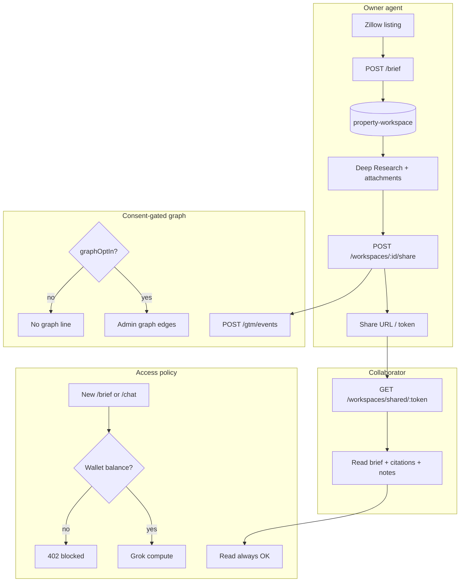

# Hauska Property Brief — collaboration and sharing

> **Audience:** Any agent building or varying collaboration, sharing, workspace, or team-read UX.
>
> **Companion doc:** UI and chat surface details live in [`75d_property_brief_ui_replit_handoff.md`](75d_property_brief_ui_replit_handoff.md). This doc covers workspace persistence, sharing, attachments, billing interaction, and admin graph only.

---

## 1. What collaboration and sharing are for

Property Brief is built around a **property workspace**: one durable folder per listing (address, source listing URL, brief runs, chat history, attachments, and who can see it).

| Concept | Meaning |
|---------|---------|
| **Collaboration** | Multiple people work on or view the same evidence package without re-running research from scratch |
| **Sharing** | Owner invites a collaborator to read the full package via a share link |

**Backend status:** Shipped in `legacy-design-tools` PR #132 (`1109f02`, migration `0029`). Extension wires recent list, reopen, and copy share link in v0.5.0+. Atom emission of share edges is a parallel track (Phase 3c).

**Product decision:** Collaboration, sharing, wallet metering, and admin graph are **V1 scope** per [`_decisions/2026-05-28_brokerage_v1_expanded_scope.md`](_decisions/2026-05-28_brokerage_v1_expanded_scope.md).

---

## 2. The workspace package

Everything hangs off one root object:

| Entity | What it holds |
|--------|----------------|
| **property-workspace** | Address, listing URL(s), owner, collaborator list, status |
| **brief-run** (child) | Each brief: reasoning summary, citations, confidence, timestamps |
| **workspace-attachment** (child) | Links, images, PDFs, notes the team adds |
| **workspace-share-edge** (child) | Who shared to whom, when, consent flags |

When someone shares, the collaborator gets the **same bundle**: prior brief + research context + citations + attachments + notes, not just a PDF export.

Atom contract shapes: `@hauska/atom-contract@1.3.0` workspace subpath (`property-workspace`, `brief-run`, `workspace-attachment`, `workspace-share-edge`).

---

## 3. Collaboration flow (day-to-day use)

```text
Agent runs brief on Zillow listing
  → Server creates/updates brokerage_workspaces (upsert on brief completion)
  → Brief payload stored; workspace linked to listing URL (page_url)

Agent opens Deep Research
  → GET /workspaces/recent  →  left nav "PROPERTIES" list
  → GET /workspaces/:id     →  rehydrate prior brief + context

Agent adds team artifacts
  → POST/GET/DELETE /workspaces/:id/attachments
  → Kinds: link | image | pdf | note

Agent returns days later
  → Same workspace ID; read always allowed (even at zero wallet balance)
```

**V1 collaboration model:** Async team prep. One agent runs the brief and adds notes/links; another agent (or TC) opens the same workspace later. There is **no live co-editing chat** in v1; it is shared read access to a persisted dossier.

**Extension UX (shipped):**

- Recent properties in Deep Research left column
- Reopen workspace by ID
- Listing backlink ("View listing")
- **Copy share link** when API is configured
- Attachment CRUD via API (UI depth varies)

---

## 4. Sharing flow (owner → collaborator)

```text
Owner (authenticated install + API key + X-Hauska-Install-Id)
  → POST /api/brokerage/v1/workspaces/:id/share
  → Server creates brokerage_workspace_shares row + shareToken
  → Owner copies share link

Collaborator (may not need owner's key for read)
  → Opens share link
  → GET /api/brokerage/v1/workspaces/shared/:shareToken
  → Receives full workspace package (brief, attachments, evidence refs)
  → collaboratorUserIds updated on workspace for future direct access
```

### Access rules

| Role | Read existing workspace | Run new brief / chat |
|------|-------------------------|----------------------|
| Owner | Always (even at zero balance) | Requires wallet balance |
| Collaborator | Always on shared workspace (unless revoked) | Requires own install balance |

Sharing grants **read the dossier**, not automatic spend of the owner's credits on new AI turns.

---

## 5. Read vs compute (paywall interaction)

Collaboration sits on a deliberate billing split (Phase 3d):

| Action | Zero balance? |
|--------|---------------|
| Open recent workspace | Allowed |
| GET workspace by ID | Allowed |
| Open shared link (`/shared/:shareToken`) | Allowed |
| View attachments | Allowed |
| **New** brief or research chat | **Blocked** (`402 insufficient_balance`) |

**Design intent:** Never lock someone out of work they already paid for or that was shared with them. Only block **new** AI generation.

### Wallet defaults (server-side)

| Variable | Default | Role |
|----------|---------|------|
| `BROKERAGE_COMPUTE_COST_CENTS` | `100` | Debit per brief/chat turn |
| `BROKERAGE_TOP_UP_INCREMENT_CENTS` | `500` ($5) | Top-up / auto-refill unit |
| `BROKERAGE_WALLET_START_BALANCE_CENTS` | `0` | New install starting balance |
| `BROKERAGE_WALLET_BYPASS` | off | Skip paywall (dev only) |

Top-up API: `POST /api/brokerage/v1/wallet/top-up`. Stripe is **not** wired in v1 (server-simulated).

---

## 6. Consent, GTM events, and admin graph

Sharing is also a viral-loop signal, gated by privacy consent.

```text
First install
  → POST /gtm/consent { installId, consentVersion, graphOptIn, termsAcceptedAt }

User shares workspace (graphOptIn: true required for graph telemetry)
  → POST /gtm/events (share-related event types)
  → Emits workspace-share-edge in data model

Operator (internal only)
  → GET /api/brokerage/v1/admin/graph?format=html
  → Header: X-Brokerage-Admin-Key
  → Blue dots = session geography
  → Blue lines = share edges between users
  → Only users/edges where graphOptIn === true
```

If the user did not opt into the graph, share still works for the collaborator; the admin viral map does not show that edge.

---

## 7. API routes (collaboration surface)

Base URL (prod): `https://cortex-api-tds7av26va-uc.a.run.app`

**Headers:**

| Header | Required on |
|--------|-------------|
| `Authorization: Bearer <key>` or `X-Hauska-Key: <key>` | All authenticated routes |
| `X-Hauska-Install-Id` | Workspace, wallet, metered brief/chat, GTM events |

### Workspace (Phase 3b)

| Method | Route | Purpose |
|--------|-------|---------|
| GET | `/api/brokerage/v1/workspaces/recent` | Recent properties for nav |
| GET | `/api/brokerage/v1/workspaces/:id` | Full workspace + latest brief |
| POST | `/api/brokerage/v1/workspaces/open` | Explicit open/rehydrate |
| POST | `/api/brokerage/v1/workspaces/:id/share` | Create share token + link |
| GET | `/api/brokerage/v1/workspaces/shared/:shareToken` | Collaborator read (no owner key required) |
| POST/GET/DELETE | `/api/brokerage/v1/workspaces/:id/attachments` | link / image / pdf / note CRUD |

### Wallet (Phase 3d)

| Method | Route | Purpose |
|--------|-------|---------|
| GET | `/api/brokerage/v1/wallet` | Balance + settings |
| POST | `/api/brokerage/v1/wallet/top-up` | $5 increment (simulated v1) |
| POST | `/api/brokerage/v1/wallet/settings` | Auto-refill toggle |

### GTM / consent

| Method | Route | Purpose |
|--------|-------|---------|
| POST | `/api/brokerage/v1/gtm/consent` | First-install consent + graphOptIn |
| POST | `/api/brokerage/v1/gtm/events` | Share and usage events (requires prior consent) |

### Admin graph (Phase 3e, operator only)

| Method | Route | Purpose |
|--------|-------|---------|
| GET | `/api/brokerage/v1/admin/graph` | JSON nodes + edges |
| GET | `/api/brokerage/v1/admin/graph?format=html` | Operator map page |

Full extension contracts: [`75a_hauska_brief_extension.md`](75a_hauska_brief_extension.md).

---

## 8. MCP read surface (agent operators)

`hauska-mcp-server` PR #23 exposes read-only parity:

| Tool | Purpose |
|------|---------|
| `list_property_workspaces` | Owner/collaborator visibility enforced server-side |
| `get_property_workspace` | Full package + evidence refs |
| `list_workspace_share_edges` | Consent-filtered by default |

No MCP write path for share in v1. Sharing stays in extension/API UI flow.

---

## 9. End-to-end diagram



---

## 10. UI variation targets (collaboration-specific)

Safe to prototype (mock data OK):

| Variation | Notes |
|-----------|-------|
| Share modal | Copy link, email invite stub, QR code |
| Collaborator badge | Show who has access on workspace card |
| Attachments panel | List + add link/note/pdf below chat |
| Shared-read banner | "Viewing shared workspace — read only" |
| Zero-balance state | Block new chat input; show top-up CTA; keep read open |
| Consent onboarding | graphOptIn toggle at first install |

Requires backend (flag only):

| Idea | Blocker |
|------|---------|
| Revoke collaborator | API may exist; full UX not locked |
| Team wallet / shared credits | Not in v1 |
| Real Stripe top-up UI | Server-simulated only |
| SkySlope auto-upload shared dossier | Phase 2 |

---

## 11. Acceptance criteria

1. Owner can reopen any recent workspace and recover prior brief + research context
2. Owner can add and retrieve links, images, PDFs, and notes on a workspace
3. Owner can share; collaborator opens the same evidence package via share link
4. Zero-balance state preserves read access but blocks net-new `/brief` and `/research/chat`
5. Share events respect `graphOptIn`; admin graph hides non-consented edges
6. Collaborator UI clearly distinguishes read-only shared access from owner compute actions

---

## 12. Out of scope (v1)

- Live multi-user editing or in-thread comments
- SkySlope partner integration for shared workspace upload
- Stripe-backed team billing
- Full revoke-share UX (schema supports shares; revoke UI may be thin)
- Paywall UI in extension (deferred; server enforces `402`)

---

## 13. Source docs

| Doc | Content |
|-----|---------|
| [`75a_hauska_brief_extension.md`](75a_hauska_brief_extension.md) | V1 product requirements, GTM consent |
| [`75_hauska_brokerage_workflow_plan.md`](75_hauska_brokerage_workflow_plan.md) | Phase 3b/3c/3d/3e plan |
| [`_inbox/2026-05-28_legacy-design-tools_cc-agent-C_brokerage_v1_workspace_metering_graph_close.md`](_inbox/2026-05-28_legacy-design-tools_cc-agent-C_brokerage_v1_workspace_metering_graph_close.md) | PR #132 routes, migrations, env vars |
| [`_decisions/2026-05-28_brokerage_v1_expanded_scope.md`](_decisions/2026-05-28_brokerage_v1_expanded_scope.md) | V1 scope decision |
| [`_inbox/2026-05-28_hauska-atom-contract_cc-agent-AC_property_workspace_atom_contract_close.md`](_inbox/2026-05-28_hauska-atom-contract_cc-agent-AC_property_workspace_atom_contract_close.md) | Atom entity shapes |

---

*Standalone handoff prepared 2026-05-29. UI/chat details: [`75d_property_brief_ui_replit_handoff.md`](75d_property_brief_ui_replit_handoff.md).*
