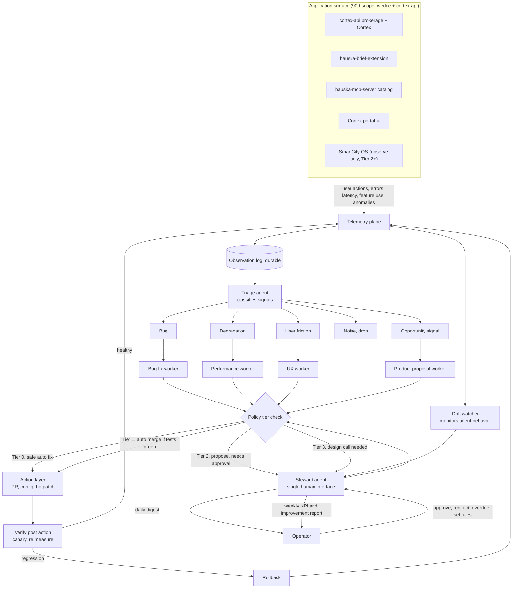
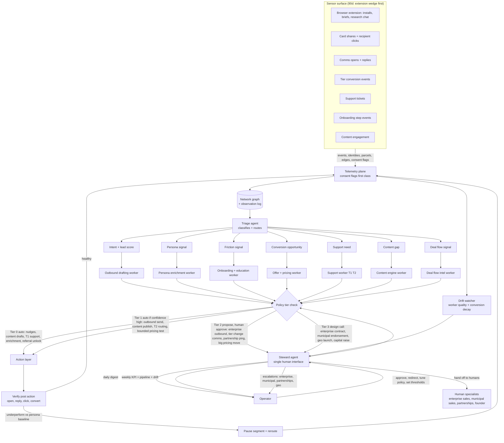

# Operator autonomous loops — maintenance and GTM (90-day scaffold)

> **Purpose.** Canonical description of two parallel operator loops sharing one structural pattern. This doc scopes both loops to the **first 90 days** while the Property Brief wedge deploys. Full-fleet expansion (SmartCity OS, ECI, all verticals) is phased after day-90 gates.
>
> **Parent plan.** [`76_empressa_wedge_90d_operating_plan.md`](76_empressa_wedge_90d_operating_plan.md)

## Pattern (load-bearing, both loops)

Every surface emits **structured events** into a **shared observation layer**. A **triage agent** classifies before any worker acts. **Narrow specialist workers** handle bins (never one general worker). **Policy tiers** gate autonomy from auto-execute through propose-only; the operator tunes policy, not individual agent negotiations. **Verify** runs after every action; regression triggers rollback or pause-and-reroute. A **drift watcher** monitors worker behavior independent of outcome metrics. One **steward agent** is the only human-facing interface. Humans receive tier 2 and tier 3 outputs; humans are not a worker layer.

## Diagram 1: self-healing maintenance loop

**Scope (full vision):** SmartCity OS, Cortex (Design Accelerator), Revit Connector, ECI, Hauska SDK.

**Scope (90 days):** `cortex-api` (brokerage + Cortex prod), `hauska-brief-extension`, `hauska-mcp-server` deploy health. SmartCity OS: **observe-only** (alerts into log, no auto-fix). Revit Connector and ECI: out of 90-day scope unless production incident blocks wedge.



Source file: [`90_runbooks/diagrams/self_healing_loop.mermaid`](90_runbooks/diagrams/self_healing_loop.mermaid)

### Maintenance loop — what it produces

Continuous platform maintenance with **one human-facing surface** instead of multiple dashboards. In 90 days: fewer prod surprises on brokerage routes, faster cc-agent-C dispatch cycles, documented rollback path.

### Maintenance — triage bins and workers

| Bin | Worker | 90-day examples |
|-----|--------|-----------------|
| Bug | Bug fix worker | Wrong `jurisdiction_key`, 503 on stale Cloud Run revision, CORS on extension |
| Degradation | Performance worker | Brief latency >90s, adapter timeout, Grok failures |
| User friction | UX worker | Valerie copy, panel layout, deep research flow |
| Opportunity | Product proposal worker | New persona card, Cortex upsell CTA |
| Noise | Drop | Bot traffic, duplicate events |

### Maintenance — policy tiers (90 days)

| Tier | Maintenance actions allowed |
|------|----------------------------|
| **0** | Auto: structured logging, alert rules, cache warm, traffic shift rollback script |
| **1** | cc-agent PR with green CI; operator merge within 24h (no auto-merge to prod without Nick) |
| **2** | Steward proposes dispatch or config change; Nick approves |
| **3** | Architecture fork, new service extract, partnership-dependent behavior |

### Maintenance — verify and drift

- **Verify:** Re-run smoke brief on Cedar Hill + Bastrop; check error rate and p95 latency on `/api/brokerage/v1/*`.
- **Rollback:** Cloud Run revision rollback per [`90_runbooks/cloud_run_canary_deploy.md`](90_runbooks/cloud_run_canary_deploy.md).
- **Drift:** Flag if bug-fix worker opens PRs outside `legacy-design-tools` allowlist or touches secrets without dispatch.

### Maintenance — 90-day build sequence

| Phase | Days | Deliverable |
|-------|------|-------------|
| M0 | 1–14 | Cloud Logging + brokerage route metrics; `_inbox/` pattern for incidents; steward daily digest (planner template) |
| M1 | 15–45 | Triage rules in runbook; cc-agent-C dispatches tagged by bin; weekly KPI (uptime, brief success rate) |
| M2 | 46–75 | Automated alert → dispatch draft for P0 (503, migration drift) |
| M3 | 76–90 | Drift check on dispatch volume; SmartCity observe-only wired |

**Steward (90 days):** doc_repo planner session-close digest + structured block in `_inbox/` until automated steward agent ships.

---

## Diagram 2: AI-first GTM operator loop

**Scope (full vision):** Extension wedge, AI GTM platform, vertical upsells, deal-flow intelligence.

**Scope (90 days):** Extension and brokerage API events only. Institutional product and deal-flow worker: **log and triage only** (no outbound). Seven workers introduced incrementally; observation layer with **consent first** is day-1 priority.



Source file: [`90_runbooks/diagrams/gtm_loop.mermaid`](90_runbooks/diagrams/gtm_loop.mermaid)

### GTM loop — what it produces

AI-first GTM where one interface replaces a dashboard farm; every automated action is verifiable and reversible. In 90 days: consent-backed event log, weekly pipeline digest, tier-0 nudges only until E&O and share terms clear.

### GTM — observation layer (build first)

**Year-zero rule:** consent flags are first-class on every event. Cannot retrofit for institutional licensing.

Minimum schema (Postgres on `cortex-api` or adjacent analytics DB):

| Field | Required |
|-------|----------|
| `event_id`, `event_type`, `timestamp` | Yes |
| `user_id` or `anonymous_id` | Yes |
| `consent_version`, `graph_opt_in` | Yes |
| `parcel_key` / address hash | When property-scoped |
| `run_id` | When brief-scoped |
| `persona_inferred`, `persona_confidence` | When classified |
| `source_surface` | extension, api, share_page |

Event types (90 days): `extension_install`, `brief_started`, `brief_completed`, `brief_failed`, `research_chat_turn`, `share_created`, `share_viewed`, `upgrade_clicked`, `stripe_converted`, `consent_granted`, `consent_revoked`.

Network graph edges (90 days): `user` → `shared_with` → `recipient`; `user` → `viewed_parcel` → `parcel_key`. Full Neo4j deferred until edge density >10K/month.

### GTM — triage bins and workers (phased)

| Bin | Worker | 90-day activation |
|-----|--------|-------------------|
| Intent + lead score | Outbound drafting | Days 46+: drafts only (Tier 2) |
| Persona | Persona enrichment | Days 31+: batch job on email domain + behavior |
| Friction | Onboarding + education | Days 46+: in-app nudges (Tier 0) |
| Conversion | Offer + pricing | Days 60+: bounded tests (Tier 1) |
| Support | Support T1/T2 | Days 15+: FAQ bot on disclaimer/coverage |
| Content gap | Content engine | Days 76+: parcel-of-week draft (Tier 2 approve) |
| Deal flow | Deal flow intel | Days 1–90: **aggregate log only**, no product sell |

### GTM — policy tiers (90 days)

| Tier | GTM actions allowed |
|------|---------------------|
| **0** | In-app nudges, T1 support replies, referral credit, enrichment batch (no PII export) |
| **1** | Publish approved content; send templated lifecycle email if confidence > threshold AND E&O bound |
| **2** | Proposed outbound to agents/investors; partnership email drafts; pilot pricing changes |
| **3** | Enterprise contract, municipal endorsement, new state launch, capital |

**Hard gate:** Tier 1+ outbound and share cards require E&O bound + share terms (see [`76_empressa_wedge_90d_operating_plan.md`](76_empressa_wedge_90d_operating_plan.md)).

### GTM — verify and drift

- **Verify:** Open rate, brief-to-share rate, free-to-paid conversion vs persona baseline (agent vs investor cohorts).
- **Pause-and-reroute:** If conversion drops >30% week-over-week for a segment, pause Tier 1 auto for that segment.
- **Drift:** Monitor outbound tone, citation claims, and volume caps (max N emails/user/week).

### GTM — 90-day build sequence

| Phase | Days | Deliverable |
|-------|------|-------------|
| G0 | 1–14 | `gtm_events` + `gtm_consent` + API routes (**code landed** 2026-05-26); extension v0.4.3 consent UI; no share without opt-in |
| G1 | 15–45 | Daily steward digest (manual): briefs, failures, top addresses |
| G2 | 46–75 | Share events + agent card; triage to support + onboarding workers (Tier 0) |
| G3 | 76–90 | Weekly KPI + pipeline report; Tier 1 pricing test; institutional meetings logged to graph |

**Humans in GTM loop (90 days):** Nick (founder, pilots, institutional), Valerie (agent seed), fractional GTM optional day 60+. Enterprise, municipal, partnerships: **Tier 3 only**.

---

## What is the same across both loops

| Commitment | Maintenance | GTM |
|------------|-------------|-----|
| Shared observation layer | `observation_log` + Cloud Logging | `gtm_events` + graph edges |
| Triage before workers | Signal class | Intent/persona class |
| Specialist workers | 4 workers | 7 workers (phased) |
| Policy tiers | 0–3 | 0–3 |
| Verify post-action | Latency, error rate | Conversion, engagement |
| Drift watcher | Dispatch/allowlist behavior | Outbound quality, volume |
| Steward | One digest to operator | One digest + escalations |

## What is different

| Dimension | Maintenance | GTM |
|-----------|-------------|-----|
| Sensors | App runtime | Extension, shares, comms, billing |
| Log shape | Stack traces, metrics | Identities, edges, consent |
| Action surface | PRs, deploy, config | Sends, offers, nudges |
| KPI | Uptime, brief success | Pipeline, ARR, conversion |
| Cadence | Real-time alerts | Daily digest, weekly KPI |

## Why both loops run in parallel (90 days)

Deploying the wedge without maintenance loop repeats the Cloud Run revision / empty brokerage key failure mode. Building GTM without consent-first observation destroys the year-4 data licensing line. **Product deploy and G0 observation schema are week-1 parallel tracks**, not sequential.

## Sequencing relative to wedge deploy

```text
Week 1–2   WEDGE: prod deploy + parcel layers
           M0 + G0: logs, events, consent schema, legal ToS

Week 3–6   WEDGE: Valerie demo, PDF, corpus 10 cities
           M1 + G1: triage tags, daily steward digest

Week 7–10  WEDGE: Stripe, share card, pilots
           M2 + G2: alerts→dispatch, Tier 0 GTM workers

Week 11–13 WEDGE: investor card, Cortex upsell, day-90 review
           M3 + G3: drift reports, weekly KPI, Tier 1 bounded
```

## Steward agent (90-day implementation)

Until a dedicated steward service ships:

| Output | Cadence | Owner |
|--------|---------|-------|
| Maintenance digest | Daily | planner from Cloud Logging + `_inbox/` |
| GTM digest | Daily | planner from `gtm_events` export |
| Combined weekly report | Friday | brief count, error rate, conversion, pipeline, drift flags |
| Escalations | Ad hoc | Tier 2/3 items to Nick only |

Upgrade path: single Cursor/agent prompt template reading both logs; then automated steward PR on `doc_repo` `_dispatches/` for approved Tier 2 actions.

## Revision history

| Date | Change |
|------|--------|
| 2026-05-26 | Initial doc: dual loops, 90-day scope, mermaid diagrams filed under 90_runbooks/diagrams |
