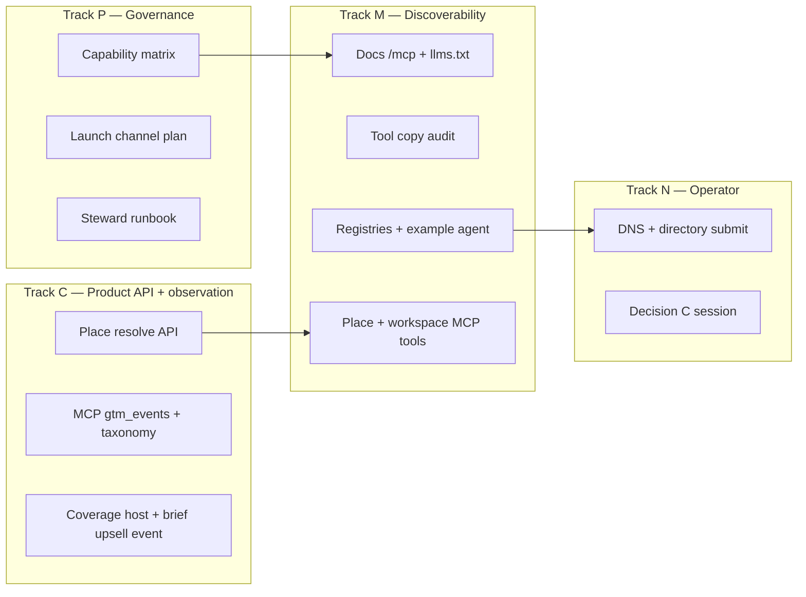

> **2026-06-07 update (GTM lane).** The data-package go-to-market and the single Decision C unpin gate now live in [`76f_gtm_data_package_go_to_market.md`](76f_gtm_data_package_go_to_market.md), which also refines the gtm_loop to a buildable Tier-0 v1 spec and indexes two QUEUED-on-deploy dispatches. The capability matrix is refreshed to v1.1 (46-tool surface, public-vs-internal corpus split, calibration caveat). Decision C remains pinned per [`52_mcp_offer_and_buildout.md`](52_mcp_offer_and_buildout.md) §5.

# GTM engine polish sprint

> **Purpose.** Full-scope execution plan to polish the **automated GTM engine**: one observation plane for the Property Brief wedge and Hauska MCP, agent discoverability at `https://hauska.dev/mcp`, honest public capability claims, registry-ready packages, and steward digests that drive the next action without outbound automation.
>
> **Not in scope.** Tier 1+ outbound email workers, paid Stripe/Circle signup, separate Regrid MCP server, publishing HN/ProductHunt (operator publishes drafts).
>
> **Public claim (until G3 probes green):** *Texas building code MCP + property workspace read API* — not “country-scale place dossier.”
>
> **Canonical URL:** `https://hauska.dev/mcp` (docs, quickstarts, capability matrix link). MCP transport endpoint remains `https://mcp.hauska.dev/mcp` (or deployed equivalent).

## Sprint exit (all required)

| # | Criterion | Evidence |
|---|-----------|----------|
| E1 | `hauska.dev/mcp` live (or `mcp.hauska.dev/docs` with redirect from `/mcp`) | Browser + curl |
| E2 | `hauska.dev/llms.txt` and `hauska.dev/.well-known/agents.txt` fetchable | curl 200 |
| E3 | Central TX coverage page live, fed by `GET /api/brokerage/v1/coverage` | URL + sample JSON match |
| E4 | Anthropic MCP directory package + `awesome-mcp-servers` PR **ready** (operator submits) | Paths in `hauska-mcp-server/docs/gtm/` |
| E5 | First **external** MCP caller in prod logs (`key_hash` not internal) | Cloud Logging query in runbook |
| E6 | MCP events in `gtm_events` (or dedicated `mcp_usage` table) + digest section | Migration + `GET .../gtm/digest` |
| E7 | [`gtm_public_capability_matrix_v1.yaml`](../_catalog/ops/gtm_public_capability_matrix_v1.yaml) matches deployed tool gates | Planner sign-off |
| E8 | [`gtm_launch_channel_plan_v1.yaml`](../_catalog/ops/gtm_launch_channel_plan_v1.yaml) filled (decision C) | Nick initials in file |
| E9 | Place MCP tools probe-green: `resolve_place`, `get_place_layers`, `get_place_dossier` (read-only) | MCP Inspector script in repo |
| E10 | 40-tool LLM description audit committed | PR diff + spot-check 5 tools |
| E11 | Example agent repo/gist public | URL in docs |
| E12 | Friday scoreboard includes 3 MCP metrics | [`79a_weekly_moat_scoreboard.md`](79a_weekly_moat_scoreboard.md) updated |

## Architecture commitments (do not relitigate)

- **One MCP server** (`hauska-mcp-server`), many tools. No Regrid passthrough server.
- **One GTM observation engine** — extend `gtm_events` / digest; do not fork analytics.
- **Regrid/FEMA/code** reach agents via Hauska tools with provenance and cache (`place-layer` snapshots), not third-party keys in client config.
- **Path A honesty** — public listings and coverage pages reflect what anonymous / public keys actually retrieve.

## Four tracks (parallel)

| Track | Owner | Repo | Dispatch |
|-------|-------|------|----------|
| **M — Discoverability + MCP surface** | cc-agent-M | `hauska-mcp-server` | [`_dispatches/2026-05-28_cc-agent-M_gtm_engine_discoverability.md`](_dispatches/2026-05-28_cc-agent-M_gtm_engine_discoverability.md) |
| **C — Place API + observation** | cc-agent-C | `legacy-design-tools` | [`_dispatches/2026-05-28_cc-agent-C_gtm_engine_observation_place_api.md`](_dispatches/2026-05-28_cc-agent-C_gtm_engine_observation_place_api.md) |
| **P — Governance + digest** | planner | `doc_repo` | [`_dispatches/2026-05-28_planner_gtm_engine_governance.md`](_dispatches/2026-05-28_planner_gtm_engine_governance.md) |
| **N — Operator gates** | Nick | — | Checklist §Operator below |

### Dependency order

1. **C1** place resolve HTTP routes land before **M4** MCP tools wire to them.
2. **P1** capability matrix draft before **M1** docs copy (avoid over-promise).
3. **Brokerage V1 deploy** (Dispatch A / place snapshots) should be **merged + prod** before `get_place_dossier` E2E is claimed; GTM docs can ship earlier with `engine_only` honesty.
4. **E0 retrieval API** public catalog tools must return data for at least Bastrop + one Central TX `neon` city before **E5** external caller goal is fair.

## Track M — Discoverability (cc-agent-M)

**Deliverables**

1. **Docs site** at `hauska.dev/mcp`: quickstarts (Claude Desktop, Claude Code, Cursor), tool catalog grouped (`catalog_*`, `place_*`, `brokerage_*`, `cortex_*` gated), attribution, commercial-use boundary, link to capability matrix.
2. **`llms.txt` + `.well-known/agents.txt`** at site root summarizing MCP URL, ICP, coverage link, support contact.
3. **Registry packages** under `docs/gtm/`: Anthropic directory submission, `awesome-mcp-servers` PR markdown, blog/HN/PH drafts (draft only).
4. **40-tool description audit** — LLM-first: jurisdiction keys, example args, error envelopes, Layer 1 vs gated.
5. **Example agent** — public repo or gist: `search_atoms` → `get_atom` → `resolve_place` → `get_place_dossier`.
6. **MCP tools (read-only)** on existing server:
   - `resolve_place` — address or lat/lng → jurisdiction_key, ll_uuid, workspace_did?
   - `get_place_layers` — layer kinds + provenance refs
   - `get_place_dossier` — bounded dossier (code inlineRefs + parcel layers); snapshot-first
   - `list_property_workspaces`, `get_property_workspace`, `list_workspace_share_edges` (per brokerage V1 parity)
7. **MCP usage logging** — structured log fields for steward: `tool`, `key_hash`, `external_caller`, `jurisdiction_key`, `error_class`, `latency_ms` (feeds E5/E6).

## Track C — Place API + observation (cc-agent-C)

**Deliverables**

1. **HTTP API** (service-token + brokerage key where applicable):
   - `POST /api/brokerage/v1/place/resolve`
   - `GET /api/brokerage/v1/place/:placeKey/layers`
   - `GET /api/brokerage/v1/place/:placeKey/dossier` (max payload budget; citations required)
2. **Migration `0029_gtm_mcp_observation.sql`** — extend `gtm_events`:
   - `source_surface`: `extension` | `api` | `mcp` | `docs` | `share_page`
   - Event types: `mcp_tool_call`, `mcp_connect`, `mcp_error`, `mcp_docs_clicked`
   - Fields: `tool_name`, `error_class`, `jurisdiction_key`, `api_key_hash` (no raw key)
3. **Unified error taxonomy** — shared enum for `brief_failed` and MCP: `no_coverage`, `empty_corpus`, `auth_reject`, `upstream_timeout`, `geocode_miss`.
4. **Coverage page host** — static or SSR route `brief.hauska.dev/coverage` **and** embed snippet for `hauska.dev/mcp/coverage` (calls live API).
5. **Extension** — “Build on this data (Hauska MCP)” link + `mcp_docs_clicked` event (hauska-brief-extension PR or note in close report).

**Coordination:** Rebase on Dispatch A (`0030` snapshots) before dossier claims zero Regrid repeat.

## Track P — Governance (planner)

**Deliverables**

1. [`_catalog/ops/gtm_public_capability_matrix_v1.yaml`](../_catalog/ops/gtm_public_capability_matrix_v1.yaml) — tool × tier × data plane × attribution.
2. [`_catalog/ops/gtm_launch_channel_plan_v1.yaml`](../_catalog/ops/gtm_launch_channel_plan_v1.yaml) — decision C: channels, dates, owner (Nick fills).
3. Update [`90_runbooks/steward_daily_digest.md`](90_runbooks/steward_daily_digest.md) — MCP log queries + Friday metrics.
4. Update [`79a_weekly_moat_scoreboard.md`](79a_weekly_moat_scoreboard.md) — 3 MCP lines.
5. Atom catalog entries in [`_catalog/atoms_index.md`](_catalog/atoms_index.md) if new ops atoms used in dispatches.

## Track N — Operator (Nick)

| Step | Action | Unblocks |
|------|--------|----------|
| N1 | 90-min session: complete `gtm_launch_channel_plan_v1.yaml` | E8, publish sequence |
| N2 | Map DNS: `hauska.dev/mcp`, `llms.txt`, `mcp.hauska.dev` | E1, E2 |
| N3 | Submit Anthropic MCP directory + open awesome-mcp PR | E4 |
| N4 | After E5: approve Show HN / blog publish (optional) | Wave 2 GTM |
| N5 | Pricing numbers session (decision B) — parallel, not blocking wave 1 docs | Wave 2 paid |

## Sequencing vs other work

| Other work | Relationship |
|------------|----------------|
| Central TX Brief / Dispatch A | **Soft gate** for dossier E2E; not for docs/registries/observation schema |
| Brokerage V1 metering/graph | Workspace MCP tools align; no write tools in this sprint |
| `79` Lane A (place graph shipping) | This sprint is **Lane B** — runs only if Brief deploy + weekly Lane A outcomes hold |
| Commercialization Wave 2 paid tier | Explicitly out of scope |

## Kill / pause criteria

- Pause registry publish if capability matrix and `list_jurisdictions` disagree on public cities.
- Pause `get_place_dossier` marketing if second `/brief` still hits live Regrid on snapshot path (Dispatch A acceptance).
- Pause MCP outbound experiments if E&O not bound and event lacks consent (unchanged from `76a_*`).

## Dispatches and decision

| Artifact | Path |
|----------|------|
| Sprint decision | [`_decisions/2026-05-28_gtm_engine_polish_sprint.md`](_decisions/2026-05-28_gtm_engine_polish_sprint.md) |
| Lane M | [`_dispatches/2026-05-28_cc-agent-M_gtm_engine_discoverability.md`](_dispatches/2026-05-28_cc-agent-M_gtm_engine_discoverability.md) |
| Lane C | [`_dispatches/2026-05-28_cc-agent-C_gtm_engine_observation_place_api.md`](_dispatches/2026-05-28_cc-agent-C_gtm_engine_observation_place_api.md) |
| Lane P | [`_dispatches/2026-05-28_planner_gtm_engine_governance.md`](_dispatches/2026-05-28_planner_gtm_engine_governance.md) |

## Revision history

| Date | Change |
|------|--------|
| 2026-05-28 | Initial full-scope sprint plan; operator confirmed name, URL, public claim, decision C time-box |
