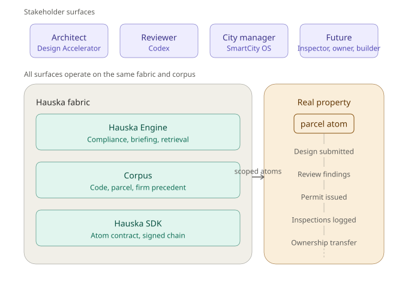

# ADR-008 — Hauska Engine factor-out, naming, and repo placement

## Status

**Accepted, scheduled.** Originated 2026-05-10 during the plan review framing session. Execution sequenced after the Cloud Run + Empressa Neon migration sprint completes (per [`12_migration_sprint.md`](../12_migration_sprint.md)) — splitting a structural refactor onto the same repo as a mid-flight infrastructure migration is the Track B saga pattern this ADR explicitly avoids.

*The diagram above shows the Hauska Engine sitting inside the Hauska fabric, between the Hauska SDK substrate and the Empressa stakeholder surfaces. This ADR establishes the engine's name, its commercial brand placement, and its target repo location.*

## Context

The plan review and parcel-briefing engine — compliance pass, context retrieval, briefing generation, AI gateway — currently lives inside the legacy-design-tools `api-server` artifact. This was natural during Design Accelerator development because the engine was first built to serve architect-side workflows. The engine then expanded to serve reviewer-side workflows (the `plan-review` artifact mirrors what reviewers see) under the "same engine, two surfaces" principle from [`40_design_accelerator.md`](../40_design_accelerator.md).

With the addition of Codex as the canonical reviewer surface (see [`47_codex_plan_review.md`](../47_codex_plan_review.md)) and the surface area expansion captured in the predecessor addendum (10+ new features including invited-participant adapters, adaptive UI, conversational primitive, audit trail anchoring), the engine's surface area has expanded approximately 4x. The original framing — engine = compliance checker shared by two surfaces — is now too thin. Today's reality is engine + adaptive UI layer + tool adapters + audit chain + conversational layer = a substantial product distinct from either Design Accelerator or SmartCity OS.

Three forces argue for factor-out:

1. **Independent release cadence.** Today the engine ships when `legacy-design-tools` `api-server` ships. Reviewer-side changes ride architect-side deploys; architect-side changes ride reviewer-side test surface. Engine evolution is coupled to architect-side release pressure.
2. **Multi-consumer surface area.** Two consumers today (DA, SmartCity OS), three on the near horizon (Codex 1a invited, Codex 1b standalone, future inspector surface), more when PropTech ecosystem partners begin consuming.
3. **Brand and commercial coherence.** The engine sits between the Hauska SDK (atom contract + anchoring) and Empressa surfaces. Naming the engine forces a brand decision that has been deferred. The Hauska commercial story benefits from extending beyond "atom contract" to "atom contract + intelligent processing."

Two forces argue against doing it now:

1. **Migration sprint is mid-flight.** Phase 1A is verified; Phases 1B (Empressa Neon provisioning), 1C (cutover), 2 (SmartCity OS migration), and 3 (Drizzle migrate adoption) are pending. Stacking a structural refactor on the same repo risks compound failure modes per the Track B saga ([`91_postmortems/2026-05-05_track_b_deploy_saga.md`](../91_postmortems/2026-05-05_track_b_deploy_saga.md)).
2. **Coordination cost.** Atom contract version bumps already require coordinated rollouts across legacy-design-tools + smartcity-os + revit-connector. Adding the engine as a 4th piece adds non-zero drag.

The decision is *yes, factor out*, with timing sequenced to avoid stacking against the migration sprint.

## Decision

### Engine name and brand

**The engine is named "Hauska Engine."** It sits in the Hauska commercial layer alongside the Hauska SDK. Empressa product surfaces (Design Accelerator, Codex, SmartCity OS) consume Hauska Engine + Hauska SDK + the `@empressaio/atom` contract.

The naming choice preserves the v1.3 ownership correction in ADR-001 (atom contract is Empressa, not Hauska — Empressa-the-product owns the contract that everyone consumes), while putting the engine in the Hauska commercial layer where it can be sold as substrate.

External product surfaces use their own brand names; the engine is visible as "powered by Hauska Engine" in product collateral where the substrate matters (e.g., for technical buyers, partners, audit-conscious customers). For most reviewer-facing collateral, the engine is invisible — Codex is the product name; Hauska Engine is the substrate.

### Repo placement

**The Hauska Engine factor-out target is its own repository in the `empressaioemail-tech` GitHub org**, named `hauska-engine`, following the same ownership convention as Hauska SDK. (When the `Hauska Inc.` org migration completes per the P3 roadmap entry, the engine repo migrates with the SDK.)

Repo structure (preliminary; final layout decided during factor-out execution):

- `packages/engine-core/` — compliance pass, briefing generation, context retrieval, AI gateway
- `packages/corpus/` — code atom ingestion, parcel intelligence, firm precedent, per-reviewer learning
- `packages/adapters/` — host tool adapters (Bluebeam, Acrobat, ProjectDox), starting with Bluebeam in Wave 1
- `packages/audit/` — audit trail anchoring (consumes Hauska SDK EventAnchoringService)
- `services/engine-api/` — HTTP/gRPC API consumed by surfaces

### Factor-out timing

**Sequenced after migration sprint Phase 2C (SmartCity OS Empressa Neon swap completed).**

- Phase 1A — verified ✓
- Phase 1B-1C — legacy-design-tools Empressa Neon migration (pending)
- Phase 2A-2C — SmartCity OS Empressa Neon migration (pending)
- **Phase 2C closeout: ADR-003 supersedes; this ADR's execution unblocks**
- Phase 3 — Drizzle migrate adoption (parallel-eligible with engine factor-out)
- **Engine factor-out sprint** — separate sprint plan, lands as own doc when scoped

Factor-out is *not* a v1 prerequisite. Codex Wave 1 (1a invited foundation) ships from the current legacy-design-tools `api-server` location; factor-out optimizes the architecture but does not unblock product features. Codex feature work and engine factor-out proceed in parallel after migration completes.

### Brand visibility per surface

- **Codex** — product name, surface-facing. Hauska Engine is the substrate, visible to technical buyers and in audit packages.
- **Design Accelerator** — product name, surface-facing. Hauska Engine substrate visible in same contexts.
- **SmartCity OS** — product name, surface-facing. Hauska Engine substrate visible same way.

The Hauska brand expands to cover SDK + Engine + (future) other substrate components. Empressa brand covers product surfaces and the atom contract.

## Alternatives considered

**Alternative 1 — Keep the engine inside legacy-design-tools.** Rejected. The four-fold surface area expansion makes the "engine is a feature of api-server" framing untenable. Multi-consumer release cadence problems compound with each new consumer.

**Alternative 2 — Empressa Engine instead of Hauska Engine.** Rejected. Putting the engine in the Empressa brand collapses the Hauska commercial layer back to "just the SDK," which contradicts the goal of having Hauska be a substantive substrate brand. Empressa is a product surface family; Hauska is platform.

**Alternative 3 — Hauska Plan Engine (or other domain-specific naming).** Rejected. The engine is not plan-review-specific. Architect-side parcel briefing, city-side property intelligence (Sylvia's hydrology query), and future inspector compliance all consume the same engine. Domain-specific naming would force a rename when adjacent surfaces consume it.

**Alternative 4 — Defer naming until factor-out execution.** Rejected. Naming the engine forces a brand decision that has been deferred for too long; resolving it now lets downstream docs (Codex product home, ADR-007, living lineage thesis) reference the engine by name without circular-blocker patterns.

**Alternative 5 — Factor out before migration completes.** Rejected. Stacks structural refactor on infrastructure migration on the same repo. Track B saga pattern. Migration completes first; factor-out follows.

## Consequences

**Positive:**

- Engine has independent release cadence, decoupled from architect-side or reviewer-side product release pressure.
- Multi-consumer surface area scales naturally — adding a new surface (inspector, owner, contractor) is a matter of consuming the engine API, not factoring out engine code from a sibling product.
- Hauska commercial brand strengthens — substrate story extends from "atom contract" to "atom contract + intelligent processing."
- Audit trail (CDX-15 in the Codex roadmap) lands cleanly in the engine repo's `packages/audit/` next to the SDK consumption, rather than sandwiched in api-server.
- Atom registry expansion for Codex (new atoms: firm-tenant, firm-precedent, audit-trail-anchor, etc.) lands in the engine repo where it belongs, not in legacy-design-tools where it currently would.

**Negative:**

- Coordination cost. Atom contract version bumps now coordinate across SDK + Engine + 3+ surfaces.
- Initial factor-out sprint is non-trivial work — moving live code, updating consumers, maintaining behavior parity.
- Operational complexity increases: another deployable, another CI surface, another secret-management story.

**Neutral:**

- Factor-out is reversible in principle (the code is the same code in a different repo) but not in practice once consumers have stabilized against the new API. Treat the move as a one-way door for planning purposes.

## Trigger conditions for revisiting

- Empressa adopts a multi-engine strategy (e.g., separate engines for plan review vs. structural compliance vs. zoning). At that point "Hauska Engine" becomes ambiguous; this ADR updates.
- Hauska Inc. GitHub org migration completes (P3 roadmap entry). Engine repo moves with SDK.
- A future commercial decision puts the engine in a different brand (Empressa or third). This ADR updates.

## Sequencing checklist

To be tracked in the eventual factor-out sprint plan:

- [ ] Migration Phase 2C (SmartCity OS Empressa Neon swap) closed
- [ ] Engine factor-out sprint scoped as its own sprint doc
- [ ] Repo `hauska-engine` created in `empressaioemail-tech` org
- [ ] Initial package layout decided
- [ ] Code moved with behavior parity tests
- [ ] Consumers updated (legacy-design-tools api-server, SmartCity OS api-server, Codex 1b standalone)
- [ ] Atom contract registry alignment
- [ ] CI surface for engine repo
- [ ] Secret Manager updates for engine deploy

## References

- [`adr_001_atom_architecture.md`](adr_001_atom_architecture.md) — atom contract that the engine consumes
- [`adr_007_cross_stakeholder_atom_access.md`](adr_007_cross_stakeholder_atom_access.md) — access model the engine enforces on cross-stakeholder reads
- [`12_migration_sprint.md`](../12_migration_sprint.md) — the migration sprint that gates factor-out timing
- [`91_postmortems/2026-05-05_track_b_deploy_saga.md`](../91_postmortems/2026-05-05_track_b_deploy_saga.md) — the saga that informs "don't stack structural refactors on infrastructure migration"
- [`47_codex_plan_review.md`](../47_codex_plan_review.md) — primary consumer that motivates urgency
- [`05_living_lineage_thesis.md`](../05_living_lineage_thesis.md) — strategic frame
- [`40_design_accelerator.md`](../40_design_accelerator.md) — current home of the engine code; receives `plan-review` artifact reframe per associated update

## Revision history

- **2026-05-10 (origin):** drafted as ADR-008 during plan review framing session. Establishes Hauska Engine name, Hauska commercial brand placement, and post-migration factor-out timing.
