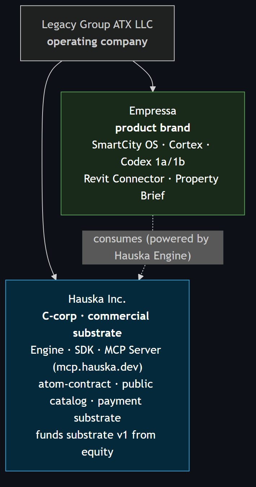
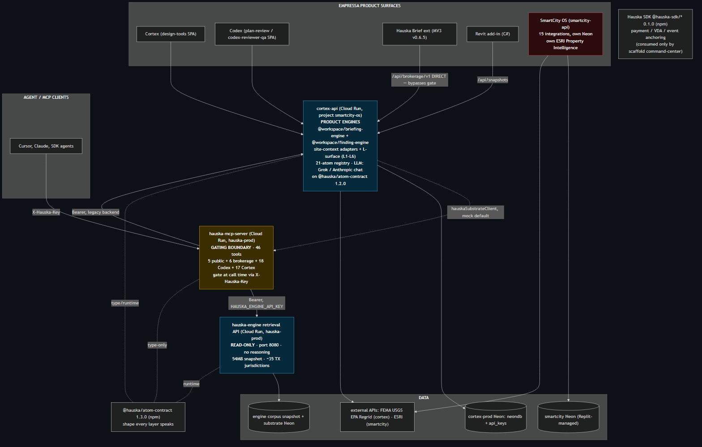
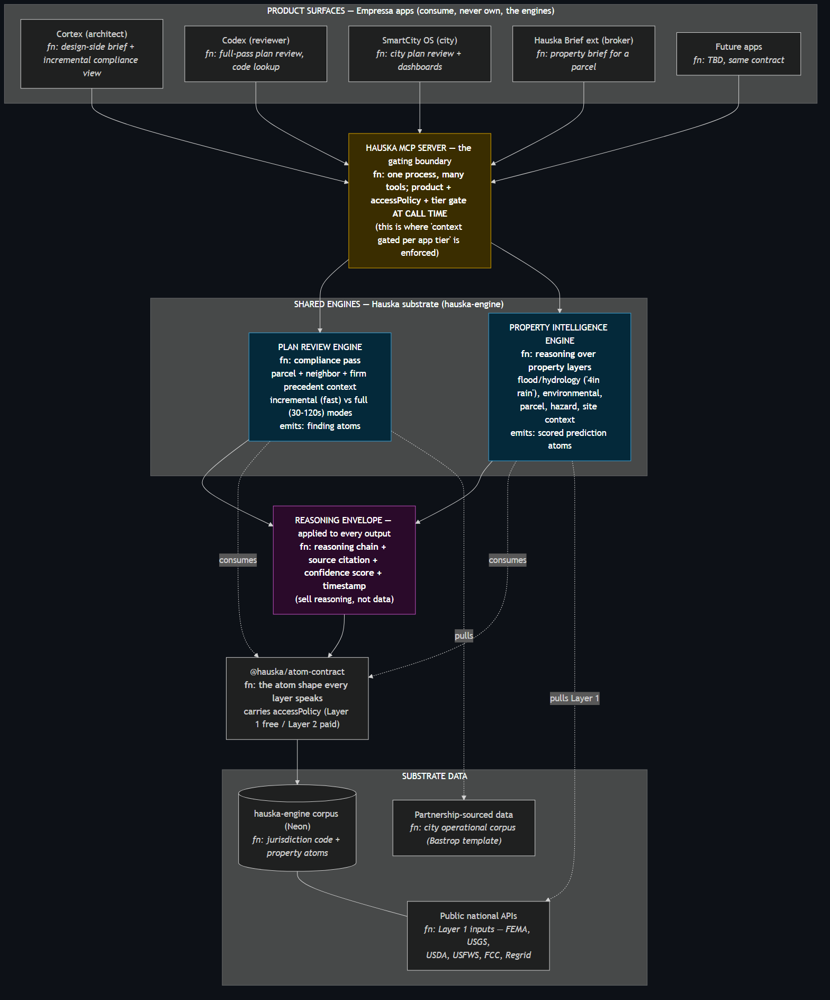
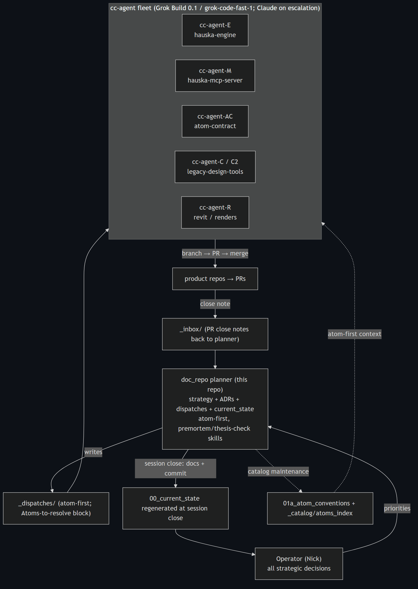
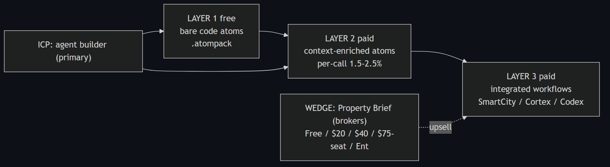
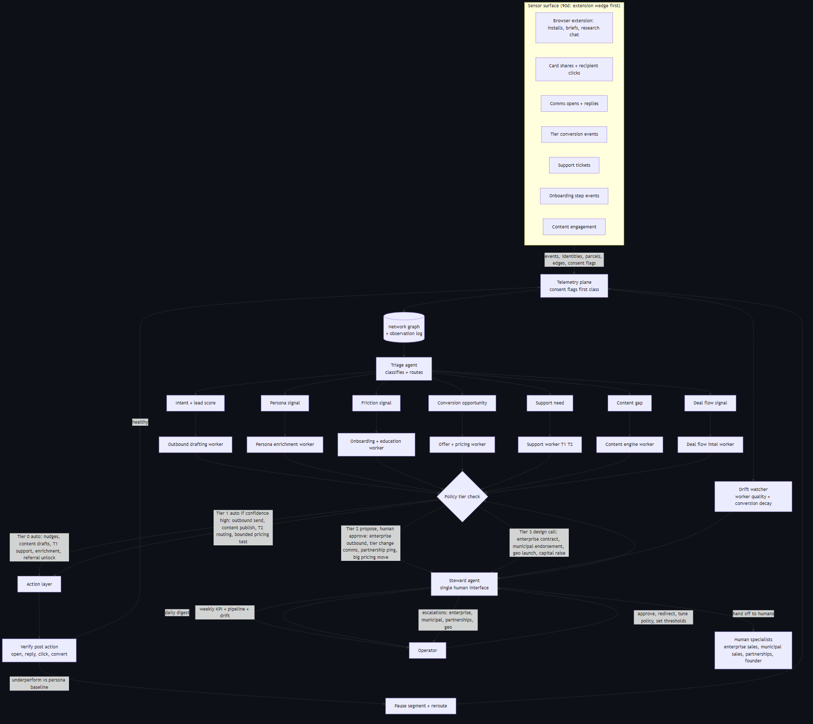
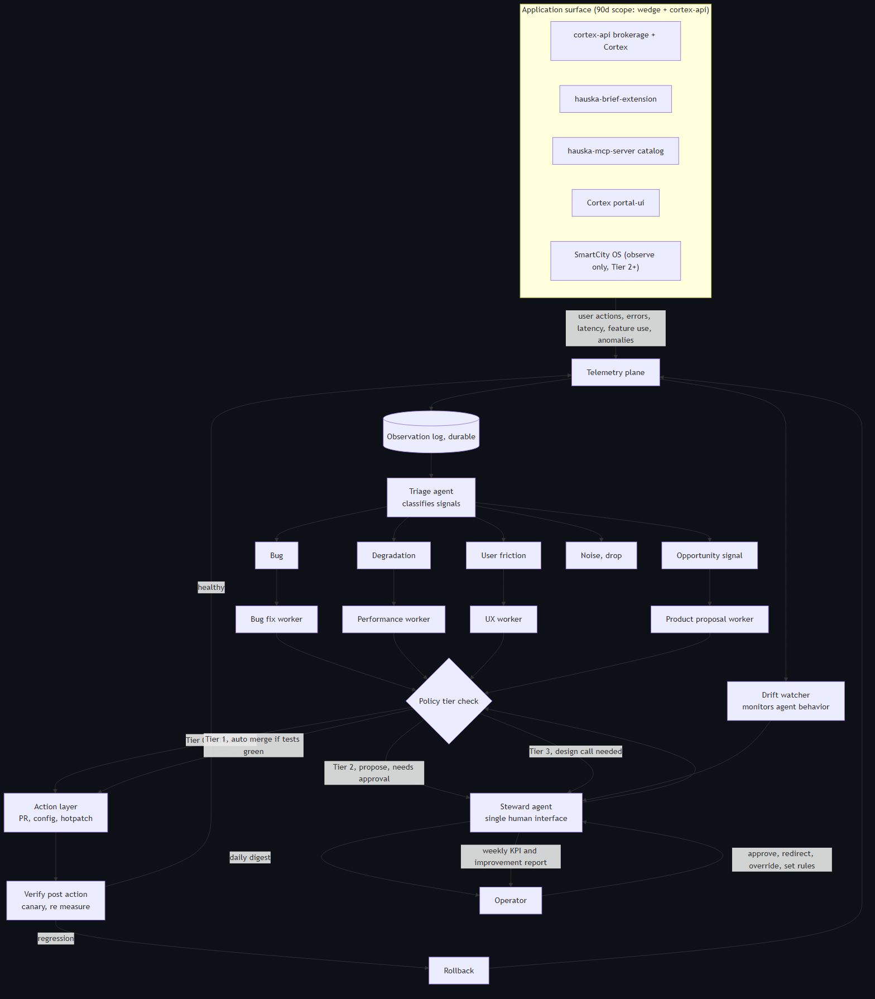
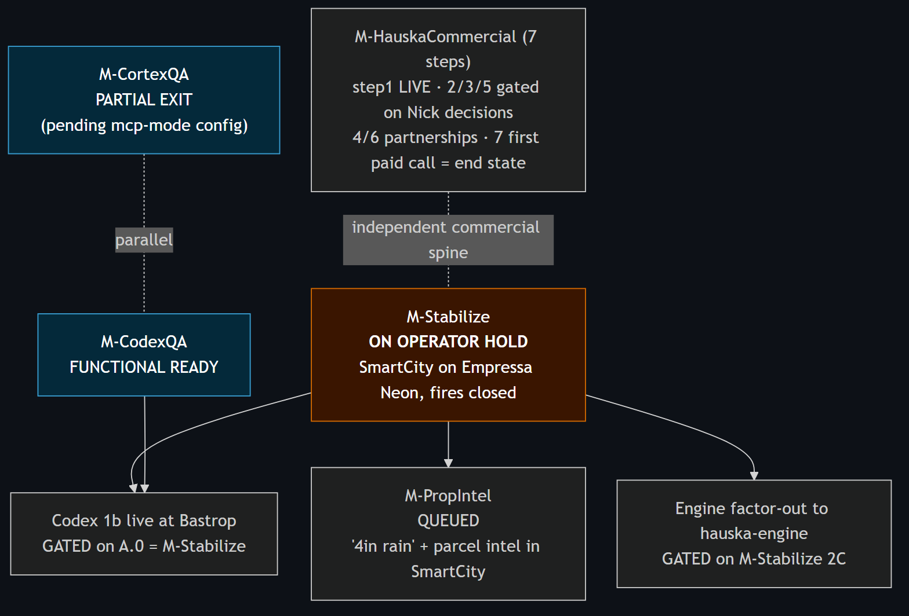

# Portfolio executive summary

This is the narrative companion to the diagrams in this folder. It reads the whole portfolio in prose, with each diagram embedded where it earns its place. It was built on 2026-06-01 from a live read of every repo, not from the doc set, so where the two disagree this is the more current account. The full reference, including the per-repo ground truth and the housekeeping list, is in [`00c_portfolio_master_map.md`](../../00c_portfolio_master_map.md).

## The one idea

We are building the canonical data and reasoning substrate for physical-world jurisdictional intelligence, and we are selling reasoning rather than data. A jurisdiction's code, a parcel's constraints, a property's flood exposure, a plan reviewer's adjudication history: today these live in disconnected tools and tribal memory. We atomize them into structured, cited, confidence-scored units, serve them through one gated interface, and let every product surface and every outside agent consume the same intelligence at the tier they are entitled to. The buyer of the substrate is the agent operator. The internal dogfood instance is our own company intelligence.

Two companies carry this. Hauska Inc. holds the commercial substrate: the engine, the SDK, the MCP server, the atom contract, the catalog, the payment rail. Empressa is the product brand whose surfaces sit on top of that substrate and are branded forward, powered by Hauska underneath. Legacy Group ATX LLC is the operating company over both.

## What is actually built and running

The encouraging headline from the cross-repo read is that the spine is real and deployed, and it is further along than our own documents had been claiming. The atom contract is published to npm. The retrieval engine and the gating server both run on Cloud Run in production. The product backend has finished migrating onto the shared contract. None of this is aspirational anymore.

The shape is worth reading carefully, because it explains both the strength and the gap. The hauska-engine is a read-only retrieval service. When it runs, it ingests code, atomizes it, evaluates quality, and hands atoms out. It holds roughly thirty-five Texas jurisdictions today and does no reasoning of any kind. All the reasoning, the property briefings and the plan-review findings, lives one layer up in the product backend (cortex-api) as two engine packages. The MCP server is the gating boundary: forty-six tools, every one of them gated at call time by the product key, which is exactly the mechanism that lets a future app consume the same engines at its own tier for almost no marginal cost.

The gap is also visible. The brokerage extension reaches the product backend directly and skips the gate. SmartCity OS, our live city platform, sits as an island: fifteen working integrations, its own parcel intelligence built on a different data source, and no connection to the substrate yet. Closing those two gaps is the substance of the next architectural leg.

## The products, and the engines under them

Empressa surfaces the same intelligence at every role in the construction and property lifecycle. SmartCity OS is the city's seat. Cortex is the architect's and engineer's seat. Codex is the plan reviewer's seat and the contractor's pre-submission self-check, plus a free code-lookup surface for anyone, human or agent. The Revit connector bridges the designer's existing tool. Property Brief is the brokerage wedge.

Underneath all of them are two logical engines. A property and parcel engine geocodes, pulls site context from national public sources, composes briefings, and reasons over layers like flood and hydrology. A plan-review engine retrieves code, generates findings, and runs adjudication into comment letters. Plan review consumes property context rather than duplicating it. Today both engines are packages inside one product backend. The destination is to extract them into the shared substrate so every app, present and future, consumes them through the gate at its own tier.

The motivating example for the property engine is the question a city manager actually asks: what happens to this property with four inches of rain. That answer is not a data lookup. It is the property engine reasoning over public flood and elevation inputs and wrapping the result in a citation, a confidence score, and a timestamp. The free public inputs are Layer 1. The reasoning over them is the paid product. That single distinction is the whole commercial model in miniature.

## How we build it

The work is produced by a small agent fleet coordinated from a single documentation and strategy repository. The planner turns the operator's priorities into atom-first dispatches. Each repository has one owning agent. Agents branch, open pull requests, and merge; close notes flow back to the planner, who regenerates the rolling state snapshot at the end of each session. The default agents run on Grok, with Claude reserved for escalation.

## How it goes to market

The commercial structure is a tier model and a wedge. Layer 1 is free bare code, distributed as widely as possible to drive adoption. Layer 2 is the context-enriched, reasoning-bearing atoms, priced per call at a low take rate. Layer 3 is the integrated product workflows. The crypto settlement rail is built and tested; the fiat rail moved to Circle and is still a near-greenfield build. The primary buyer we are designing for is the agent builder working on the Anthropic SDK.

The go-to-market wedge is Property Brief, sold to brokers, with a free tier and a paid ladder, and explicit upsell doors into Cortex, Codex, SmartCity OS, and the MCP for heavier needs. The ninety-day plan ladders from ten internal briefs, to a design-partner broker using it weekly, to a first paid pilot with insurance bound, to a meaningful run-rate or signed pipeline by day ninety. The five-year base plan ladders that wedge, plus vertical, data, and transaction revenue, toward a half-billion-dollar outcome.

Both the growth engine and the maintenance engine are designed as the same self-healing shape: sense, triage, work, gate by policy tier, act, verify, and escalate to a single human steward only when the tier demands it. Neither is built and running yet; both are roadmap.

## Where we stand on the path

One dependency dominates the technical roadmap. The city platform is on an operator hold while its production database is handled directly. Until that releases, the reviewer product going live at our anchor city, the property-intelligence capability, and the engine extraction all wait behind it. The rain capability specifically needs two more build phases in the Cortex site-context work, since only the topography phase is done, and then a port into the city platform.

The commercial path is gated less by engineering than by two operator decisions, on pricing and on go-to-market channels, plus the fiat-rail build. The public MCP launch step is already done. The corpus is at roughly twenty-seven hundred atoms across five jurisdictions, with the cost-per-jurisdiction discipline holding. Further jurisdiction expansion is deliberately demand-pulled rather than pushed.

## The honest close

The substrate thesis is no longer a plan, it is partly shipped. The next leg is about three things: extracting the engines into the shared substrate so the architecture matches the story, pulling the two outliers (the city platform and the brokerage extension) onto the gated spine, and turning one of the designed loops into a running system. The realignment session that follows this map works the specific decisions, captured in [`00c_portfolio_master_map.md`](../../00c_portfolio_master_map.md) section ten. Before any of those decisions hardens into a sprint, it runs through the structural commitments.
