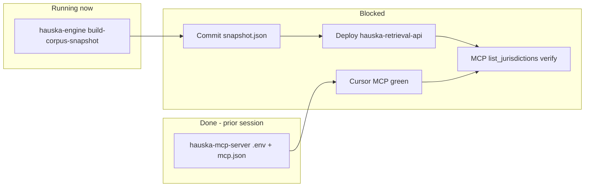

# Recon — parallel agents on cente workstation (2026-05-26)

**From:** cursor-auto (hauska-mcp-server workspace monitor pass)  
**To:** planning-agent  
**Trigger:** Operator asked for visibility into what other agents have done across `hauska-mcp-server` and related repos.

---

## TL;DR

| Lane | Repo | Status |
|------|------|--------|
| **Local MCP setup** | `hauska-mcp-server` | **Done** (prior Cursor session) — `.env`, `mcp.json`, smoke tests; **server currently DOWN** |
| **Post-#49 snapshot + deploy** | `hauska-engine` → retrieval-api | **In progress** — `build-corpus-snapshot` running ~57+ min; last log: San Antonio UDC ingest |
| **Git on `hauska-mcp-server` `main`** | `hauska-mcp-server` | **Clean** vs `origin/main` — **no commits** from parallel agents; 3 untracked files only |

**Planner takeaway:** cc-agent-M dispatch from [`post_batch49_snapshot_deploy`](_inbox/2026-05-26_hauska-mcp-server_cc-agent-M_post_batch49_snapshot_deploy.md) is executing in **hauska-engine**, not blocked on MCP-server code changes. Local Cursor MCP will stay red until operator restarts `pnpm dev`.

---

## 1. `hauska-mcp-server` git state

- **Branch:** `main`, synced with `origin/main` (`f181ae7` — Lane M final hand-off #22).
- **Modified tracked files:** none.
- **Untracked only:**

| File | Modified | Notes |
|------|----------|-------|
| `scripts/start-mcp-dev.ps1` | 2026-05-25 | Helper: `NODE_OPTIONS=--use-system-ca`, `pnpm dev` |
| `_research/2026-05-20_mcp_architecture_map.md` | 2026-05-20 | Read-only QA-05 recon (40 tools, single process) |
| `pnpm-lock.yaml` | 2026-05-20 | Extra lockfile; repo primary is `package-lock.json` |

No staged changes. Parallel agents have **not** committed to this repo.

---

## 2. Prior agent session — local MCP + Cursor (complete)

**Session:** Cursor auto in `hauska-mcp-server` (operator setup Stages B/C, MCP panel, smoke matrix).

### Completed

1. **`.env`** in repo root (gitignored) — production `cortex-api`, retrieval-api, Postgres keys, Upstash, admin key.
2. **`C:\Users\cente\.cursor\mcp.json`** — `hauska-cortex` + `hauska-codex` as HTTP MCP:
   - URL: `http://127.0.0.1:3000/mcp` (switched from `localhost` for Windows IPv6)
   - Auth: `X-Hauska-Key` (not `Authorization: Bearer`)
3. **Smoke matrix** — cortex/codex tool round-trips reported green when server was up.
4. **Artifacts**
   - `scripts/start-mcp-dev.ps1` (untracked)
   - `.vscode/tasks.json` — task **"MCP: start dev server"** (gitignored via `.vscode/`)

### Current operator state (recon time)

- **`GET http://127.0.0.1:3000/health`** — **unreachable** (`pnpm dev` not running).
- **Impact:** Cursor MCP entries show `ECONNREFUSED` until dev server restarted.
- **Fix:** `.\scripts\start-mcp-dev.ps1` or Terminal → Run Task → MCP: start dev server; toggle MCP servers Off/On in Cursor.

---

## 3. Active agent session — cc-agent-M post-#49 (in progress)

**Dispatch source:** [`_inbox/2026-05-26_hauska-mcp-server_cc-agent-M_post_batch49_snapshot_deploy.md`](_inbox/2026-05-26_hauska-mcp-server_cc-agent-M_post_batch49_snapshot_deploy.md) (from cc-agent-E).

**Observed execution:**

| Step | Expected repo | Observed |
|------|---------------|----------|
| 1. Regenerate `snapshot.json` | `hauska-engine` | **Running** — background shell `P:\hauska-engine`, started `2026-05-25T18:11:22Z` |
| 2. Commit snapshot | `hauska-engine` | Not yet |
| 3. Redeploy retrieval-api | `hauska-engine` | Not started |
| 4. Verify MCP `list_jurisdictions` | `hauska-mcp-server` | Blocked on steps 2–3 + local MCP up |

**Snapshot build log (partial, as of recon):**

- **Skipped:** Bastrop UDC (0 sections — live-source drift).
- **PASS:** Bastrop B3, Bastrop County, Elgin, Hutto, Round Rock, Taylor, Leander, Georgetown, New Braunfels, Killeen, Copperas Cove, Austin, Manor, Lockhart, Lago Vista, Dripping Springs, Wimberley, Rollingwood.
- **In progress at recon:** San Antonio Unified Development Code (Municode).
- **Log file:** `P:\hauska-engine\_snapshot-build.log`
- **Budget:** operator was told 30–90+ min; elapsed ~57 min at recon — still within range.

**cc-agent-M Cursor session** (hauska-mcp-server workspace) had only opened — initially searched for `services/retrieval-api/DEPLOY.md` in the wrong repo. Actual deploy docs live under **hauska-engine**.

---

## 4. Cross-repo dependency map



**QA unblock chain (unchanged from post_batch49 handoff):**

- **QA-61** Code Library live catalog — needs retrieval snapshot redeploy.
- **QA-60** Cedar Hill plan review — needs `cedar_hill_tx` in snapshot (batch #49).
- **QA-58** — priority key `cedar_hill_tx` (430 Evergreen Trl, Cedar Hill TX).

**legacy-design-tools** partial QA-62 pass (5 jurisdictions) documented in [`cursor-auto_session_close`](_inbox/2026-05-26_legacy-design-tools_cursor-auto_session_close.md) — root cause still stale prod snapshot until this engine lane completes.

---

## 5. Risks / operator heads-up

| Risk | Mitigation |
|------|------------|
| Operator thinks MCP code is broken | Server not running — not a config regression; restart `pnpm dev` |
| cc-agent-M works in wrong repo | Point to `P:\hauska-engine` for snapshot + DEPLOY.md |
| Snapshot still running | Do not kill shell pid 68128 unless operator aborts; check `_snapshot-build.log` tail |
| San Antonio / remaining metros timeout | Same as cc-agent-E handoff — partial ingest possible; read eval FAIL lines |
| Dallas city / Dallas County | **Out of scope** for this batch (AmLegal track) |

---

## 6. Suggested planner actions (optional)

1. **No new dispatch** to `hauska-mcp-server` code — wait for engine snapshot + retrieval redeploy.
2. **Operator ping:** restart local MCP dev server if QA-62 / Cursor smoke needed before prod catalog refresh.
3. **When snapshot completes:** cc-agent-M should commit `snapshot.json` on `hauska-engine` `main`, deploy per `services/retrieval-api/DEPLOY.md`, then verify `list_jurisdictions` and ping cc-agent-C per existing handoff checklist.
4. **Archive:** after cc-agent-M close, delete or supersede this recon file.

---

## 7. Verification commands (operator)

```powershell
# Local MCP up?
Invoke-WebRequest http://127.0.0.1:3000/health -UseBasicParsing

# Snapshot still running?
Get-Content P:\hauska-engine\_snapshot-build.log -Tail 20

# After deploy — prod catalog (replace URL/key from Secrets.txt)
# GET /jurisdictions?qualityBarOnly=true  → expect >> 5 rows, cedar_hill_tx present
```

---

cursor-auto recon — filed for planning-agent inbox review
