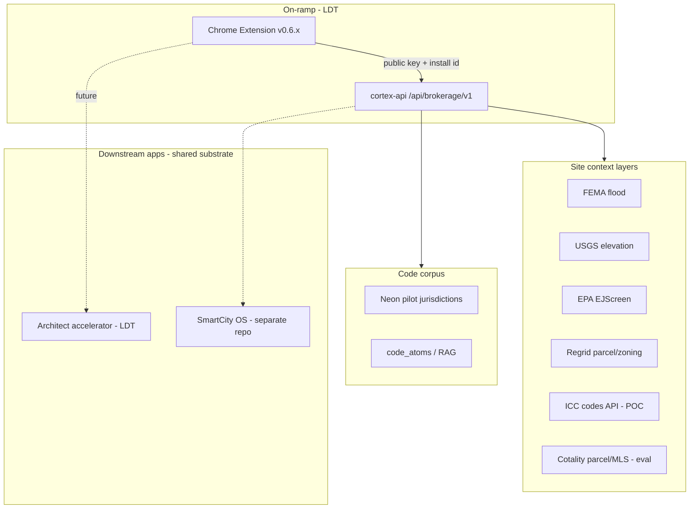

# Session handoff — Property Brief extension public tier deploy + strategic context

**Purpose:** Single pickup doc after operator deploy session (2026-05-29/30). Use this to resume QA, fix extension bugs, and plan data-layer expansion (ICC, Cotality, Regrid).

**Vision (unchanged):** Browser extension = on-ramp → “cylinder of intel” over an address (codes, zoning, flood, parcel, deed restrictions, eventually mineral rights) with cited reasoning, GTM telemetry, and tiered access (consumer free pilot → paid depth → architect/city apps on shared substrate.

**Honest status:** Good progress on **auth + deploy + public tier**; **consumer UX still rough** (storage quota, optional key confusion); **parcel/zoning gaps** (Regrid archive no-coverage on canary/prod smokes); **ICC POC not started**; **Cotality not integrated** — new strategic lane to evaluate.

---

## 1. What shipped (legacy-design-tools)

### Merged PRs (main)

| PR | Title | Merge SHA | What it does |
|----|-------|-----------|--------------|
| [#138](https://github.com/empressaioemail-tech/legacy-design-tools/pull/138) | Brief API slim + workspaceId | merged | Returns `workspaceId`/`workspaceDid`; strips `siteContext.layers[].payload` for extension clients |
| [#139](https://github.com/empressaioemail-tech/legacy-design-tools/pull/139) | Hotfix brief-coverage.html boot | merged | Lazy-load coverage HTML (Cloud Run ENOENT fix) |
| [#140](https://github.com/empressaioemail-tech/legacy-design-tools/pull/140) | Extension public client key | `a17b38ae` | `BROKERAGE_EXTENSION_PUBLIC_KEY` tier: rate limits, neon pilot gate, GTM `clientTier: extension_public`, 403 on wallet/share/encumbrance |

### Key code paths

- Auth: `artifacts/api-server/src/middlewares/brokerageAuth.ts`
- Public tier limits/gating: `artifacts/api-server/src/lib/brokerageExtensionPublic.ts`
- Brief route: `artifacts/api-server/src/routes/brokerageBrief.ts`
- Deploy docs: `docs/deploy.md` § Property Brief — extension public key

---

## 2. Prod / Cloud Run state (as of session end)

| Item | Value |
|------|--------|
| **Project** | `legacy-design-tools-prod` |
| **Service** | `cortex-api` |
| **Prod URL** | `https://cortex-api-tds7av26va-uc.a.run.app` |
| **Canary URL** | `https://canary---cortex-api-tds7av26va-uc.a.run.app` |
| **Serving revision (100% traffic)** | `cortex-api-00119-laq` — confirmed via `update-traffic --to-tags=canary=100` |
| **Prod smoke (public key)** | **PASS** — `round_rock_tx`, `extension_public` on default URL (2026-05-30) |
| **Image** | `cortex-api@sha256:e7df2b6c…` (PR #140 / `a17b38a` line) |

### Secrets / env on good revision (00116+ pattern; 00119 inherits)

| Name | Mount |
|------|--------|
| `BROKERAGE_EXTENSION_PUBLIC_KEY` | Secret Manager v2 (56-char key — **never commit**; in SM only) |
| `REGRID_API_KEY` | Secret Manager |
| `XAI_API_KEY` | Secret Manager |
| `BRIEFING_LLM_MODE` | `grok` |
| `BROKERAGE_DEV_API_KEY` | Plain env (copied from old `00073-57r`) |
| Wallet vars | `BROKERAGE_WALLET_*` |

### Operator deploy quirk (documented, not fixed in workflow)

Every GitHub **`deploy-canary`** resets to workflow baseline: **no brokerage secrets**, `BRIEFING_LLM_MODE=mock`. After each canary deploy, operator must re-run `gcloud run services update` with secrets + `--tag=canary --no-traffic`, smoke, then **`shift-traffic`**.

**Recommended follow-up PR:** extend `.github/workflows/cloud-run-deploy.yml` `deploy-canary` step to include brokerage secrets + `BRIEFING_LLM_MODE=grok` so promote is one dispatch.

### Secret Manager hygiene

- `BROKERAGE_EXTENSION_PUBLIC_KEY` v1 = junk (2 chars) — **disable v1** when convenient
- v2 = production extension public key

---

## 3. Smoke results (session)

| Test | URL | Result |
|------|-----|--------|
| Canary no-auth | canary `/brief` | **401** (keys loaded) |
| Round Rock brief | canary | **200** — `jurisdiction: round_rock_tx`, `meta.clientTier: extension_public`, Grok summary |
| Plano brief | canary | **403** — `jurisdiction_not_available`, `clientTier: extension_public` |
| Prod brief (public key) | prod | **PASS** — `round_rock_tx`, `extension_public` (post shift-traffic) |
| Regrid layers | brief response | **no-coverage** from archive on Round Rock smoke (parcel/zoning empty → lay summary “zoning not available”) |

---

## 4. Extension state (hauska-brief-extension)

### Release build

- Path: `P:\hauska-brief-extension`
- Build: `.\scripts\build-release.ps1` with `HAUSKA_EXTENSION_PUBLIC_KEY` from Secret Manager
- Last build: **OK** — “public client key: injected”
- Load unpacked: **repo root** `P:\hauska-brief-extension` (manifest points at `dist/background.js` + `src/content/content-bundle.js`)

### Public key injection (verified in artifacts)

- `dist/background.js`, `dist/options.js`, `src/content/content-bundle.js` contain baked key via esbuild `__HAUSKA_EXTENSION_PUBLIC_KEY__`
- Runtime: `resolveHauskaKey()` uses **override** `hauskaKey` from sync storage if set, else baked public key

### QA issues observed (2026-05-30)

| Issue | Symptom | Likely cause | Fix for next session |
|-------|---------|--------------|---------------------|
| “Still need API key” | User filled **Override API key** in options | Added during prod 401 window; override is optional | Clear override; reload extension; refresh Zillow tab |
| `QuotaBytes quota exceeded` | Red error in panel | **Full** `chrome.storage.local` from pre-slim briefs | Remove extension → reinstall OR `chrome.storage.local.clear()` in service worker |
| “Building reasoning summary…” hang | Spinner | Stale content script after update, or SW died | Hard refresh listing page after extension reload |
| Share / dev features | Expected blocked on public tier | By design (`account_upgrade_required`) | Document in QA script |

### Extension bug backlog (code)

1. **`slimBriefForStorage` incomplete** — keeps full `reasoningSummary`, `laySummary`, etc. May still exceed quota on some parcels. Consider slimming those fields in `src/lib/brief-storage.js`.
2. **Workflow: deploy-canary wipes API** — operator pain; fix in LDT workflow PR above.
3. **Regrid no-coverage** — API/archive gap, not extension bug; blocks ADU/zoning confidence in lay summary.

---

## 5. Pickup checklist (next session — operator)

### A. Confirm prod (5 min)

```powershell
$publicKey = (& gcloud secrets versions access latest --secret=BROKERAGE_EXTENSION_PUBLIC_KEY --project=legacy-design-tools-prod).Trim()
$headers = @{
  Authorization = "Bearer $publicKey"
  "X-Hauska-Install-Id" = [guid]::NewGuid().ToString()
  "Content-Type" = "application/json"
}
Invoke-RestMethod -Method POST `
  -Uri "https://cortex-api-tds7av26va-uc.a.run.app/api/brokerage/v1/brief" `
  -Headers $headers `
  -Body '{"address":"1904 Heathwood Cir, Round Rock, TX 78664"}' |
  Select-Object jurisdiction, @{n="clientTier";e={$_.meta.clientTier}}
```

Expect: `round_rock_tx`, `extension_public`.

### B. Clean extension QA

1. Remove + load unpacked `P:\hauska-brief-extension`
2. Options: **override key blank**, API URL = prod cortex-api
3. Zillow Round Rock → accept terms → Run full brief
4. Plano → jurisdiction block
5. Confirm no QuotaBytes error

### C. Optional housekeeping

- Disable SM secret v1
- Open workflow PR for brokerage secrets on deploy-canary
- Extension PR: slim `reasoningSummary`/`laySummary` for storage

### D. Do **not** repeat

- **`deploy-canary`** until workflow includes secrets (wipes canary config)
- Pasting `PS P:\...>` into PowerShell (runs `Get-Process` alias)
- PowerShell commands in **Cloud Shell bash** (use `gcloud` without `.cmd` and backslashes)

---

## 6. Strategic context — transcript ingest

### 6.1 Forrest call (`80_meetings/transcripts/2026-05-forest_forrest_consulting_call_otter.txt`)

**Participants:** Nick, Valerie, Forrest (municipal / development services background, Gerald TX, LLC in progress)

**Contract model (aligned):**

- Forrest as **consultant / SME**, not equity partner yet
- Base + hourly + **commission on client wins**
- Helps: jurisdiction capture, municipal sales cycles, regulatory complexity, standardization advocacy

**Product framing (Nick):**

- **Bastrop** = beta “landing pad” (SmartCity OS — **separate repo** `smartcity-os`, not LDT)
- **Architect app** + **browser extension** share substrate / DB
- Extension = **on-ramp** → dossier at an address → deeper apps later
- **ICC green light** to ingest codes + reasoning layer (see §6.2)
- Vision: cylinder of data from surface to mineral rights

**Relevance to Property Brief (LDT):**

- Forrest is channel/partner for **Central TX municipal + dev community** intros
- His “standardize statewide process” passion aligns with **ICC base + municipal overlay** atom model
- Not a technical integration — **GTM / jurisdiction expansion**

**Action items (from call, Hauska side):**

- Draft consultant contract bullets (Nick/Valerie)
- Loop Forrest in on **codes/compliance product** (Property Brief extension) when ready for pilot feedback

---

### 6.2 ICC call (`80_meetings/transcripts/2026-05-icc_ed_saler_api_licensing_call_otter.txt`)

**Participants:** Nick, Phil (ICC), Ed Saler (ICC API product manager)

**Hauska pitch:**

- Catalog **summaries** of codes in agent-first format; **cite ICC**; sell **reasoning**, not republish
- Browser extension: property intel on listings; Texas wedge; architect + municipal apps on same substrate
- Monetization: subscriptions ($5–10 consumer, $1–300 architect), **x402 / event logging** for usage tracking

**ICC requirements:**

- **No republishing** full code text — intelligent use + proper **citation / reference section**
- **Usage tracking** per tier (municipality vs architect vs browser)
- **Proof of concept:** $1k fee → 2 older titles via API → demo surfacing in apps → credit toward SaaS
- **SaaS API fee:** ~$3k–$10k/yr by regional scope (Texas-first = lower)
- **Per-user** pricing for architect (~$4/user/mo at full catalog) vs municipal population model
- **eCO platform** — 3700 municipalities’ local ordinances/zoning (ICC can license; messy per-town)

**ICC assessment:**

- Browser extension using ICC content = **new category** for them (open but need monetization story)
- Ed: ambitious (3 products); Texas focus = good (avoid California crowd)
- Plan review / PDF atomization discussed — ICC familiar with variable plan sets

**Relevance to current stack:**

| ICC asset | LDT today | Gap |
|-----------|-----------|-----|
| Model codes API | Round Rock / Austin / Bastrop **local code atoms** in Neon (not ICC API) | ICC POC = parallel corpus + citation to ICC titles |
| eCO zoning ordinances | Regrid zoning + local codes | eCO could supplement Regrid no-coverage |
| Citation format | Brief returns `atomDid` + snippets | Need formal ICC reference block for license demo |

**Next steps (ICC track — not started):**

1. Sign POC agreement (~$1k)
2. Integrate 2 ICC titles in dev; demo in extension + architect UI
3. Define usage telemetry for ICC (GTM events may suffice initially)

---

## 7. Cotality — new data partner lane

**Source:** [Cotality Our Data](https://www.cotality.com/our-data) (formerly CoreLogic property data umbrella)

**What they offer:**

- **5.5B** US property records (~99.9% coverage), 50-year history
- **API**, bulk export, data marketplaces (Databricks, GCP, Snowflake)
- **MCP Server** — “secure, real-time access to verified property and location intelligence” for AI agents
- Layers: parcel ID, ownership, valuation, hazard, energy, neighborhood, AI property tours

**Why it matters for Property Brief vision:**

| Need | Current LDT | Cotality fit |
|------|-------------|--------------|
| Parcel / lot boundaries | Regrid (mounted; **no-coverage** on some smokes) | Strong parcel + ownership graph |
| MLS / listing enrichment | Scrape Zillow/Redfin in extension | Listing + tax + deed history |
| Valuation / equity context | Not in brief | Home price / equity trends |
| Agent-first access | Custom adapters | **MCP server** aligns with Hauska MCP substrate story |
| Hazard | FEMA NFHL (working) | Cotality hazard modeling (overlap — compare quality) |

**Integration options (evaluate next session):**

1. **API adapter** — new `siteContext` layer `@workspace/adapters/national/cotality` (like Regrid)
2. **MCP** — if Cotality MCP is production-ready, route brief enrichment through existing MCP client instead of direct REST
3. **Bulk / GCP marketplace** — if Neon warm path needs offline parcel cache for Central TX pilot
4. **MLS path** — Cotality as “RealList” backend for tax + MLS fields Nick referenced in user note

**Open questions:**

- Pricing vs Regrid for pilot scale
- License terms for **consumer browser extension** (ICC-like tracking concerns)
- Overlap with SmartCity OS Bastrop integrations (keep LDT consumer extension separate per AGENTS.md tenant rules)

**Suggested dispatch (future):**

- `doc_repo/_dispatches/` — Cotality recon: API docs, MCP schema, sample parcel for 1904 Heathwood Cir, compare to Regrid layer output

---

## 8. Architecture snapshot (where pieces sit)



---

## 9. Vision gap analysis (progress vs north star)

| North star | Status | Gap |
|------------|--------|-----|
| Zero-config consumer extension | **Public key baked** | Override UX confusing; QA storage bugs |
| Free Central TX pilot | **Working** | Only 6 neon keys; Plano correctly blocked |
| Cited code reasoning | **Working** (Grok + atoms) | ICC licensing not formal; citation format for ICC demo |
| Parcel + zoning in brief | **Partial** | Regrid no-coverage; Cotality eval needed |
| Deed restrictions / mineral / full cylinder | **Not started** | Encumbrance upload = dev tier only |
| Share / workspace / wallet | **Dev tier** | Public tier correctly 403 |
| x402 / on-chain event billing | **Designed** (Nick/ICC call) | Not wired in extension public tier |
| Municipal + architect landing pads | **Separate surfaces** | Extension on-ramp not yet funnel-tested |
| Deploy reproducibility | **Fragile** | Manual gcloud secret patch after each canary |

---

## 10. File / link index

| Resource | Path / URL |
|----------|------------|
| Deploy runbook | `doc_repo/90_runbooks/property_brief_cortex_deploy.md` |
| Data wave close | `doc_repo/_inbox/2026-05-29_legacy-design-tools_cursor_property_brief_data_wave_deploy_close.md` |
| Extension public close | `doc_repo/_inbox/2026-05-30_legacy-design-tools_cc-agent-C_extension_public_client_key_close.md` |
| Extension repo | `P:\hauska-brief-extension` |
| LDT repo | `P:\legacy-design-tools` |
| Forrest transcript | `doc_repo/80_meetings/transcripts/2026-05-forest_forrest_consulting_call_otter.txt` |
| ICC transcript | `doc_repo/80_meetings/transcripts/2026-05-icc_ed_saler_api_licensing_call_otter.txt` |
| Cotality data | https://www.cotality.com/our-data |
| GitHub deploy workflow | `.github/workflows/cloud-run-deploy.yml` |

---

## 11. Suggested next-session agenda (prioritized)

1. **15 min** — Clean extension QA (§5B) — prod smoke **done**
2. **30 min** — Extension fix: storage slim + options copy (“leave blank for store builds”)
3. **1 hr** — Workflow PR: brokerage secrets on deploy-canary
4. **2 hr** — Regrid no-coverage debug (live fetch vs archive for Round Rock)
5. **Research spike** — Cotality API/MCP docs + one-parcel comparison dispatch
6. **Parallel track** — ICC POC agreement + 2-title integration plan (separate from consumer ship)

---

*Session closed 2026-05-30. Prod promoted to `00119-laq`; prod smoke **PASS** (`extension_public`). Transcripts archived under `80_meetings/transcripts/`. Consumer extension QA incomplete — storage + override cleanup before Chrome Web Store submission.*
