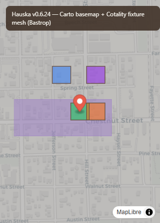

# Max map render fix — v0.6.24

## Problem

Max spatial map showed a flat brown canvas with floating pins (vertical line at center): no Carto streets, no parcel choropleth, garbled workspace address (`419 sqftActive 103 Kamaiki Dr`), squished brief column.

## Root causes

| # | Issue | Root cause |
|---|-------|------------|
| 1 | No basemap | `HAUSKA_GIS_BASE_STYLE` was background-only (brown fill). `HAUSKA_MAP_STYLE` Carto raster existed but was never wired. |
| 2 | No parcel mesh | Live `/gis-layer` quota/tier failures returned empty slots; no offline fixture fallback. |
| 3 | Pins in a line | MapLibre initialized while `.hp-spatial__panel` was `display:none` (collapsed tab) → zero-width canvas; markers stacked at center x. |
| 4 | Garbled address | Zillow DOM concatenates `419 sqft` + `Active` → `sqftActive`; persisted workspaces kept pre-slug-fix scrape. |
| 5 | Dock layout | Map column too narrow by default; 40px tab read as a bar; resize didn't always reflow map after open. |

## Fixes shipped

### 1. Basemap (no Cotality dependency)

- `src/lib/gis-map-paint.js` — `HAUSKA_GIS_BASE_STYLE` now layers **Carto light raster** over deep-brown canvas (`#3d2f24`) with editorial tint.
- `manifest.json` — explicit MV3 CSP: `worker-src 'self'; script-src 'self' 'wasm-unsafe-eval'`.
- CSP worker unchanged: `vendor/maplibre-gl-csp-worker.js` in `web_accessible_resources`.

### 2. Fixture mesh (cc-agent-C Cotality shape)

- `src/lib/gis-fixture-data.js` — Bastrop viewport mesh (13 parcels + FEMA AE/X) using Cotality assessor field shapes from `cotalityFixtures.ts`.
- `src/lib/gis-proxy-api.js` — `resolveGisSlots()` tries live pin + bbox mesh first; falls back to fixture when quota/keys unhealthy.

### 3. Pin anchoring

- `src/lib/site-map.js` — **lazy map init** on first tab expand; double-`rAF` `resize()` + marker re-apply so lng/lat project correctly over basemap.

### 4. Address cleanup

- `src/adapters/zillow.js` — normalize `sqftActive` blob before status regex.
- `src/lib/address-clean.js` — re-derive from Zillow URL slug; scrub garbled persisted addresses.
- `src/research/research-app.js` — clean on workspace reopen, navigation, and `localStorage` migration.

### 5. Dock layout

- `research/research.css` — brief `minmax(320px,1fr)`; map column default **520px**; collapsed tab **32px**.
- `styles/site-map.css` — compact Map pull-tab (not full-height bar).
- `src/lib/research-dock.js` — resize callback on map open.

## Visual proof



Captured from `scripts/map-visual-verify.html` using the same `HAUSKA_GIS_BASE_STYLE` + fixture GeoJSON as the extension. Carto tiles return **HTTP 200**; streets visible under land-use fills.

## Build / load

```powershell
cd P:\hauska-brief-extension
npm run build
# Chrome → Extensions → Load unpacked → P:\hauska-brief-extension
# Reload extension after pull
```

## QA checklist (live extension)

1. Open Deep Research on a Max workspace (or map-max-qa install).
2. Click **Map** tab → dock opens ~520px; basemap shows **streets + labels** on brown-tinted canvas.
3. Parcel choropleth + FEMA overlay visible (fixture if live GIS 403; live when quota healthy).
4. Researched pins sit on geocoded coordinates, not a vertical center line.
5. Address header shows slug-derived street (e.g. **205 Javelina Trl**), not `419 sqftActive 103 Kamaiki Dr`.
6. Drag map↔brief divider — canvas reflows.

## Files

| Area | Path |
|------|------|
| Basemap style | `src/lib/gis-map-paint.js` |
| Fixture mesh | `src/lib/gis-fixture-data.js` |
| Live/fallback | `src/lib/gis-proxy-api.js` |
| Map shell | `src/lib/site-map.js` |
| Address | `src/lib/address-clean.js`, `src/adapters/zillow.js` |
| Dock | `src/lib/research-dock.js`, `research/research.css`, `styles/site-map.css` |
| CSP | `manifest.json` |
| Tests | `scripts/test-address-clean.mjs` |
