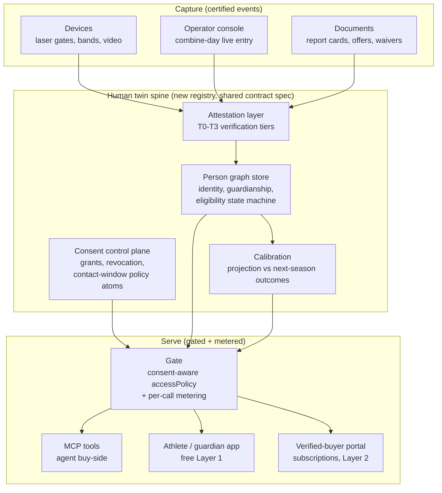

# Human twin spine — vision and build spec

**Status: brainstorm exercise, 2026-07-14.** Produced from the Legacy Group / RT product design call (TSA Youth Combine, Taylor Sports Academy). This is a what-would-it-take document. It does not activate anything. The thesis-check verdict stands: this does not fit the jurisdictional vertical, and pursuing it as a workstream trips the spine rule and the focus queue rule. This doc exists so the idea is fully thought through once, honestly costed, and parked with named entry criteria instead of re-derived every time it comes up.

## 1. Vision

### The one-sentence transplant

Take the proven pattern (verified provenanced atoms, composed into a twin, gated by consent-aware access policy, sold as calibrated reasoning, metered per agent call) and move the node type from **parcel** to **person**. The place graph becomes a **person graph**. The first app on it is the TSA Youth Combine: a verified, longitudinal, athlete-owned performance record.

### Why the pattern transfers

Everything that makes the jurisdictional substrate defensible has a direct analog here:

| Place spine | Human twin spine |
|---|---|
| Parcel / jurisdiction node | Person node (athlete first) |
| Code text, permits, adjudications | Measurements, events, outcomes, credentials |
| Provenance tiers (born-digital, scraped, adjudicated) | Verification tiers (self-reported, hand-timed, device-timed, sensor-corroborated) |
| Jurisdiction onboarding | Certified capture-event onboarding (a combine is a jurisdiction) |
| Cost per jurisdiction under $200 + 1 hr | Cost per certified combine event (same discipline, number set at pilot) |
| Calibration: predicted outcome vs permit history | Calibration: projected trajectory vs next season's measured results and offers |
| Buyer: agent operator | Buyer: verified coach, scout, agent (human or their agent) |
| Tenant data sovereignty | Subject data sovereignty (the athlete owns the twin) |

### The core inversion that makes this a different company

On the place spine, the data subject is a parcel; sovereignty is an enterprise-trust feature. On a human spine the subject is a person, mostly a minor, and **sovereignty is the product**. The athlete (via guardian) owns the twin, gates every read, and captures value when their data drives a decision. This is the value-returns-to-contributors bet (09, section on political economy) in its strongest possible form: the contributor and the subject are the same person. The pitch to families is the one Nick landed on live: *you are already being scouted and profiled by third parties who own everything about you; here, own your own record and gate access to it.*

### Why youth sports is the right wedge

1. **Verifiable ground truth exists.** A laser-timed 40 is a clean, objective, repeatable measurement. Most human-data domains (health, hiring) start in swamp; this one starts on bedrock.
2. **The subjects want to be measured.** Kids want rankings; parents pay $100 to $150 per combine for the privilege. Capture is revenue-positive from day one, which no other human-data wedge offers.
3. **The buyers already pay for worse data.** 247, ESPN 300, Hudl monetize unverified or fragmentary signal. Verified + longitudinal + all-sport is a real gap (per the operator on the call: nothing holds it all under one umbrella).
4. **Natural capture cadence.** Combines are scheduled, physical, operator-controlled events. That is the same reason Bastrop worked: a bounded, cooperative anchor where the whole loop can be proven.
5. **The calibration loop is native.** Training program in, next-season measurement out. Arrow two applied to athletics, with seasons as the outcome clock.

### Where it leads

Wedge: youth combine records. Then: recruiting intelligence (the paid layer), NIL brokerage rails (payment substrate reuse), certified-event franchising (verification-as-a-service, the true substrate business: certifying other operators' combines the way the place spine onboards jurisdictions), and eventually the general pattern for any verified human track record (the eXp-agent recruiting idea floated on the same call is the same spine, different vertical). The transcript's instinct ("this has never been done on a human") is directionally right; the durable position is not the app, it is the **verified human performance ledger plus the calibrated projection layer on top of it**.

## 2. Structural commitments, transplanted

Every commitment carries over with a domain twist. These would be the constitution of the new spine.

1. **Sell reasoning, not data.** Rankings, percentiles, trajectory projections, comparable-athlete analysis are the paid products; every output carries verification tier, source citation, confidence, timestamp. The raw measurement belongs to the athlete and is free to the athlete forever.
2. **Confidence is earned, not asserted.** Verification tiers at capture (below); projection confidence calibrated against subsequent seasons. No number presented as verified that was hand-timed. This is the anti-fraud moat the call kept circling ("anybody can say he ran a four three").
3. **Cost per capture event onboarded.** Hardware amortization + compute + operator hours per certified combine, with a hard kill threshold set after the pilot (the analog of the $200/jurisdiction rule).
4. **Dual interface.** MCP-first for the buy side (a college program's recruiting agent queries the graph); app UI for athletes and parents. The kid-facing surface is UI-first by necessity; the money-facing surface is agent-first by design.
5. **Subject sovereignty (promoted to first-class here).** Consent-gated reads, guardian custody for minors, no pooling of private signal, right-to-delete honored at the content layer with tamper-evidence preserved at the hash layer.

## 3. Architecture

### Honest reuse accounting

The 2026-07-02 deep review found the property twin is ~90 percent composition of existing machinery. **The human twin is not 90 percent; it is roughly 60 percent**, and the missing 40 percent includes the single hardest unbuilt affordance the review named. Breakdown:

**Reused as-is or near-as-is:**
- Atom contract core: provenance block (sourceAdapter, contentHash, fetchedAt), five-value accessPolicy, bitemporal versioning (observedAt / atomizedAt), widthed confidence. The person family is a new atom namespace on the same contract spec, exactly as encumbrance and workspace families were added.
- Actor atoms (ADR-015) as the base for person-record.
- Procedure-execution atoms (ADR-013) for training-program adherence and capture-event runs.
- Access control model (ADR-017) with tenant-private as the athlete-private partition.
- MCP gate architecture (product-key gating, per-tool metering, layer2_call meter): clone the deployed pattern.
- Payment SDK (Circle fiat + USDC rails) for subscriptions and, later, NIL settlement.
- Calibration machinery (Bayesian blend of observed outcomes over asserted priors, invalidation on regime change): the engine already has this; season-over-season is just a slower clock.
- Document-ingest pipeline (point-to blobs + extracted atoms) for report cards, offer letters, waivers.

**New builds (the real spec):**

1. **Person graph store.** New node type with identity resolution (same kid across combines, name changes, transfers), guardian linkage, and an age-driven eligibility state machine (under-13 / 13-plus / high-school recruiting-eligible / NCAA-eligible / adult). No analog exists on the place spine; parcels do not turn 13.
2. **Sensor and telemetry stream contract.** The deep review named live sensor streams "the one genuinely new contract affordance" and it is the heart of this product. Three-tier shape as already sketched: sensor-identity atom (the Steel laser gate, a camera rig, a marathon-style band), referenced external time-series, derived-event atoms (the 1.78s split as a minted measurement). Needs its own ADR; the human spine forces the write.
3. **Consent and guardianship control plane.** COPPA-grade. Dual-guardian grant model, scoped and expiring consent-grant atoms, revocation, and recruiting-contact windows encoded as machine-checkable policy atoms (the NCAA calendar is, amusingly, jurisdictional intelligence: rules text compiled into gates). This is the biggest genuinely new control-plane build and the one that must exist before a single minor's atom is minted.
4. **Attestation and verification layer.** Who vouches for a measurement: the certified event operator (human attestation), the device (device identity + calibration state), video AI (the existing vision-to-coordinate annotation pipeline, repointed), or multiple corroborating sensors. Verification tiers: **T0** self-reported, **T1** operator hand-timed and attested, **T2** certified-device timed, **T3** multi-sensor or video corroborated. Tier is carried on every atom and every derived output, non-negotiable (commitment 2).
5. **Ranking and projection reasoning package.** The Cortex-equivalent of this spine: percentile-by-age-band-and-region, longitudinal trajectory, training-regimen correlation, comparable-athlete retrieval. This is the Layer 2 product.
6. **The first app: TSA Youth Combine.** Athlete/guardian app (profile, own record, leaderboards, badges, profile-completeness loop per the call), combine-day live capture console (operator enters or imports times, atoms mint live, leaderboard updates on the floor), verified-buyer portal (KYC'd, credential-verified coaches/agents on subscription), and the MCP toolset for agent consumption.

### Anchoring and the blockchain claim

The call pitched "on the blockchain, tamper proof." The honest architecture, consistent with ADR-011 and the living-lineage thesis (05): content-addressed atoms with hash-chained lineage as the primary integrity mechanism, periodic anchoring of ledger roots as the designed (not yet live) layer, and no per-edit on-chain writes. Externally the claim is "content-addressed, cryptographically verifiable, append-only, with independent anchoring on the roadmap." Do not sell "blockchain" as present-tense; that is the same discipline as the confidence commitment.

### Topology sketch

### Person atom family (first cut)

| Atom type | Base | Content |
|---|---|---|
| `person-record` | actor atom (ADR-015) | identity, DOB band (not raw DOB at public tiers), guardianship links, eligibility state |
| `measurement` | new | metric, value, unit, capture method, verification tier, event ref, device ref |
| `capture-event` | procedure-execution (ADR-013) | combine session: location, operator, certification state, roster |
| `attestation` | new | attester identity (operator / device / model), what is vouched, signature |
| `consent-grant` | new | grantor (guardian), scope, audience class, expiry, revocation state |
| `outcome` | new | offer received, signing, award, season result (calibration ground truth) |
| `program-execution` | procedure-execution | training/nutrition regimen adherence (the forward-looking fuel) |
| `contact-window-policy` | code-atom pattern | NCAA/UIL contact rules compiled to machine-checkable gates |

## 4. Tier and business model

**Layer 1 (free, maximum distribution):** the athlete's own complete record, shareable profile cards, public leaderboards showing only consented minimal fields. The athlete never pays to see or share their own data.

**Layer 2 (paid):** verified-buyer subscriptions (coach / program / agency tiers, per the call: monthly, priced against what programs already pay for worse data), per-query MCP metering for agent consumption, early-access windows on fresh combine results.

**Event economics (theirs, not the spine's):** combine entry fees fund capture. The spine charges the event a certification/ingest fee, which is the franchise model: any operator anywhere runs a certified combine on the platform and their data enters the graph at T2+.

**Later:** NIL settlement rails (SDK reuse, take rate per 14_pricing discipline), scholarship/charitable vehicle via the existing 501c3, marketplace referral royalties (agent signings). All downstream; none load-bearing for v1.

## 5. Regulatory band (the hard wall, named honestly)

This is the heaviest regulatory surface in the portfolio by an order of magnitude: COPPA (under-13 verifiable parental consent), state biometric statutes (TX CUBI, IL BIPA; laser gates are arguably fine, video gait/vision analysis is arguably not), FERPA adjacency the moment report cards enter, NCAA/UIL contact and amateurism rules, state NIL statutes, and background-check obligations for any adult-to-minor messaging surface. Design consequences baked in above: guardian-custodied twins, no public minor PII by default, verified-adult buy side only, contact windows enforced in the gate, messaging off in v1. **Gate zero of the build spec is a counsel-scoped regulatory memo; no minor's atom is minted before it clears.** (Adult and waiver-covered athletes at the pilot facility can precede it.)

## 6. Entity, brand, and placement

- **Not Hauska.** Branding canon: Hauska = SDK only (2026-07-06 decision); the jurisdictional substrate carries Empressa. A human spine under either brand muddies both.
- **Not an Empressa product surface.** Different vertical, different buyer, different regulatory posture.
- **Recommended shape: NewCo or JV**, with Taylor Sports Academy as the anchor design partner (the Bastrop role: pioneering first operator, not data source), Legacy Group ATX as the build vendor, and the substrate licensed in. TSA brings athletes, events, credibility, and the 501c3; the spine company owns the contract, graph, gate, and reasoning layer. Their app brand (TSA Youth Combine) rides on the spine the way product surfaces ride on the place spine.
- **Contract placement:** shared contract *spec*, separate registry and corpus (the ECI precedent: same pattern as `@empressaio/atom-internal`). One decision to take at phase 0: person family as a namespace in the published contract vs a sibling package. Lean: sibling package consuming the same core primitives, so the jurisdictional catalog never carries minors' schema surface area.
- **Naming:** open. Working label "human twin spine" until a real naming pass. Flagged per convention rather than silently invented here.

## 7. Build spec (execution order, dependencies named)

Stacked in dependency order. No duration estimates by convention.

**Phase 0 — decisions and gates (blocks everything)**
1. Entity/ownership term sheet with TSA (who owns spine IP vs app brand vs data custody; the call surfaced they want LLC + IP help anyway).
2. Regulatory scoping memo via counsel (Hulahan intro exists). Output: what may be captured from whom, consent mechanics, biometric exposure ruling on video. Gate for all minor data.
3. Data-rights charter (the constitution above, section 2, ratified).
4. Naming + kill criteria (cost per event threshold; buyer-demand checkpoint: N paying subscriptions by the Kth combine or stop).

**Phase 1 — contract and ADR work (blocks ingest)**
5. Person atom family ADR (table in section 3) + package scaffold (sibling package, shared core).
6. Sensor/telemetry stream ADR (the named unbuilt affordance; three-tier shape). This ADR is dual-use: the place spine's IoT/operational-twin need (ADR-022 extension) consumes the same shape, which is the one piece of this exercise with direct value to the existing portfolio even if the rest stays parked.

**Phase 2 — pilot capture lab (blocks everything downstream; runs at the Taylor facility)**
7. Capture path v0: operator console with manual entry + laser-timer import (the Steel gates already in use; import their output rather than integrate live in v0). Mint T1/T2 measurement atoms with full provenance. Waiver-covered or adult athletes only until the phase 0 memo clears minors.
8. Attestation v0: operator attestation + device identity records. Verification tier stamped end to end.
9. Cost meter from the first event (commitment 3 instrumentation).

**Phase 3 — spine services**
10. Person graph store + identity resolution + eligibility state machine.
11. Consent control plane (grants, revocation, guardian model) wired into a cloned gate; consent-aware accessPolicy enforced at the single chokepoint (adopting the place spine's hardest-won lesson: one enforcing gate, never two surfaces that drift).
12. Metering + subscription billing (SDK reuse; Stripe/Circle pattern already live elsewhere).

**Phase 4 — surfaces (app + MCP together, dual interface)**
13. Athlete/guardian app: profile, own-record view, leaderboards, completeness loop, badge/offer wall.
14. Verified-buyer portal: KYC + credential verification, subscription tiers, search and watchlists.
15. MCP toolset: query-athletes, get-verified-record, percentile-card, trajectory-projection, all consent-filtered at the gate.

**Phase 5 — first live combine (the Sync-4 analog)**
16. Full loop at a real TSA combine: registration with consent capture, live minting on the floor, leaderboards live same-day, buyers consuming within the week. Cost checkpoint against the kill threshold.

**Phase 6 — calibration and projection**
17. Outcomes ledger (offers, season results, next-combine deltas).
18. Projection layer with calibration against season-over-season ground truth; confidence earned per commitment 2.

**Explicitly deferred:** live sensor streaming (import first), messaging between buyers and athletes (regulatory heaviest, defer past v1), NIL settlement, video-AI verification (T3), franchise/certification of third-party operators (needs the loop proven at TSA first), any additional sport-specific instrumentation beyond the four test families TSA already runs (reaction, explosiveness, agility, speed).

## 8. What this costs the current program (the honest part)

This is a second company's worth of build. Phases 0 through 5 are roughly the size of the substrate v1 sprint plus the tenancy leg combined, on a spine where the consent plane and person graph have no existing code. Under the focus queue rule it cannot start without naming what dies, and right now the active program (tenancy flip, M1 calibration gate, GTM pivot support, ICC/Codex motion, O&G C7) is the company. **Entry criteria to unpark:** (a) TSA or an investor funds it as an engagement (the call said "billion dollar idea"; fine, then it can pay for its own phase 0 and 1), or (b) the operator explicitly re-sequences the portfolio. Until one of those is true, the only items worth doing are the ones with dual value: the sensor-stream ADR (item 6, feeds the place spine's operational twin) and the services work Legacy Group can bill now (demo site, facility architecture, LLC/IP referral).

## 9. Open questions

1. Identity substrate for minors: what is the durable person key when names, schools, and guardians change (place spine solved this with APN+FIPS; there is no APN for a 12-year-old).
2. Video-AI verification liability: does an inferred time ever get T2+ standing, or is model-derived measurement permanently a lower tier.
3. Whether the athlete's twin is portable out (atom-contract portability says yes structurally; NCAA/commercial dynamics may resist).
4. Whether the buy side is big enough below D1 football/basketball to carry subscriptions across all sports, or whether revenue concentrates in two sports and the all-sport framing is capture-side only.
5. Guardian-fraud surface: parents inflating records is the new "hand-timed" problem, one attestation layer up.
