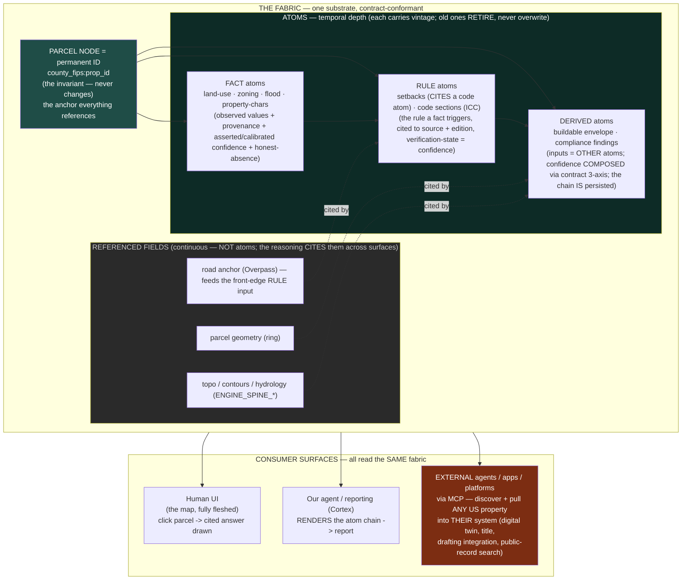
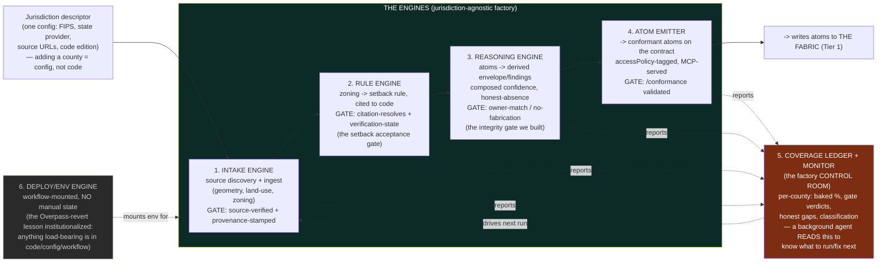

# The property-node atom fabric + the engines that produce it

The picture of what we are building, from three operator keystones (2026-07-23):
1. The parcel NODE is a permanent ID; external-ref atoms give it depth over time; everything else is a variable (owners, structures, zoning, valuations come and go — the property's real ID never changes).
2. It is ONE unified reasoning surface (map answers, code answers, compliance findings, reports, agent calls — all the same atom chain, read by different consumers).
3. It must serve BOTH a human UI (the map, fully fleshed) AND an MCP/agent surface where ANY external agent/app/platform can call ANY US property and pull its atoms into THEIR OWN system, easily — discoverable, self-describing, drop-in. This is infrastructure others build on without a human integration project, not a product.

And the frame under all of it: Central-TX is the FIRST jurisdiction we run the ENGINE on to prove it — the engine (jurisdiction-agnostic) is the deliverable; national is running the engine by configuration, not rebuilding. Build the factory, then mass-produce (Apple built computer factories before computers).

## TIER 1 — THE FABRIC (the WHAT): node + atoms + reasoning + consumers



Reading it: the NODE is the permanent center. FACT -> RULE -> DERIVED is the reasoning chain (zoning fact triggers the setback rule which, with geometry + road-anchored front edge, derives the envelope). RULE atoms CITE code atoms (setbacks and codes are one substrate). Continuous fields (geometry, topo, road) are REFERENCED, not atomized — the derived atom cites them across surfaces. All three consumer classes read the identical fabric: our map, our reporting, and — the disruption — ANY external agent/app via MCP, drop-in.

The temporal property (explicit): a zoning change adds a new zoning-fact atom with a new vintage; the prior stays as history (that history IS the calibration record — "we said RS in 2026, city rezoned MF in 2028"). A demolished building retires its structure atoms; the node persists. The node is the spine; the atoms are its time-series. This matches the contract's signed-history layer for data atoms.

## TIER 2 — THE FACTORY (the HOW): the engines that PRODUCE + GATE each atom

Each engine is a DURABLE application (not a script) with a QA GATE, jurisdiction-agnostic, runnable by a background agent unattended because the gate catches fabrication automatically. Discovered from doing Central-TX by hand.



The factory principle: the REASONING lives in the engines (jurisdiction-agnostic templates); the jurisdiction-specific-ness lives ONLY in the descriptor + source adapters + provenance — NEVER in the reasoning code. That separation is the anti-zombie-code discipline: county #500 is a new descriptor a background agent runs, not a fork of the logic. The gates are the QA line that lets it run unattended (a gate that blocks fabrication automatically = the property a factory needs). The ledger is the control room the agent reads to self-direct.

## What this diagram commits us to (for the execution plan)

1. Atomize the zoning-fact -> setback-rule -> envelope-derived chain FIRST, against the real contract (3-axis confidence replaces the labeling x district multiply; the matcher's binary decision becomes graded confidence-provenance — which also answers the Kyle-R1-T / Bexar-I2-fallback matcher problems honestly).
2. Setback rule CITES a code atom (setbacks + ICC unify).
3. Flood MIGRATES onto the node as a fact atom; topo/hydrology/geometry/road stay REFERENCED (cross-surface cite).
4. Build the six engines as durable, gated, jurisdiction-agnostic applications; the reasoning is in the engine, the jurisdiction is in the descriptor.
5. The fabric is consumed identically by the map, our reporting, AND external agents via MCP — discoverable + self-describing + drop-in (the infrastructure requirement).
6. Temporality is baked in: atoms carry vintage, node is invariant, history retires-not-overwrites (= the calibration record).

Next: fold this + the WDLL remaining pieces + the agent's 5 feedback asks into ONE unified master execution plan (after the in-flight agent fully lands), broken into executable tasks a background-agent fleet can run against the gates.
```
