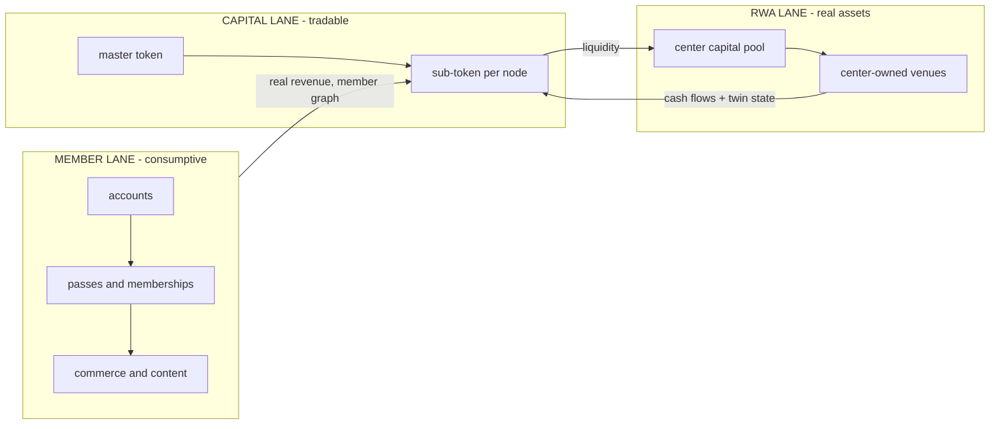

# Architecture

**Terminology ruling (Nick, 2026-08-14):** two senses of "node" were colliding. In the DATA MODEL, "node" means any twinned graph entity - persons, teams, vendors, venues, the league - one node per entity forever, with facts as attached atoms and relationships as typed edges (the parcel-node pattern; the cockpit security-master pattern). The economy-topology role this doc's table calls "node" (the team-as-operator) is a ROLE expressed as edges and flags, and is called **operator** in code. Person-nodes are platform-global; tenancy scopes edges, atoms, and operational rows, never a person's identity - so the league-scale graph (one fan, many teams) falls out of the schema for free.

## Roles

| Role | Sports instance | General role | What they hold |
|---|---|---|---|
| Center | league | issuer and governor | network brand, territories, conduct rules, treasury, capital pool |
| Node | team | operator | the local business on the shared template; assembles real-asset projects |
| Member | fan | the demand engine | an account that is their own record: status, history, property |
| Anchored asset | athlete, venue | the referents | verified twins with evidence-backed state |
| Platform | Empressa | builds and operates | member layer, verification bed, rails; the model itself |
| Tokenomics team + counsel | external | instrument design | supply, liquidity, listings, treasury policy, legal wrapper |

## The three lanes as systems

The member lane produces the cash flows and the graph the capital lane points at. The capital lane's liquidity funds the RWA lane. The RWA lane's assets and cash flows deepen the capital lane's linkage. Verification runs under all three: the twins are what make the linkages claims rather than stories.

## Master/sub token structure — three candidate shapes (tokenomics team decides)

1. **Reserve/settlement master** (Chiliz pattern): master is the denominating asset; sub-tokens mint or bond against it; every sub-token trade routes value through the master. Concentrates liquidity through the center; most directly serves the capital thesis. Makes the master systemically important (a hazard as well as a feature).
2. **Parent-with-series** (holdco/tracking pattern): sub-tokens are series referencing node economics; TradFi-legible, maps cleanly onto a securities wrapper.
3. **One contract, many IDs** (multi-token standard): master and every sub are token IDs in one issuance system; a new node is a new ID, not a new deployment; one governance surface, one treasury. Operationally cleanest for an expanding network.

The first design question is where liquidity concentrates: master-paired subs concentrate it (good; thin markets are the known killer); independently-paired subs fragment it across N micro-markets (bad). The second design question is the exact linkage definition per sub-token: what, precisely, does it reference (brand royalty? territory economics? venue cash flow once the RWA lane lands?), because the linkage definition determines the legal wrapper and the attestation feed.

## Custody and identity (the custody gradient, applied)

Per the doctrine developed in the athlete-twin work: custody is a vector per key-class, honestly typed, graduating hosted to delegated to self.

| Key class | Signs | Member default | Athlete default |
|---|---|---|---|
| Consent/grant | consents, access grants, revocations | self (passkey, from enrollment) | self, always |
| Attestation | records on the twin | hosted (platform signs, labeled) | delegated: team staff, scoped and expiring |
| Payment/holding | funds, token custody | hosted (fiat checkout, custodial token account, honestly labeled) | hosted until the athlete opts up |

Fans never need a wallet: fiat in, hosted custody, self-custody as an invisible-until-wanted graduation. Custody state is a recorded fact on every account; hosted output is labeled hosted. This is the difference between an economy civilians can join and a crypto product.

## The verification bed (what the platform already runs)

Twins of people (member accounts, athlete records with per-measurement provenance), places (venues from siting through operation), and documents (smart records and disclosure rooms with access passes and audit chains); attestation feeds with provenance on every claim; payment rails with programmatic splits and per-reference metering. The sub-token attestation feed is this machinery pointed at the linkage claims: member-graph size, verified-asset inventory, venue state. Built once, already running for the first node.
