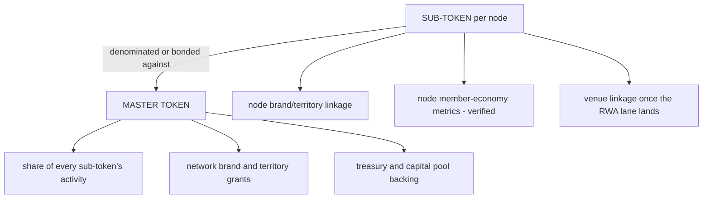

# Economic model

## Where money enters the economy (exogenous inflows)

An economy is only real if outside money enters for non-speculative reasons. The inflows, ranked by reliability:

1. **Members buying belonging** (passes, memberships, drops, content): recurring, consumptive, proven at node one. The bedrock.
2. **Sponsors buying the graph** (node-local and network-wide): scales with registered members, not attendance; the network-level inventory only the center can sell.
3. **Ticket-adjacent and venue revenue** (existing economy, enhanced): the traditional business, made more valuable per member by the account layer.
4. **External buyers of verified data** (scouts, media, analysts, per-reference royalties): small at first; the metering rail exists.
5. **Capital-lane buyers** (token purchasers): the least reliable inflow and the one that must never be load-bearing for operations. Capital, not revenue.

The solvency test restated in flow terms: inflows 1 through 4 must cover the operating economy; inflow 5 buys assets, never payroll.

## What each instrument's value rests on

The honest statement of what a sub-token is, pre-RWA: a tradable claim on the *verified trajectory* of one node's economy, denominated through the network. That is a narrative asset with verified fundamentals underneath — stronger than a fan token (which has no fundamentals) and weaker than equity (which has legal claims). The RWA lane is what upgrades it: a sub-token linked to a cash-flowing, center-owned venue has an asset under the narrative. This ordering matters: **the capital lane gets more real over time by design**, and early buyers must be told exactly which stage they are buying.

## Treasury shape (the center)

Inflows: master/sub primary issuance, secondary royalties if designed in, its share of member-lane revenue per existing network structure. Outflows: the capital pool (venue acquisition), liquidity provisioning, operations share. Policy questions the tokenomics team must answer before first issuance: supply schedule and vesting; what the center may never sell (no-dump commitments); whether secondary royalties exist and at what rate; the liquidity budget (who market-makes, with what, under what rules); and the reserve policy between raises. A written treasury policy is a launch gate, not an afterthought.

## Node economics (grounded in the live node)

The Bulls work gives real reference points: a founding series (1,000 numbered units), an annual membership base, four to six drop moments a season, premium content revenue-shared with athletes, and local sponsorship on the graph. Illustrative single-node digital season on the order of low-to-mid six figures at maturity, against platform operating costs that must be modeled honestly (support, content ops, payment costs, compliance). Per-node contribution likely turns positive on the member lane alone at modest conversion; the model must show at what member count. **The template's unit economics are the whole ballgame for the rollout story**: a node that loses money on the member lane makes the token layer a subsidy machine, which is the reflexivity trap.

## The RWA loop, quantified honestly

A 5,000-seat venue runs $60M to $150M. Fan-raise precedents deliver low millions per campaign; token liquidity for niche assets is thin (the flagship tokenized building trades at zero daily volume). Therefore: the capital lane does not build venue one. Realistic sequence: venue one is financed conventionally (municipal participation, senior debt, sponsor equity) with the token tranche as a *minority slice* and the twin as its disclosure layer; the capital lane's venue role grows only as the master token's market cap earns it. Any pitch implying token-funds-stadium-one fails the honesty bar and, worse, fails diligence.

## What the tokenomics team must model first (the commissioning brief)

1. Liquidity architecture: master-paired vs independent sub-token markets, simulated under thin-volume assumptions (use fan-token actual volumes as the base case, not hopes).
2. The reflexivity stress test: model the economy with token price at zero. If anything operational breaks, redesign.
3. Supply, vesting, and treasury policy under three demand scenarios, including the ugly one.
4. The linkage definition per sub-token and its attestation feed (what is claimed, how often verified, by what machinery).
5. Primary issuance mechanics and who may buy (geography, accreditation, KYC) per counsel's wrapper choice.
6. The center-fold scenario: what token holders hold if the network contracts, folds, or is sold (the network's own governing documents contemplate a sale; the token design must too).
