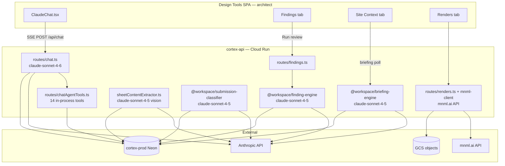

# Cortex AI model inventory — Design Tools architect surfaces

Research inventory of every AI/LLM call site in the Cortex product (Design Tools app + `cortex-api` backend). Scope is the **architect-facing Cortex app** only. SmartCity OS and the standalone plan-review reviewer artifact are noted where they share the same backend but are out of scope for the architect dashboard.

Verified 2026-05-23 against `P:\legacy-design-tools` on `main` (local clone). Code paths cited by file; line numbers may drift on merge.

---

## Executive summary

Cortex does **not** use a single in-app AI model. It runs **two Anthropic Sonnet model IDs** across **five architect-path LLM call sites**, plus a **separate non-LLM vendor** (mnml.ai) for the Renders tab.

| Model | Call sites |
|---|---|
| `claude-sonnet-4-6` | In-app chat (`chat.ts`); reviewer comment-letter polish (`communications.ts`, not architect UI) |
| `claude-sonnet-4-5` | Finding engine, briefing engine, sheet vision OCR, submission classifier |
| mnml.ai API (not Anthropic) | Renders tab — image generation, Prompt Generator |

All Anthropic traffic flows server-side through `@workspace/integrations-anthropic-ai`, keyed on `AI_INTEGRATIONS_ANTHROPIC_API_KEY` and `AI_INTEGRATIONS_ANTHROPIC_BASE_URL`. The browser SPAs never call Anthropic directly.

The **primary architect-visible AI** is the right-sidebar in-app chat (`ClaudeChat.tsx` → `POST /api/chat`). It is a **tool-use agentic loop** (max 8 iterations, 14 tools) that executes in-process against cortex-api tables. It does **not** route through `hauska-mcp-server`.

---

## Architecture diagram



Solid: architect-visible paths. The MCP server (`hauska-mcp-server`) is **not** in this diagram for in-app chat — external agents use MCP; the in-app agent uses in-process tools only.

---

## Model inventory

### Anthropic models in use

| Model ID | Package / route | Max tokens (typical) | Mode env var | Default mode |
|---|---|---|---|---|
| `claude-sonnet-4-6` | `artifacts/api-server/src/routes/chat.ts` | 4096 | (none — always live when key present) | anthropic |
| `claude-sonnet-4-6` | `artifacts/api-server/src/routes/communications.ts` | 4096 | reviewer-only | anthropic |
| `claude-sonnet-4-5` | `lib/finding-engine/src/anthropicGenerator.ts` | 6144 | `AIR_FINDING_LLM_MODE` | `mock` |
| `claude-sonnet-4-5` | `lib/briefing-engine/src/anthropicGenerator.ts` | 4096 | `BRIEFING_LLM_MODE` | `mock` |
| `claude-sonnet-4-5` | `artifacts/api-server/src/lib/sheetContentExtractor.ts` | 1500 | sheet content LLM mode | `mock` |
| `claude-sonnet-4-5` | `lib/submission-classifier/src/classifier.ts` | 800 | classifier LLM client | `mock` |

Shared credentials: `AI_INTEGRATIONS_ANTHROPIC_API_KEY`, `AI_INTEGRATIONS_ANTHROPIC_BASE_URL` via `lib/integrations-anthropic-ai/src/client.ts`.

No `claude-opus` or `claude-haiku` models are pinned in production Cortex paths. Haiku appears only in eval cost tables (`lib/eval/src/instrumentedClient.ts`).

### Non-Anthropic AI vendor

| Vendor | Route / module | UI surface | Activation |
|---|---|---|---|
| mnml.ai | `artifacts/api-server/src/routes/renders.ts`, `lib/mnml-client/**` | Renders tab | `RENDERS_PROD_ENABLED=true` + `MNML_RENDER_MODE=live` + `MNML_API_KEY` |

Prompt Generator (`POST /api/renders/prompt-generator`) calls mnml.ai, not Anthropic. Concept floor-plan imagery requests from the in-app chat agent cannot be fulfilled by the chat model — that gap motivated the rendering sprint (`40c`, `40e`).

---

## Call site 1 — In-app chat (primary architect AI)

**What the architect sees:** right-sidebar Claude chat on engagement detail (`artifacts/design-tools/src/components/ClaudeChat.tsx`).

**Backend:** `artifacts/api-server/src/routes/chat.ts`  
**Model:** `claude-sonnet-4-6`  
**Transport:** SSE stream (`POST /api/chat`)  
**Pattern:** Anthropic tool-use agentic loop, max 8 iterations (`MAX_AGENT_ITERATIONS`)

Chat history is **session-only** — page refresh clears it (banner copy in `ClaudeChat.tsx`).

### Automatic prompt context (every turn, no tool call)

Injected before the model runs:

1. **Engagement atom** — name, address, jurisdiction via `@hauska/atom-contract` registry
2. **Latest snapshot atom** — Revit push summary
3. **Snapshot focus mode** (optional) — multi-snapshot comparison via `snapshotFocus`, `snapshotFocusIds`, or inline `{{atom|snapshot|<id>|focus}}` syntax
4. **Attached sheets (vision)** — up to 4 sheet PNGs when operator checks sheet thumbnails (`referencedSheetIds`); each also gets sheet atom prose
5. **Code atoms** — from cortex-prod `code_atoms`:
   - Up to 6 user-referenced atoms (`referencedAtomIds`)
   - Up to 8 jurisdiction-retrieved atoms (`retrieveAtomsForQuestion`)
   - Skipped when jurisdiction key cannot be resolved
6. **Chat history** — prior turns in session
7. **Ambient context** — active tab name (`activeTab` body field)
8. **Tool guidance** — `buildAgentToolGuidance()` from `chatAgentTools.ts`
9. **QA-23 coverage guardrail** — `buildCoverageGuardrail()` when jurisdiction has no ingested code (`coverageGuardrail.ts`)

### Agent tools (14 total)

Defined in `artifacts/api-server/src/routes/chatAgentTools.ts`. All tools are scoped to the current engagement — no `engagementId` tool input (tenant isolation).

#### Read tools (11)

| Tool | Function |
|---|---|
| `list_sheets` | List drawing sheets (id, number, name) |
| `read_sheet` | Sheet metadata + `contentBody` + L2 OCR extraction if present |
| `list_findings` | Compliance findings on latest submission (severity, confidence, text) |
| `list_submissions` | Plan-review submissions (status, discipline) |
| `list_snapshots` | Revit snapshot history (counts, timestamps) |
| `list_response_tasks` | L1 response tasks; optional `state` filter |
| `list_detail_callout_specs` | L4 detail callout specs |
| `list_product_spec_references` | L5 product spec references |
| `read_site_context` | Parcel briefing sections A–G + briefing sources |
| `list_attached_documents` | Client-uploaded PDFs, photos, notes (QA-18) |
| `read_attached_document` | Full extracted text of one attached document |

#### Write tool (1 — direct, reversible)

| Tool | Function | Reversibility |
|---|---|---|
| `create_response_tasks` | Create one or many L1 response tasks (batch max 25) | Cancel via L1 `cancelled` state; agent-action log in chat panel |

Provenance (WSC.5): `actorId = "cortex-in-app-agent"`, reasoning footer on description, AI-origin marker, source finding/comment propagation.

#### Draft-only tools (2 — operator saves via form)

| Tool | Function | Persists? |
|---|---|---|
| `draft_detail_callout_spec` | Pre-fills L4 Detail Callouts form | No — operator reviews and saves |
| `draft_product_spec_reference` | Pre-fills L5 Product Specs form | No — operator reviews and saves |

L4/L5 direct-write was intentionally avoided because those atom types lack a reversible delete/archive path.

### SSE event types emitted to the panel

| Event | Meaning |
|---|---|
| `{ text: "..." }` | Streaming text delta |
| `{ type: "tool_use", tool: "<name>" }` | Tool invocation status |
| `{ type: "agent_action", action: {...} }` | Reversible write (response task created) |
| `{ type: "agent_draft", draft: {...} }` | L4/L5 form pre-fill |
| `{ error: "stream_failed" }` | Stream failure |
| `[DONE]` | Turn complete |

### What the in-app agent cannot do today

| Gap | Backlog / dispatch |
|---|---|
| Generate client letters or export documents | QA-28 — dispatched Phase 3, not shipped |
| Fetch external URLs / create engagement from dropped intake | QA-27 — dispatched Phase 3, not shipped |
| Read Hauska substrate catalog via MCP | Roadmap retrofit per `28_mcp_first_product_design.md`; Code Library uses cortex-prod-local `code_atoms` |
| Produce render/concept imagery | Renders tab (mnml.ai), not chat |
| Initiate compliance review run | Findings tab separate engine path |

### WS-C lineage

- Original WS-C (2026-05-20): 12 tools, PR #56 merged 2026-05-21
- QA-18 (2026-05-21): +2 attached-document tools, PR #62
- QA-23 (2026-05-21): jurisdiction honesty guardrail, PR #60

Dispatch reference: `_dispatches/2026-05-20_cc-agent-C_cortex_qa_wsc_in_app_agent.md`

---

## Call site 2 — Compliance review (Findings tab)

**What the architect sees:** Findings tab → "Run review" on engagement detail (`FindingsTab.tsx` in design-tools). Relocated from standalone Codex reviewer per P1-4 (2026-05-22 QA build).

**Backend:** `artifacts/api-server/src/routes/findings.ts` → `@workspace/finding-engine`  
**Model:** `claude-sonnet-4-5` (`FINDING_ANTHROPIC_MODEL`)  
**Max tokens:** 6144  
**Mode:** `AIR_FINDING_LLM_MODE` — `mock` (default) or `anthropic`

### Function

Pre-submittal compliance review. Input: submission context + retrieved code atoms (max 8). Output: structured JSON `{ findings: [...] }` with severity, category, confidence, citations, element refs.

Findings persist as atoms; architect adjudicates (accept / edit / reject) in Findings tab. Chat agent can read findings via `list_findings` and push to response tasks via `create_response_tasks`.

### Quality signals

- `invalidCitationCount` recorded on finding runs
- Eval harness wraps engine (`lib/eval/`) — not architect-visible

---

## Call site 3 — Site context briefing (Site Context tab)

**What the architect sees:** Site Context tab narrative sections after "Generate Layers" / auto-briefing (`SiteContextTab.tsx`).

**Backend:** `@workspace/briefing-engine` (triggered from briefing routes)  
**Model:** `claude-sonnet-4-5` (`BRIEFING_ANTHROPIC_MODEL`)  
**Max tokens:** 4096  
**Mode:** `BRIEFING_LLM_MODE` — `mock` (default) or `anthropic`

### Function

Synthesizes parcel briefing narrative (sections A–G) from structured site-context adapter payloads (FEMA, USGS, EPA, parcels, zoning, roads, etc.). Chat agent reads output via `read_site_context`.

Briefing **data fetch** (adapters) is not LLM — only the narrative synthesis step is.

---

## Call site 4 — Sheet text extraction (background)

**What the architect sees:** Indirectly — extracted text appears in sheet reads and finding cross-reference chips.

**Backend:** `artifacts/api-server/src/lib/sheetContentExtractor.ts`  
**Model:** `claude-sonnet-4-5` vision (`SHEET_CONTENT_ANTHROPIC_MODEL`)  
**Max tokens:** 1500  
**Trigger:** Background after sheet upload when Revit metadata lacks `contentBody`

### Function

Vision OCR/transcription of sheet PNG: general notes, keynotes, cross-refs ("SEE A-301"). System prompt: "You are an OCR/transcription assistant for architectural drawing sheets."

Does not block upload response. Failures swallow to null.

---

## Call site 5 — Submission classifier (background)

**What the architect sees:** Nothing direct — runs on submission create.

**Backend:** `@workspace/submission-classifier` via `autoTriggerClassificationOnSubmissionCreated.ts`  
**Model:** `claude-sonnet-4-5` (`CLASSIFIER_ANTHROPIC_MODEL`)  
**Max tokens:** 800

### Function

Cover-sheet triage JSON: `projectType`, `disciplines`, `applicableCodeBooks`, `confidence`. Feeds submission metadata; not surfaced as a chat capability.

---

## Same backend, not architect-facing in Design Tools

These share `cortex-api` and Anthropic credentials but serve the **plan-review** artifact (reviewer audience) or internal QA:

| Route / module | Model | Audience | Function |
|---|---|---|---|
| `routes/communications.ts` | `claude-sonnet-4-6` | Reviewer (`requireReviewerAudience`) | Polish outbound comment letters (deterministic skeleton + Anthropic polish) |
| `lib/qa/diffSuggester.ts` | `claude-sonnet-4-5` | Internal autopilot | Suggest code diffs for classified findings; `AIR_AUTOPILOT_DIFF_MODE`, default `mock` |

Out of scope for a Design Tools model swap unless SmartCity reviewer surfaces are included.

---

## Non-LLM Cortex capabilities (architect-visible)

For completeness when evaluating "what AI does in Cortex":

| Surface | Technology | Notes |
|---|---|---|
| IFC ingest / 3D BIM viewer | web-ifc WASM worker, Three.js GLB | No LLM |
| Site context layer fetch | External GIS/API adapters (UGRC, FEMA, USGS, EPA, Regrid, etc.) | No LLM; briefing narrative is LLM on top |
| Code Library page | cortex-prod `code_atoms` table; QA-17 substrate client mock-mode default | Not LLM at read time |
| Deliverable letters (L3/L6) | Template + DOCX/PDF render pipeline | No LLM in letter composition route today |
| Renders tab | mnml.ai image API | Separate vendor, not Anthropic |

---

## MCP relationship

Per [`44_mcp_cortex_architecture_map.md`](../44_mcp_cortex_architecture_map.md):

- **In-app chat does not consume hauska-mcp-server.** Tools execute in-process (`chatAgentTools.ts`).
- **MCP → Cortex is one-directional:** MCP server calls cortex-api L-surface routes; cortex-api does not call MCP or hauska-engine retrieval API (with QA-17 exception: Code Library substrate client, mock default).
- **31 Cortex MCP tools** on `hauska-mcp-server` mirror L-surface operations for **external agents** (Cursor, Claude Desktop). The in-app agent reuses the same L1/L4/L5 **data contracts** but not the MCP transport.

Retrofit to wire Code Library and in-app agent to Hauska substrate catalog: tracked roadmap item per `28_mcp_first_product_design.md`.

---

## Environment and operational notes

### Required for live Anthropic (all modes)

```
AI_INTEGRATIONS_ANTHROPIC_API_KEY
AI_INTEGRATIONS_ANTHROPIC_BASE_URL
```

Stored in GCP Secret Manager for Cloud Run (`cortex-api`). A stale Replit-era key caused in-app chat 401s post-cutover (2026-05-20 session); fixed by secret rotation + revision pin.

### Per-engine mode switches

| Env var | Values | Effect |
|---|---|---|
| `AIR_FINDING_LLM_MODE` | `mock` (default), `anthropic` | Findings tab review generation |
| `BRIEFING_LLM_MODE` | `mock` (default), `anthropic` | Site briefing narrative |
| Sheet content extractor mode | `mock` (default), `anthropic` | Vision OCR on upload |
| Classifier | follows LLM client resolution | Submission triage |

Production must set `anthropic` on finding and briefing modes for the customer-zero loop to produce real (non-mock) findings and site narratives.

### Cost attribution

All Anthropic cost accrues server-side. No per-feature metering in v1. Chat tool loop can multiply token usage (up to 8 iterations × tool results in prompt).

---

## Model swap implications

If replacing "the in-app AI model," minimum touch:

1. **`artifacts/api-server/src/routes/chat.ts`** — model string (2 call sites in loop), verify tool-use + vision + SSE streaming on target provider
2. **`artifacts/api-server/src/routes/chatAgentTools.ts`** — tool schema format if moving off Anthropic tool-use API
3. **`lib/integrations-anthropic-ai`** — swap or parallel integration module

Full Cortex AI swap additionally requires:

4. **`lib/finding-engine/src/anthropicGenerator.ts`** — structured JSON findings output
5. **`lib/briefing-engine/src/anthropicGenerator.ts`** — structured JSON sections A–G
6. **`sheetContentExtractor.ts`** — vision OCR path
7. **`lib/submission-classifier`** — classification JSON
8. **Eval harness** (`lib/eval/`) — rubric and cost tables

Cross-cutting risks:

- **Tool-use loop** — in-app agent depends on Anthropic `tool_use` / `tool_result` message shape
- **Vision** — chat attaches sheet PNGs; finding engine does not; sheet extractor does
- **JSON contract** — finding/briefing/classifier parsers strip markdown fences and validate strict shapes
- **Grounding guardrail (QA-23)** — prompt engineering in `coverageGuardrail.ts`; must port with chat
- **Provenance (WSC.5)** — independent of model; persists on atoms regardless

Renders tab is unaffected by Anthropic swap (mnml.ai).

---

## Open / roadmap items affecting AI surface

| Item | Status | Effect on AI |
|---|---|---|
| QA-27 link-drop intake | Dispatched Phase 3 | New chat tools: URL fetch, engagement create |
| QA-28 in-app letter generation | Dispatched Phase 3 | New chat tool → L3/L6 pipeline |
| QA-20 background code collection | Routed to cc-agent-E | Engine/substrate; pairs with ungrounded jurisdiction gap |
| Cortex MCP retrofit | Roadmap | Wire Code Library + chat to Hauska substrate |
| Chat-initiated render requests | Fast-follow per 40c/40e | Would extend chat tools to mnml kickoff — cc-agent-C territory, not cc-agent-R |
| ADR-010 tool-use retrieval at LLM time | Deferred | Would add mid-generation code cross-ref traversal to finding engine |

---

## Source file index

| Concern | Primary file |
|---|---|
| In-app chat route | `legacy-design-tools/artifacts/api-server/src/routes/chat.ts` |
| Chat agent tools | `legacy-design-tools/artifacts/api-server/src/routes/chatAgentTools.ts` |
| Coverage guardrail | `legacy-design-tools/artifacts/api-server/src/routes/coverageGuardrail.ts` |
| Chat UI | `legacy-design-tools/artifacts/design-tools/src/components/ClaudeChat.tsx` |
| Finding engine | `legacy-design-tools/lib/finding-engine/src/anthropicGenerator.ts` |
| Briefing engine | `legacy-design-tools/lib/briefing-engine/src/anthropicGenerator.ts` |
| Sheet OCR | `legacy-design-tools/lib/../artifacts/api-server/src/lib/sheetContentExtractor.ts` |
| Submission classifier | `legacy-design-tools/lib/submission-classifier/src/classifier.ts` |
| Anthropic integration | `legacy-design-tools/lib/integrations-anthropic-ai/src/client.ts` |
| Findings UI | `legacy-design-tools/artifacts/design-tools/src/components/engagement-detail/FindingsTab.tsx` |
| Renders / mnml | `legacy-design-tools/artifacts/api-server/src/routes/renders.ts` |
| Architecture map (doc) | `doc_repo/44_mcp_cortex_architecture_map.md` |
| WS-C dispatch (doc) | `doc_repo/_dispatches/2026-05-20_cc-agent-C_cortex_qa_wsc_in_app_agent.md` |
| QA backlog (doc) | `doc_repo/43_cortex_qa_backlog.md` |
| Prior UI recon (doc) | `doc_repo/_sessions/2026-05-18_cortex_ui_inventory_cc-agent-UI.md` |

---

## Verification artifact

Inventory produced from local clone read + grep, 2026-05-23. Tool count confirmed at 14 in `CHAT_AGENT_TOOLS` array (`chatAgentTools.ts:234–443`). Model strings confirmed at `chat.ts:861,904` (4-6) and engine constant files (4-5).

Confidence: **high** for code structure and model IDs; **medium** for production env mode values (mock vs anthropic per engine) — confirm against live Cloud Run revision env if swapping models in prod.
