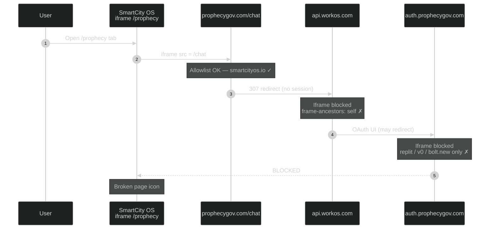
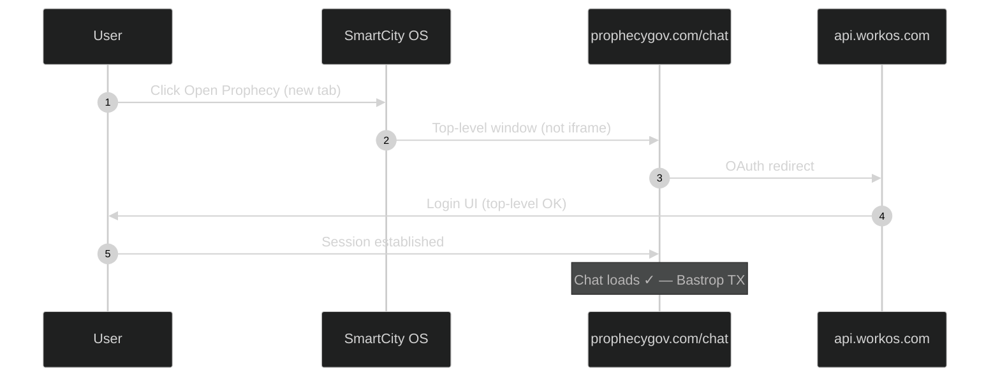

# Prophecy Gov embed flow — vendor diagram

> **Caption for email:** Current embed flow (Bastrop / SmartCity OS at `https://smartcityos.io/prophecy`). Main-domain allowlist is in place; failure occurs when unauthenticated `/chat` redirects into WorkOS OAuth, which blocks iframe embedding. Pop-out login in a new tab works today.

Evidence: read-only recon `_research/prophecy_integration_audit_2026-06-01.md` in `empressaioemail-tech/smartcity-os` (branch `recon/prophecy-integration-audit`, commit `2478a4e`).

---

## Diagram

### Path A — Iframe embed (broken today)



| Step | Host | Status |
|------|------|--------|
| 1 | `prophecygov.com/chat` | Allowlist includes `smartcityos.io` (partial fix) |
| 2 | `api.workos.com` | Blocks all third-party iframes |
| 3 | `auth.prophecygov.com` | Allows dev platforms only, not SmartCity OS |

### Path B — Pop-out login (works today)



---

## Allowlist ask (for Prophecy / WorkOS)

| Domain / surface | Current state | Needed |
|---|---|---|
| `prophecygov.com` | `smartcityos.io` allowed ✓ | Also allow `www.smartcityos.io` |
| `auth.prophecygov.com` | Dev platforms only ✗ | Add `smartcityos.io` + `www.smartcityos.io` |
| `api.workos.com` (WorkOS AuthKit) | `frame-ancestors self` ✗ | Embedded-auth config for SmartCity OS parent frame, or confirm pop-out is the supported pattern |
| Auth cookies | `SameSite=Lax` | `SameSite=None; Secure` for iframe embed contexts (if iframe embed is a supported pattern) |

---

## Footnote

After top-level login, refreshing the iframe may still fail: `SameSite=Lax` cookies set on `prophecygov.com` often do not persist inside a cross-site iframe (`smartcityos.io` embedding `prophecygov.com`) under modern browser third-party cookie policies. Pop-out login remains reliable; in-iframe session persistence may require cookie policy changes from Prophecy even after `frame-ancestors` fixes.

---

## ASCII fallback (copy-paste if Mermaid does not render)

```
PATH A — IFRAME EMBED (BROKEN)
================================
User → smartcityos.io/prophecy (iframe)
     → prophecygov.com/chat          [frame-ancestors: smartcityos.io ✓]
     → 307 → api.workos.com          [frame-ancestors: self ✗ BLOCKED]
     → (may hit) auth.prophecygov.com [frame-ancestors: replit/v0/etc ✗]
     → broken page icon in iframe

PATH B — POP-OUT (WORKS)
========================
User → "Open Prophecy" (new tab, top-level)
     → prophecygov.com/chat → WorkOS OAuth → login ✓
     → Prophecy chat UI loads (Bastrop TX)
```
