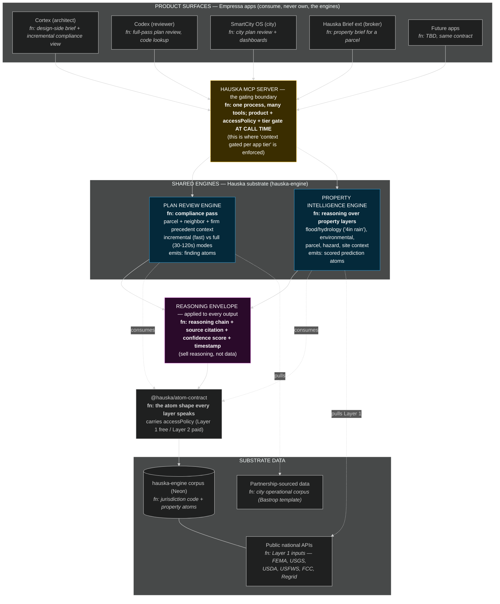
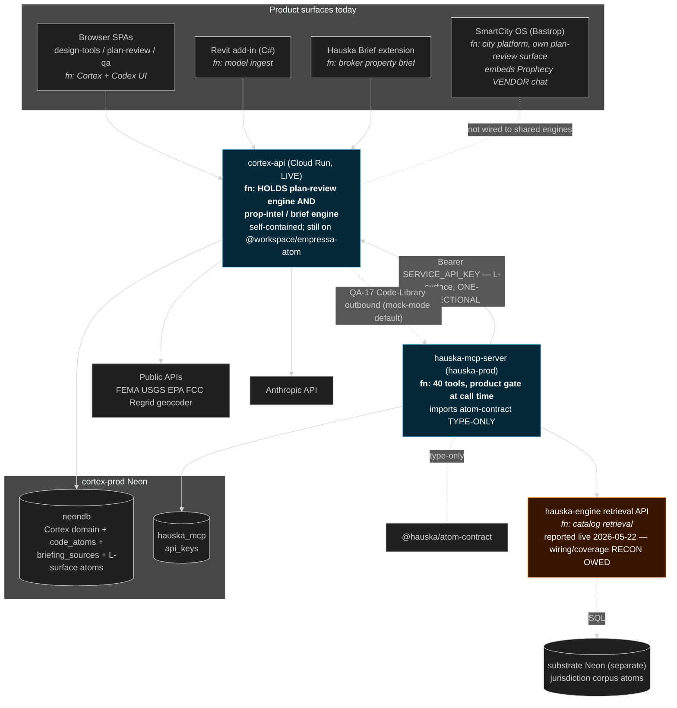

# Shared engines — vision vs current state

> Planning anchor for the realignment session ahead of the sprint later this week. Two diagrams: the destination (two shared engines on the Hauska substrate, consumed by every app, context gated per app tier) and the verified-today topology. The delta between them is the realignment agenda, captured in the final section.
>
> **Sourcing.** Current-state diagram is drawn from [`44_mcp_cortex_architecture_map.md`](../44_mcp_cortex_architecture_map.md) (code-verified 2026-05-20, updated 2026-05-22). That map flags a post-deploy topology refresh as owed; items marked "recon owed" below should be re-verified against the live repos as the first task of the sprint. Vision placement is checked against [`adr_008_engine_factor_out.md`](../80_adrs/adr_008_engine_factor_out.md), [`08_tiered_access_model.md`](../08_tiered_access_model.md), and [`09_post_saas_substrate_thesis.md`](../09_post_saas_substrate_thesis.md).

## The two engines

1. **Plan review engine** — compliance pass against jurisdiction code, parcel, neighbor, and firm-precedent context. Already conceived as one engine across surfaces and being factored into `hauska-engine` per ADR-008. Mode separation (fast incremental vs full pass) still aspirational; one code path today.

2. **Property intelligence engine** — reasoning over property layers: flood/hydrology ("what happens to this property with 4 inches of rain"), environmental, parcel, hazard, site context. Today welded inside `cortex-api`, not factored out at all.

The motivating principle from the operator: both engines shared across all current and future apps, with **context gated per app tier**. That gating mechanism already exists (the MCP server product gate plus accessPolicy plus the Layer 1 / Layer 2 tier model); the work is to route both engines through it, not to invent it.

---

## Diagram A — Vision (destination)

What the vision asserts, made explicit:

The MCP server is the only place gating happens. Apps do not decide what context they receive; the gate does, per product key and tier. That is why "future apps, same contract" costs almost nothing to add.

The reasoning envelope sits between the engines and the contract on purpose. It is the layer that converts raw data into a sellable Layer 2 output. The "4 inches of rain" answer is not a data lookup; it is the property-intelligence engine reasoning over Layer 1 flood inputs and wrapping the result in citation plus confidence.

Both engines live in the Hauska substrate, not in any product. Per ADR-008, catalog, MCP server, atom substrate, and reasoning layer attribute to Hauska; product surfaces attribute to Empressa.

---

## Diagram B — Current state (verified topology, 2026-05-22 baseline)

What is actually true today:

Both engines live inside `cortex-api`, an Empressa product surface. The plan-review pass and the prop-intel / brief pass are the same self-contained backend, not substrate components.

The MCP-to-cortex edge runs backwards from the vision. `cortex-api` is a one-directional data provider into the MCP layer over the L-surface; it consumes nothing back. The QA-17 Code-Library outbound path (mock-mode default) is the only hint of inversion and it is not real data yet.

`cortex-api` has not migrated from `@workspace/empressa-atom` to `@hauska/atom-contract`. That migration is the tracked can-kick and it blocks clean extraction.

SmartCity OS is not wired to the shared engines at all. It runs its own surfaces and embeds the third-party Prophecy chat. Codex 1b is the planned bridge.

The Hauska Brief extension talks to `cortex-api` directly, not through the MCP gate. So per-tier gating is not actually enforced at the substrate boundary for the brokerage surface yet.

---

## The delta — realignment agenda

The gap between Diagram B and Diagram A is the work. Ordered by dependency, not by calendar.

1. **Re-verify the post-deploy topology.** The 2026-05-22 map flags this as owed. Confirm `hauska-engine` retrieval API deploy state, coverage, and live wiring; confirm `hauska-mcp-server` hauska-prod state; confirm whether QA-17 is still mock-mode. This is the first sprint task because every downstream decision rests on it.

2. **`hauska-engine` is the spine and the chokepoint.** Both engines and the entire catalog surface depend on it. Its real coverage gates everything in Diagram A.

3. **Extract the engines out of `cortex-api` into the substrate.** ADR-008 places them in the Hauska layer. This is the largest structural move and it requires inverting the MCP-to-cortex edge so cortex becomes a consumer of its own former logic.

4. **`cortex-api` atom-contract migration.** The can-kick. It is the unlock that lets engine logic move to the substrate without a rewrite.

5. **Route the Hauska Brief extension through the MCP gate.** Today it bypasses the gate by calling cortex-api directly, so per-tier gating is not enforced for the brokerage surface.

6. **Bridge SmartCity OS to the shared engines.** Codex 1b is the planned path; today the city platform consumes nothing from the substrate.

7. **Verify the reasoning envelope is uniformly applied.** Chain plus citation plus confidence plus timestamp is a structural commitment; enforcement across all surfaces is unverified and should be confirmed, not assumed.

## Open fork carried into the session

Where the property-intelligence engine lives is the one genuine architectural fork. Path A (extract into `hauska-engine`, thesis-correct, gated on the deploy and the migration) versus Path B (leave it in cortex-api and let apps call the L-surface, faster but makes an Empressa surface the shared engine, ADR-008 conflict). Recommendation on record is Path A as the destination with a staged route. Run premortem-check formally before this locks into an ADR or a sprint commitment.
