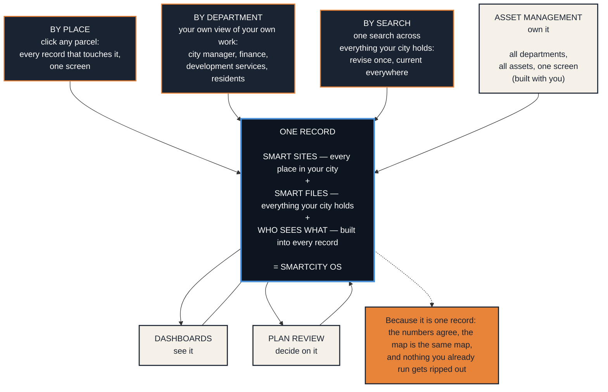

# The front door, distilled

Two diagrams. The first is the model — the single idea the page communicates. The second is the page — how that idea lays out as a one-pager. Review the model first; if the model is right, the page follows.

## Diagram 1 — the model

One record. Three ways in. Three products growing out. Permission built into the middle of everything.

Notes on the arrows, because they carry meaning: the doors point IN (ways of asking). Dashboards reads out. Plan Review and Asset Management point BACK IN — decisions and assets deposit onto the record, which is why the system compounds instead of just displaying. If the diagram gets simplified for the page, that read-versus-write distinction is the last thing to cut.

## The differentiation, in one contrast

Why no one on the shelf can copy this page. Every incumbent has exactly one door and no record behind it.

| | Their door | Behind it |
|---|---|---|
| GIS viewers | place | geometry, no records |
| Department systems (permits, work orders, finance) | workflow | one silo, no neighbors |
| Document systems | search | files, no context |
| Big-gov platforms | all of it | priced for big government, skips the middle |
| **SmartCity OS** | **place, department, and search** | **the same record, every door** |

## Diagram 2 — the page

The front-door one-pager as a zone map. Replaces `01_onepager_overview.md` once ratified.

```mermaid
flowchart TB
    classDef hero fill:#0d1520,stroke:#e8833a,color:#ffffff,stroke-width:2px
    classDef band fill:#f5f0e8,stroke:#1a2332,color:#1a2332
    classDef dark fill:#1a2332,stroke:#4a90d9,color:#ffffff
    classDef cta fill:#e8833a,stroke:#1a2332,color:#1a2332,stroke-width:2px

    H["HERO (locked 2026-08-07)<br/>NO MORE DEPARTMENT SILOS<br/>SmartCity OS joins what your departments already run into one record:<br/>every place, every file, every asset. One click on a parcel shows everything.<br/>One search finds anything. Every department sees its own view<br/>of the same record, tailored to their role."]:::hero
    T["BAND 2 — ONE RECORD, THREE WAYS IN<br/>three door cards: BY PLACE / BY DEPARTMENT / BY SEARCH<br/>(Diagram 1's top half, rendered as cards)"]:::band
    E["BAND 3 — THE EQUATION (accent band)<br/>Every place becomes a smart site. Every document becomes a smart file.<br/>Every water main, sidewalk, and vehicle becomes a smart asset.<br/>That is SmartCity OS.<br/>(who-sees-what moved to Band 5; smart-reports line moved to Plan Review page)"]:::dark
    U["BAND 4 — HOW YOU USE IT<br/>three product cards, each the door to its own one-pager:<br/>DASHBOARDS see it / PLAN REVIEW decide on it / ASSET MGMT own it<br/>(AM banner lives on the AM page, not here)"]:::band
    C["BAND 5 — RESULTS (dark band)<br/>Results You Can See / Answers You Can Check<br/>mechanism outcomes only, no figures ever; closes with source-and-date<br/>('open any number and see where it came from') and ownership<br/>('the record is yours: you decide who sees what, and it stays')<br/>(the refusal moved to the Dashboards one-pager)"]:::dark
    PF["BAND 6 — PROOF<br/>Live with the City of Bastrop, Texas.<br/>City leadership runs the city on it day to day."]:::band
    F["FOOTER — CTA<br/>Schedule a demonstration on your city's data.<br/>(catalog listing title: SmartCity OS for Public Sector)"]:::cta

    H --> T --> E --> U --> C --> PF --> F
```

## Defaults applied, for your review

Three calls you left open; I made the working choice and marked it here so a veto is one line:

1. **Hero: silos-first.** "No More Department Silos" leads; "All departments. All assets. One screen." lands as the Asset Management banner in Band 4, in offer-voice with "built with you" attached. Flip if you want the capability line as the headline.
2. **Equation: rendered visually as an equation** (the dark Band 3), but in words, not math symbols on the page itself — the plus signs live in the diagram, the page says it in four short sentences.
3. **Smart reports: one line inside the equation band**, completing the family ladder (smart sites, smart files, smart reports, SmartCity OS) without becoming a fourth product to unpack.

## What grows from this

DONE 2026-08-07: the model was ratified in session and `01_onepager_front_door.md` now carries the front-door brief (the earlier overview brief is replaced). The product one-pagers' grow-into lines point at the front door, Band 2's three-doors language is the Vertosoft catalog card description source, and the whole `onepager_briefs/` set plus this model is the hand-off to Claude design. The channel white-space briefing (`06_onepager_category_whitespace.md`) stays the rep-facing companion; the contrast table above is its bridge and never appears on the external page.
