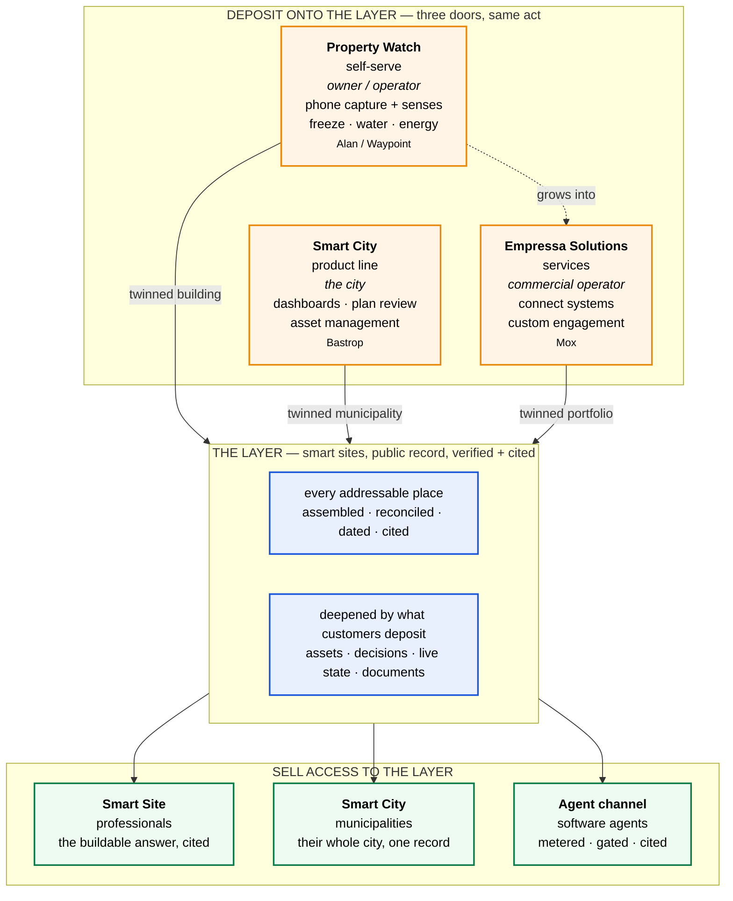

# The layer and the three doors

Ratified 2026-08-10. This is the frame everything else in the portfolio hangs off.

## The one-sentence version

**We build one public layer of verified truth about physical places, we sell access to it several ways, and every customer who uses it deposits more of the country onto it.**

## 1. The layer

The base is a next-generation public layer: every addressable place in the country, assembled from public record, reconciled, dated, cited, and queryable. A place on that layer is a **smart site**.

Two things are true of it at once, and both matter.

**It exists whether or not anyone buys.** Smart sites are reconstructed from public record — parcels, zoning, codes, flood, terrain, roads. A city that never becomes a customer still has its smart sites. This is what makes it a layer rather than a product: it is not created by a sale.

**It is thin until someone deepens it.** The public record gets you the parcel, the zoning, the setbacks, the flood zone. It does not get you what is inside the building, where the water main runs, what the lift station is doing right now, or what the city decided about a permit last year. That depth arrives only when somebody puts it there.

Which is the whole strategy: **the public layer is free to build and impossible to complete alone; the depth arrives as a byproduct of customers getting what they want.**

## 2. Twinning is a deposit, not a product

This is the piece that unifies everything and the piece most likely to be misread.

Nobody buys a twin. A twin is what exists after somebody does something they actually wanted to do. An operator wants to stop pipes freezing. A city wants to know where its water mains are. A commercial operator wants their scattered systems to talk. In every case the customer gets the thing they came for, and the layer gets deeper.

So twinning is not a line item, not a SKU, and not a phase. It is **what happens to the layer when any customer is served.**

INTERNAL ONLY — the vocabulary trap. "Digital twin" is internal language and stays internal (the two-altitude rule, `42_stub_thesis_national_twin_substrate.md`). Alan Hoffman is the clean test case: he pulled hard on what the docs called the digital twin portion, and he had no idea what a twin was. What he understood was **a watcher on his building that would stop a recurring headache**. That is the correct external framing and it is the one that sells. Do not conclude from a customer's interest in the capability that the word is safe to use.

## 3. The three doors

Three ways depth gets deposited. Same act, same layer, three levels of effort and price.

### Self-serve — Property Watch

An owner or operator claims their site, captures what they have with a phone, connects what already reports, adds senses where the building is blind, and puts named watches on what matters: freeze watch, water watch, energy watch.

They came for the watch. The layer got a twinned building.

This is the cheapest twin-creation mechanism in the portfolio — no engagement, no scoping call, no consultant. A test kit is roughly $773 in hardware the customer owns. The free tier is a forecast-only watch on any claimed site, using public data alone, which means a building can go live on the layer before anything ships.

Reference customer: Alan Hoffman, Waypoint Management (multifamily; student housing and assisted living; Minnesota). Recorded ask: pipe-freeze early warning alone would be worth buying — "I'd buy it if it existed." Detail in `65_sensors/pilot_waypoint.md`.

### Municipal — Smart City

A city deploys dashboards, runs plan review against its own adopted code, and puts its physical assets into a durable, access-controlled record. Its water mains, sidewalks, lift stations and vehicles become records that hold up. Its decisions get kept.

They came for one view of their city, less review going to outside firms, and records that survive staff turnover. The layer got a twinned municipality.

Product line, priced. Entry deployment prices set 2026-08-10; see `_smartcity_masters/`.

### Custom — Empressa Solutions

A commercial operator with scattered systems and real complexity. Mox is the archetype: 300 people, 45 locations, 12,000 units, three lines of business, Yardi underneath. Connect the systems, atomize the decisions, twin the portfolio.

They came for their systems to finally talk. The layer got a twinned portfolio.

**This is a services business, not a product line.** Per-engagement, scoped and priced individually, sold by relationship. There is no list price and there should not be one — a minimum viable deployment does not exist for a buyer of this shape.

INTERNAL ONLY: Mox is the heavy, bespoke version of what Alan wants cheaply and repeatably. That relationship — self-serve product on one end, custom engagement on the other, same substrate underneath — is what makes Property Watch the general product to market and custom builds the thing you grow into. Alan is how the general product got discovered; Mox is what it looks like when a buyer needs all of it at once.

## 4. Selling access to the layer

Distinct from depositing onto it. Access is sold to whoever needs verified truth about places:

**Smart Site** — the professional buyer (agent, architect, investor, lender). The buildable answer, cited. Product line with a settled ladder; see `_smartsite_masters/`.

**Smart City** — the municipal buyer. See above and `_smartcity_masters/`.

**The agent channel (MCP)** — software agents consuming the same reasoning through a metered, gated interface. The authorized channel that does not otherwise exist.

One substrate, one set of guarantees, several front doors.

## 5. How it all fits

The loop: a customer is served through a door, the layer gets deeper, and a deeper layer makes every access product better for everyone on it. Nobody has to understand the loop to benefit from it.

## 6. What each customer thinks they are buying

The gap between the left and right columns is the strategy. Nothing in the right column is ever said to the customer in the left.

| Customer | What they came for | What the layer got |
|---|---|---|
| Alan / multifamily operator | pipes that stop freezing | a twinned building, live |
| A city | one view, cheaper review, records that last | a twinned municipality |
| Mox / commercial operator | scattered systems finally talking | a twinned portfolio |
| A realtor or architect | the buildable answer, cited | usage signal, calibration |
| A software agent | verified truth an agent can trust | metered demand, source obligations |

## 7. Where the money is

**Product lines, priced:** Smart Site (professional ladder) and Smart City (municipal entry prices set 2026-08-10). Property Watch is the third and is the general product to market — offer architecture ratified 2026-08-06 (`65_sensors/positioning_and_brand.md`), commercial terms not yet set.

**Services, unpriced by design:** Empressa Solutions custom builds. Per-engagement, relationship-sold, no list.

The unit of purchase in Property Watch is the **watch, per site, never per sensor** — per-sensor pricing punishes coverage and would push a customer to skip exactly the senses that make the product work. Hardware is pass-through at transparent cost and owned by the customer; kit margin is never the business.

## 8. What this frame supersedes

It does not delete anything. It sits above and reconciles:

- `41_three_wedge_spine_strategy.md` — the three wedges (RE-pro, municipal, custom-build) are three doors. Doc 41 flagged custom-build-as-repeatable-offering as the least-defined wedge with a framing pass owed. **That pass resolves here: custom build stays services; Property Watch is the repeatable commercial product it was reaching for.**
- `42_stub_thesis_national_twin_substrate.md` — the unit was named "stub" provisionally; it is **smart site**. The three temporal modes hold, and deepen now has a self-serve path (Property Watch) it did not have when doc 42 was written, where it meant only heavy engagements.
- `09_post_saas_substrate_thesis.md` — the substrate thesis is the layer. Compatible; 09 predates the door framing.

## 9. Open

1. **Property Watch commercial terms.** Offer architecture is ratified; prices are not set. TWIN IT one-time capture, WATCH IT per-site recurring, hardware pass-through.
2. **Tenant isolation gates the first private-telemetry customer.** Waypoint telemetry is tenant-private by accessPolicy, and the substrate does not enforce tenant isolation today (sprint 54 tenancy leg). Operator call owed: sequence behind 54, or deploy isolated in the interim. Watch v0 (forecast-only, zero hardware) proceeds either way.
3. **The 2026-08-06 sensor session was never closed.** Final close, `00_current_state` refresh, and the app UX discussion remain owed.
4. **Portfolio doc reconciliation.** Docs 41, 42 and 09 now sit under this frame and should be updated to point at it.

## Revision history

- 2026-08-10, origin. Ratified in strategy discussion: the layer is the base and exists without customers; twinning is a deposit rather than a product; three doors (self-serve Property Watch, municipal Smart City, custom Empressa Solutions) deposit onto one layer; access is sold separately through Smart Site, Smart City and the agent channel; Property Watch named (ratifying the candidate name carried in the 2026-08-06 sensor positioning doc); custom builds confirmed as services, not a product line.
